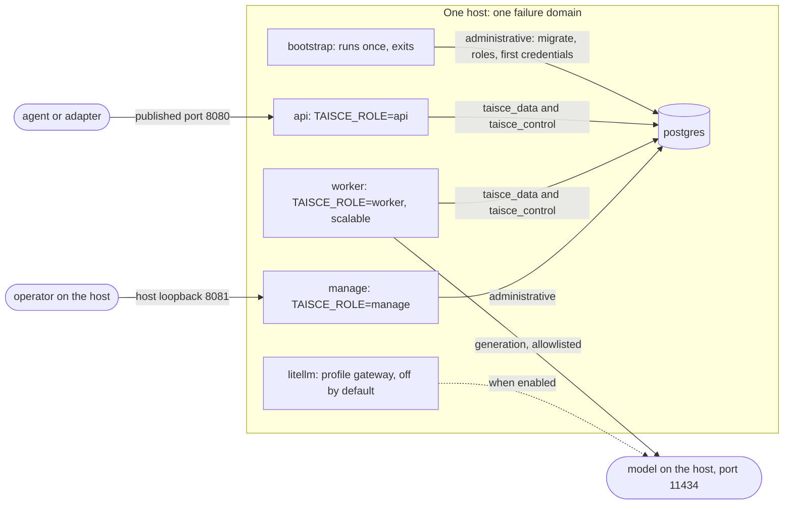
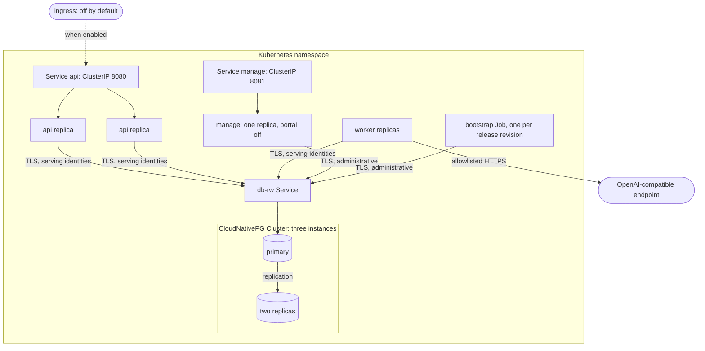

<!-- Copyright 2026 The Taisce Authors -->
<!-- SPDX-License-Identifier: Apache-2.0 -->

# Deployment

Taisce runs on one machine with `compose.yaml`, or in a Kubernetes cluster with the Helm chart under
`deploy/helm`. This page explains how each arranges the processes, how either one reaches a model,
which surfaces a deployment exposes, and every `TAISCE_*` variable the binary reads.

**What you'll learn**

- what every deployment has in common, whatever it runs on;
- how the compose file lays out one machine, and what it does not protect;
- how Taisce reaches a model, and how the allowlist decides where text may go;
- what the Helm chart sets up for high availability, and what it does not claim;
- the surfaces a deployment exposes: memory API, MCP, management and portal;
- every environment variable, with its default.

Read the [architecture overview](overview.md) first. It explains the process roles and the three
database identities this page arranges.

## What every deployment has in common

Every deployment arranges the same four things:

1. **One image.** The service image (`Dockerfile`) is a static binary on a distroless base, running
   as non-root. `TAISCE_ROLE` decides whether a container serves the API, forms the backlog, or
   serves the management surface. A release publishes it as
   `ghcr.io/ensera-ai/taisce:<tag>` for `linux/amd64` and `linux/arm64`, signed with the workflow's
   own identity and carrying build provenance — see [what a release publishes](#what-a-release-publishes).
2. **Bootstrap before serving.** `taisce bootstrap` connects with the administrative identity and:
   - creates or reconciles the two serving logins and the `control` namespace
     (`migrate.EstablishPlanes`);
   - applies every migration to the memory namespace (`migrate.ProvisionMemorySchema`);
   - checks both serving roles' effective privileges;
   - provisions the first project (`migrate.ProvisionScope`);
   - mints the first operator credential and the first project credential, but only when none can
     reach them yet. Each token is printed once, and only its digest is stored
     ([commands.go](../../cmd/taisce/commands.go), `bootstrap`).

   Bootstrap is idempotent, because both deployment styles run it on every start or upgrade.
3. **Serving identities that cannot change the schema.** The API and the workers connect as
   `taisce_data` and `taisce_control`. Every new connection is checked for excess privilege before
   it is used. Only bootstrap, the manage role and operator commands hold the administrative
   connection.
4. **A PostgreSQL with three extensions.** `vector`, `btree_gist` and `pg_stat_statements` are
   created when the cluster is initialised, not by the migrator. `CREATE EXTENSION` needs privileges
   the runtime is never granted, and a missing extension should fail while the cluster comes up. See
   [`deploy/postgres/initdb/00-extensions.sql`](../../deploy/postgres/initdb/00-extensions.sql).

## Compose: one machine

`docker compose up` brings up the database, applies every migration, creates a project, mints
credentials and serves memory on `:8080`. The file is [`compose.yaml`](../../compose.yaml).

It names published images and never builds, so the file on its own is enough — no checkout, no Go
toolchain. The version is pinned rather than `latest`, because a getting-started file that follows a
moving tag breaks under people who changed nothing; override it with `TAISCE_VERSION`. A contributor
running their own working tree adds [`compose.build.yaml`](../../compose.build.yaml):

```bash
docker compose -f compose.yaml -f compose.build.yaml up -d --build
```



| Service | What it runs | Notes |
|---|---|---|
| `postgres` | `ghcr.io/ensera-ai/taisce-postgres`, built from [`deploy/postgres`](../../deploy/postgres/Dockerfile): PostgreSQL 18 with pgvector compiled in | not published to the host; data on the `postgres-data` volume |
| `bootstrap` | `taisce bootstrap -project ${TAISCE_PROJECT:-default}` | with `manage`, the only service given the superuser DSN; `restart: "no"`; the other services wait for it to finish successfully |
| `api` | `TAISCE_ROLE=api` | published on `${TAISCE_PORT:-8080}`; forms nothing; probed with `taisce probe` |
| `worker` | `TAISCE_ROLE=worker` | no published port; health listener on loopback only; scale with `docker compose up --scale worker=3` |
| `manage` | `TAISCE_ROLE=manage` | management surface on `:8081` in the container, published only on the host's loopback (`127.0.0.1:8081`); portal off unless `TAISCE_PORTAL=on` |
| `litellm` | model gateway | only with `docker compose --profile gateway up` |

**Bootstrap is its own service**, not an entrypoint inside the server. Migrations are DDL, and DDL
takes locks a serving process must not hold. Two server replicas starting together would also both
try to migrate.

**The API and the workers are separate services**, even on one machine. The quickstart then teaches
the same layout a real deployment uses. It also lets you scale the workers when the backlog is deep,
or stop them during a provider incident while reads keep answering.

**Every pool size is set in its DSN.** A pool with no size defaults to the machine's CPU count, and
several processes could then ask for more connections than the database has. The compose file sets
`pool_max_conns` per role:

- the API: 8 memory and 2 registry connections (`TAISCE_MEMORY_POOL`, `TAISCE_REGISTRY_POOL`);
- each worker: 4 memory connections (`TAISCE_WORKER_MEMORY_POOL`) and no registry connection. A
  worker resolves no credentials, so it is not given the login that can read them.

Each process refuses to start if the database cannot satisfy its pool (see the
[sizing connections](../21-production-postgresql.md#sizing-connections)). The API also needs at least
three memory connections and one registry connection for its admission gate (`NewAdmission` in
[admission.go](../../internal/api/admission.go)). Of a memory pool of N connections, admission lets
min(64, N − 1) requests run at once, half of those for any one project and half again for any one
token. The default pool of 8 therefore allows one request in flight per token on each API process;
raising `TAISCE_MEMORY_POOL` is how to allow more.

**One host is one failure domain, and the file says so.** Nothing in it survives losing the machine,
and no arrangement of containers on one host could. High availability is what the Helm chart is for.

### What compose does not protect

- **Database connections are unencrypted.** They use `sslmode=disable` and rely on the database
  never leaving the compose network.
- **The role passwords are placeholders.** They fall back to `change-me-data`, `change-me-control`
  and `taisce` unless you set `TAISCE_DATA_PASSWORD`, `TAISCE_CONTROL_PASSWORD` and
  `POSTGRES_PASSWORD`. Bootstrap refuses empty passwords, but it cannot tell a placeholder from one
  you chose.
- **The API is plain HTTP on every host interface.** TLS, a firewall, or anything else in front of
  it is up to you.

For anything beyond a laptop, set real passwords and keep the database port unpublished.

### Measurement overlays

Two override files adapt the compose deployment for measurement runs. Neither is a production
layout.

| File | For | What it changes |
|---|---|---|
| [`compose.perf.yaml`](../../compose.perf.yaml) | qualifying PostgreSQL settings on a single-VM Docker host | CPU, memory and shared-memory limits on `postgres`; explicit `postgresql.conf` starting values; database published on loopback `55433`; pools with bounded lifetimes. Durability stays on. Run it under a separate project name so it gets its own volume (see [testing a change on Colima](../21-production-postgresql.md#testing-a-change-on-colima)) |
| [`compose.gpu.yaml`](../../compose.gpu.yaml) | a disposable eight-GPU qualification node | pinned vLLM generation replicas behind a TLS-verifying nginx, a pinned embedding server, TLS to both, a second PostgreSQL for integration fixtures that change cluster-wide roles, and a test container. See [`deploy/gpu/README.md`](../../deploy/gpu/README.md) |

A laptop running the model, the database and the service at once cannot produce performance numbers
that describe this system. These overlays give measurements a defined place to be taken, and each
published result names the machine it ran on.

## Reaching a model

The service speaks the OpenAI-compatible HTTP interface and nothing more vendor-specific
([config.go](../../internal/infra/inference/config.go)). Because there is one interface, where
inference happens can change without touching the extractor, which is where the correctness checks
live. A hosted provider, a gateway and a model on the same machine are all just an endpoint.

### What compose ships by default

Compose points generation at a model on your own machine, reached from the container as
`http://host.docker.internal:11434/v1`, with an allowlist of `host.docker.internal:11434`. That
default needs no signup and sends nothing off the machine.

LiteLLM ships as an opt-in profile (`--profile gateway`, configured by
[`deploy/litellm/config.yaml`](../../deploy/litellm/config.yaml)). It is not the default hop. A
gateway still needs a provider and a key behind it, so making it the default would add a container
without removing any configuration. It is worth running when you reach several providers, want one
place to keep keys, or want to see inference cost in one place. The Helm chart ships no gateway: its
endpoint is whatever you set.

### Inference profiles

[`deploy/inference/`](../../deploy/inference/) holds three environment files. Each sets an endpoint,
a model and an allowlist, and never a key. A key in a committed file is a key in the repository, so
you export it separately.

| Profile | Generation | Embedding | For |
|---|---|---|---|
| [`local.env`](../../deploy/inference/local.env) | a model on this machine | the same machine | the default; nothing leaves the machine |
| [`openrouter.env`](../../deploy/inference/openrouter.env) | a hosted provider | this machine | when a hosted extractor is acceptable; conversation text then leaves your infrastructure |
| [`gpu.env`](../../deploy/inference/gpu.env) | a host you rented | your choice | measurement runs; the endpoint and allowlist are deliberately empty and must be filled in per run |

The profiles use `localhost` because they are for tools running on the host, such as test targets
and scripts. Compose has its own container-side defaults. A value you have already exported wins
over the profile's.

Generation and embedding may use different providers. The embedding endpoint and key fall back to
the generation ones when unset. A key always travels with its own endpoint: a different embedding
endpoint uses its own key or none, never the generation provider's.

### The allowlist

`TAISCE_INFERENCE_ALLOWLIST` lists the hosts allowed to receive somebody's words. The rules are in
`permitted` in [config.go](../../internal/infra/inference/config.go):

- **Closed when unset.** An empty list permits nothing, and the process logs that memory will not
  form. An allowlist that allowed everything when empty would be one forgotten variable away from
  not being an allowlist.
- **Exact host match, never a prefix.** Each comma-separated entry must equal the endpoint URL's
  host exactly as written: the hostname, plus `:port` only when the URL names a port. So
  `http://host.docker.internal:11434/v1` needs `host.docker.internal:11434`, and
  `https://models.example/v1` needs `models.example`. `models.example:443` does not match it,
  because the URL has no port. A prefix match would accept `https://models.example.attacker.test`
  for an entry of `models.example`.
- **Every endpoint is checked.** The generation endpoint, and a different embedding endpoint, are
  both checked against the same list. The second inherits nothing from the first.
- **TLS off the machine.** Plain `http` is accepted only for `localhost`, `127.0.0.1`, `::1` and
  `host.docker.internal`. Every other host needs `https`.

**What the allowlist does not cover.** It decides where message text may be sent. It says nothing
about what a listed provider does with it. Listing a hosted provider is you choosing that
conversation text leaves your infrastructure, and an erasure in this database cannot reach anything
that provider kept. The list also does not constrain how a listed hostname resolves.

Outbound notifications are a separate egress with a separate list, `TAISCE_NOTIFY_DESTINATIONS`
([config.go](../../internal/notify/config.go)). It is also closed when unset, so a deployment with
no destinations makes no notification requests at all.

## Helm: a cluster

The chart at [`deploy/helm/taisce`](../../deploy/helm/taisce/) is highly available by default. The
application needs nothing extra for that: formation already takes a per-project advisory lock, and
the watermark row is locked `FOR UPDATE`, so several replicas are safe. Availability is purely what
the chart arranges. [`deploy/helm/README.md`](../../deploy/helm/README.md) has the install steps.



| Component | Default | Value |
|---|---|---|
| PostgreSQL | a CloudNativePG `Cluster` of three instances; the operator promotes a replica on failure | `postgresql.cnpg.instances: 3` |
| API | two replicas, spread across nodes, with a disruption budget of `minAvailable: 1` | `api.replicas: 2` |
| Workers | two replicas | `worker.replicas: 2` |
| Management surface | one replica, ClusterIP only | `manage.enabled: true` |
| Portal | off | `manage.portal: "off"` |
| Ingress | none | `ingress.api.enabled`, `ingress.portal.enabled` |
| API readiness requires formation | yes | `api.requireFormation: true` |

**The CloudNativePG operator is a prerequisite, not part of the chart.** Failover needs something
that knows how to promote a replica, and the operator is that something. It is cluster-scoped and
belongs to whoever owns the cluster, so the chart declares a `Cluster` and leaves the operator alone.

**The administrative identity is narrower than a superuser.** The chart's database owner,
`taisce_admin`, is created at initdb with `CREATEROLE`, which is all bootstrap and the manage role
need. Superuser access stays disabled (`enableSuperuserAccess: false`). A repeat bootstrap refuses a
serving role that has gained a privilege rather than quietly repairing it.

**Transport and containers.** In `cnpg` mode, every DSN the chart writes requires TLS
(`sslmode=require`). In `external` mode the DSNs come from your secret, and TLS is whatever those
strings say. Every container runs as non-root, with a read-only root filesystem and all capabilities
dropped. The service account does not mount a token.

**Secrets.**

- The two serving-role passwords are generated on first install and kept across upgrades
  (`helm.sh/resource-policy: keep`). Regenerating them would rotate the roles under running pods.
- The provider key is a Secret you create (`inference.apiKeySecret`, key `apiKey`). It is never a
  chart value.
- To use an existing database, set `postgresql.mode=external` and provide a Secret with `adminDSN`,
  `memoryDSN`, `registryDSN`, `dataPassword` and `controlPassword`.

**Bootstrap runs on every upgrade.** It is an ordinary Job named after the release revision, not a
Helm hook. A post-install hook would wait for the API to become ready, but the API is not ready until
bootstrap has run. The serving pods restart until the Job completes.

**Formation gates readiness.** With `api.requireFormation: true`, an API pod is ready only when some
worker has written a heartbeat recently (`pg.FormationHealthMaxAge`, 330 seconds; see
[operational health](../07-operational-health.md)). If formation cannot start, because the endpoint
is unset or the allowlist refuses it, no heartbeat is ever written and the API never becomes ready.
The chart chooses to fail visibly there. Set `api.requireFormation=false` to serve reads while
formation is deliberately off.

### Shrinking it, deliberately

```sh
helm install memory deploy/helm/taisce \
  --set postgresql.cnpg.instances=1 --set api.replicas=1 --set worker.replicas=1
```

That makes every tier a single point of failure, and the chart renders it as asked. The default is
the large shape so that nobody deploys the small one believing it was the large one.

### What the chart does not claim

**No recovery time and no data-loss bound.** None has been set, and describing a topology as a
guarantee would get it relied on as one. [`deploy/helm/failover.sh`](../../deploy/helm/failover.sh)
measures the API's outage when the primary is deleted, on whatever cluster runs it. The chart README
records one such run, with the machine named. That run shows the failover path works. It wrote
nothing during the window, so it says nothing about data loss.

**Nothing restricts traffic inside the cluster.** The chart renders no NetworkPolicy, so any pod can
reach the management Service. What stops misuse is the operator credential that surface requires.

## The surfaces a deployment exposes

| Surface | Served by | Path | Authenticated by | Default exposure |
|---|---|---|---|---|
| Memory API | `api` (or `all`) on `TAISCE_ADDR` | `/v1/...` | a project credential | compose: published; chart: ClusterIP, ingress off |
| MCP | the same listener | `POST /mcp` | the same project credential | wherever the API is |
| Liveness and readiness | every serving role | `GET /health`, `GET /ready` | none; they return no detail | worker: loopback only |
| Management surface | `manage` on `TAISCE_MANAGE_ADDR` | `/manage/v1/...` | an operator credential | compose: host loopback; chart: ClusterIP |
| Portal | the same `manage` listener | `/portal/` | an operator credential, then a session in that process | off until `TAISCE_PORTAL=on` |

### The management surface and the portal

An operator's work is a set of management operations over HTTP: projects, credentials, refusal
counts, erasure receipts, parked turns, and sealing and verifying the ledger. The `manage` role
serves them on its own listener with the administrative connection, because creating a project runs
DDL. The memory server keeps exactly the privileges it had.

Credentials come in two kinds, stored as a column in the registry. A project credential never opens
the management surface, and an operator credential never opens a project's memory. Each door refuses
the other kind with the same answer it gives a stranger.

With `TAISCE_MANAGE_API` and `TAISCE_OPERATOR_TOKEN` set, the `taisce project`, `credential` and
`audit` commands talk to this surface over HTTP and need no database connection. Without them, they
connect directly with `TAISCE_ADMIN_DSN`. Bootstrap uses the direct path, because no credential
exists yet.

The **portal** is server-rendered pages over the same stores. `managementHandler` in
[managerole.go](../../cmd/taisce/managerole.go) mounts it only when `TAISCE_PORTAL` is `on`. When it
is off, the routes do not exist, which is the only way to be certain a browser surface is not exposed
by default.

The portal shows counts, never message content or the words of a refused claim. Those are read with a
project credential, through the memory routes. In the chart, `ingress.portal` is refused at render
time unless the portal is on, so an ingress can never point at the management surface by accident.

### The MCP route

`POST /mcp` is one route on the API listener, not a second process ([mcp.go](../../internal/api/mcp.go)).
Each tool call becomes an ordinary request to the v1 route of the same name, carrying the caller's
own credential, and is looped back through the server's handler chain. Credential checks, admission,
the ledger row and the error codes are therefore the same as over REST.

The route serves six tools: `recall`, `observe`, `freshness`, `context`, `resolve_citation` and
`report_feedback`. Erasure and export are deliberately not tools. A model reads a tool list as a
menu, and an agent must not be able to erase a person because a sentence in its context told it to.
See [MCP and the Claude Code plugin](../developers/mcp.md) for the caller's view.

### Adapters, the conformance suite and the Claude Code plugin

The Python, Java and .NET adapters each live in their own repository (see
[adapters](../developers/adapters.md)). What lives here is the suite that holds them all to the same
behaviour:

- [`conformance/cases.json`](../../conformance/cases.json) holds the language-neutral cases.
  [`conformance/README.md`](../../conformance/README.md) describes the driver protocol and the one
  shape of the injected memory message.
- [`internal/conformance`](../../internal/conformance/) is the runner. It seeds a real deployment
  through the public API, puts a recording proxy between the driver and the deployment, and can
  answer `503` for one operation to prove an adapter survives an outage.
- `taisce conformance --api <url> --driver "<command>"` runs an adapter's driver against a
  deployment. `--reference` runs the reference adapter first, to prove the deployment and the suite
  are sound before an adapter is blamed.

[`plugins/claude-code`](../../plugins/claude-code/README.md) is configuration over the MCP route. It
provides three commands, a skill, a session-start hook that reports the watermark, and a capture hook
that is off by default. It has no server of its own and needs a project credential that can write.

## Environment variables

Configuration comes from the environment. Every variable has the `TAISCE_` prefix, because a process
that read a bare `DATABASE_URL` or `API_KEY` would pick up whatever the shell that started it had
exported. The tables below list every variable the binary reads outside its tests.

### Database and namespace

| Variable | Read by | Default | What it does |
|---|---|---|---|
| `TAISCE_MEMORY_DSN` | `serve` (`all`, `api`, `worker`), `embeddings follow` | none: required | the memory identity (`taisce_data`); set `pool_max_conns` in it. Operator commands fall back to it when `TAISCE_ADMIN_DSN` is unset ([main.go](../../cmd/taisce/main.go), [commands.go](../../cmd/taisce/commands.go)) |
| `TAISCE_REGISTRY_DSN` | `serve` (`all`, `api`, `worker`) | none: required, never derived from the memory DSN | the registry identity (`taisce_control`) |
| `TAISCE_ADMIN_DSN` | `bootstrap`, `manage` role, operator commands | falls back to `TAISCE_MEMORY_DSN`; `taisce health` requires it explicitly | the administrative identity; refused on either serving pool |
| `TAISCE_SCHEMA` | every process | `memory` | the instance's memory namespace, fixed at startup; `control`, `public`, `information_schema` and `pg_*` are refused (`configuredMemorySchema`) |
| `TAISCE_DATA_PASSWORD`, `TAISCE_CONTROL_PASSWORD` | `bootstrap` | none: required | passwords bootstrap sets on the two serving logins; there is no default, so no login works by accident |

### Process role and listeners

| Variable | Read by | Default | What it does |
|---|---|---|---|
| `TAISCE_ROLE` | `serve` | `all` | `all`, `api`, `worker` or `manage`; anything else is refused |
| `TAISCE_ADDR` | `api`, `all`, `probe` | `:8080` | the memory API listener; all interfaces, because it runs in a container |
| `TAISCE_HEALTH_ADDR` | `worker`, `probe --worker` | `127.0.0.1:8082` | the worker's health listener; a non-loopback address is refused ([health.go](../../cmd/taisce/health.go)) |
| `TAISCE_MANAGE_ADDR` | `manage`, `probe --manage` | `127.0.0.1:8081` | the management listener ([managerole.go](../../cmd/taisce/managerole.go)) |
| `TAISCE_PORTAL` | `manage` | off | `on` (any case) mounts the portal at `/portal/` on the management listener |

### Serving and formation

| Variable | Read by | Default | What it does |
|---|---|---|---|
| `TAISCE_BUNDLE_CHARACTERS` | `api`, `all` | 16,000 (`recall.DefaultBudget`) | the recall character budget; a caller may ask for less, never more. An unparsable or non-positive value falls back to the default instead of refusing to start (`bundleBudget`) |
| `TAISCE_REQUIRE_FORMATION` | `api`, `all` | `false` | when `true`, readiness also requires a recent worker heartbeat; must parse as a boolean |
| `TAISCE_FORMATION_TURN_BUDGET` | `worker`, `all` | `5m` (`formation.DefaultPolicy`) | how long one formation attempt may take, and the model client's timeout; anything but a positive duration is refused |

### Inference

All of these are read in [config.go](../../internal/infra/inference/config.go), except the revision,
which is read in [passages.go](../../cmd/taisce/passages.go).

| Variable | Default | What it does |
|---|---|---|
| `TAISCE_INFERENCE_ENDPOINT` | none | base URL of the generation endpoint; `/chat/completions` is appended. If unset, a forming process starts and logs that memory will not form |
| `TAISCE_INFERENCE_EXTRACTOR_MODEL` | none | the generation model; required for formation |
| `TAISCE_INFERENCE_API_KEY` | empty: no key sent | the generation provider's key |
| `TAISCE_INFERENCE_ALLOWLIST` | empty: permits nothing | comma-separated hosts, each matching an endpoint URL's host exactly |
| `TAISCE_INFERENCE_EMBEDDING_ENDPOINT` | the generation endpoint | where embedding requests go, when that is a different provider |
| `TAISCE_INFERENCE_EMBEDDING_MODEL` | none | the embedding model; an embedder refuses at the point of use without it |
| `TAISCE_INFERENCE_EMBEDDING_API_KEY` | the generation key, only when the embedding endpoint is the same | the embedding provider's key; never borrowed across hosts |
| `TAISCE_INFERENCE_EMBEDDING_REVISION` | empty: off | turns on embedding on the read path; when set, a missing or unpermitted embedding configuration fails startup |

### Notifications

| Variable | Default | What it does |
|---|---|---|
| `TAISCE_NOTIFY_DESTINATIONS` | empty: notifications off | hosts a project may name as a notification endpoint; exact hostnames, or a leading-dot suffix for subdomains |
| `TAISCE_NOTIFY_PERMIT_PRIVATE` | off | `true` lets a destination resolve to a private address |

### Command-line clients

| Variable | Read by | Default | What it does |
|---|---|---|---|
| `TAISCE_MANAGE_API` | `project`, `credential`, `audit` | unset: direct database path | base URL of the management surface |
| `TAISCE_OPERATOR_TOKEN` | the same | none | the operator credential; environment only, never a flag, so it stays out of shell history and the process list ([manage.go](../../cmd/taisce/manage.go)) |
| `TAISCE_API` | `ingest`, `conformance` | none (or `--api`) | base URL of the memory API |
| `TAISCE_TOKEN` | `ingest`, `conformance` | none | a project credential |
| `TAISCE_OUTPUT` | every command | detected from the terminal | `fancy`, `json` or `plain` ([cliui.go](../../cmd/taisce/cliui.go)) |
| `TAISCE_ASCII` | every command | unset | any value limits terminal output to ASCII |

The test suite reads more variables, such as `TAISCE_TEST_DSN`. Those appear only in `_test.go`
files and configure nothing in a deployment.

### Compose-only settings

Compose substitutes these itself; the binary never reads them: `TAISCE_VERSION` (the release both
images are pulled at), `TAISCE_PORT` (`8080`), `TAISCE_MANAGE_PORT` (`127.0.0.1:8081`),
`TAISCE_PROJECT` (`default`), the three pool sizes above, `POSTGRES_PASSWORD` and `LITELLM_PORT`
(`4000`). `compose.perf.yaml` adds
`TAISCE_PERF_POSTGRES_PASSWORD` and `TAISCE_PERF_POSTGRES_PORT`.

## Probes

The distroless image has no shell, so the binary probes itself. `taisce probe` checks the local API's
readiness; `--live`, `--worker` and `--manage` select liveness or the other listeners. Both compose
and the chart use it.

- `/health` answers while the listener can serve.
- `/ready` checks the memory namespace and the credential table under the real serving identities,
  and caches the result for one second.

Neither returns detail or writes to the ledger. [Operational health](../07-operational-health.md) is
the reference.

## What a release publishes

A tag is the only thing that produces an artefact, and one workflow produces all of them. Everything
below is built on a GitHub runner, signed with the workflow's own Sigstore identity — there is no
signing key anywhere to steal — and carries SLSA build provenance, so an artefact that did not come
from this repository is distinguishable from one that did.

| Artefact | Where |
|---|---|
| Service image | `ghcr.io/ensera-ai/taisce:<tag>`, also `:latest` and `:<commit sha>` |
| Substrate image | `ghcr.io/ensera-ai/taisce-postgres:<tag>`, also `:latest` |
| Helm chart | `oci://ghcr.io/ensera-ai/charts/taisce`, version `<tag without the v>` |

The chart's `appVersion` is the release tag, `v` included, so it asks for the image by the same name
the image was pushed under; the release refuses to push a chart that names a tag it did not push
([D5](../01-decisions.md)). Charts 0.3.0 and 0.3.1 predate this and need `--set image.tag=v0.3.1`.
| CLI binaries and checksums | the release page |

Both images carry `linux/amd64` and `linux/arm64`, so the architecture is the one you are on rather
than an emulation of the one the runner had.

**The version tag is what a deployment should name.** `latest` exists for discovery and for anyone
who has decided they want the moving one; the compose file and the chart pin a version, because an
instance that changes what it runs without anybody saying so is an outage with no change to point at.

### Checking what you pulled

Provenance — built by this repository's release workflow, from the tag you name:

```bash
gh attestation verify oci://ghcr.io/ensera-ai/taisce:v0.3.2 \
  --repo ensera-ai/taisce \
  --signer-workflow ensera-ai/taisce/.github/workflows/release.yml \
  --source-ref refs/tags/v0.3.2
```

Signature — made by that workflow's identity at that tag:

```bash
cosign verify ghcr.io/ensera-ai/taisce:v0.3.2 \
  --certificate-identity https://github.com/ensera-ai/taisce/.github/workflows/release.yml@refs/tags/v0.3.2 \
  --certificate-oidc-issuer https://token.actions.githubusercontent.com
```

Both work the same way for `taisce-postgres`, and `cosign verify` for the chart. The release runs these
checks on its own artifacts before it announces them. What they establish — SLSA Build Level 2 — and
what they do not is in [`SECURITY.md`](../../SECURITY.md).

## Where to go next

- [Architecture overview](overview.md): the roles and identities this page arranges.
- [Security](security.md): what each boundary here protects, and from whom.
- [PostgreSQL overview](../postgresql/overview.md) and
  [roles and grants](../postgresql/roles-and-grants.md): the database layer and its privileges.
- [Production PostgreSQL](../21-production-postgresql.md): sizing, durability and the connection
  budget.
- [`deploy/helm/README.md`](../../deploy/helm/README.md): installing the chart and running the
  failover measurement.
- [The HTTP API, by task](../developers/http-api.md): the operations behind the memory surface.
