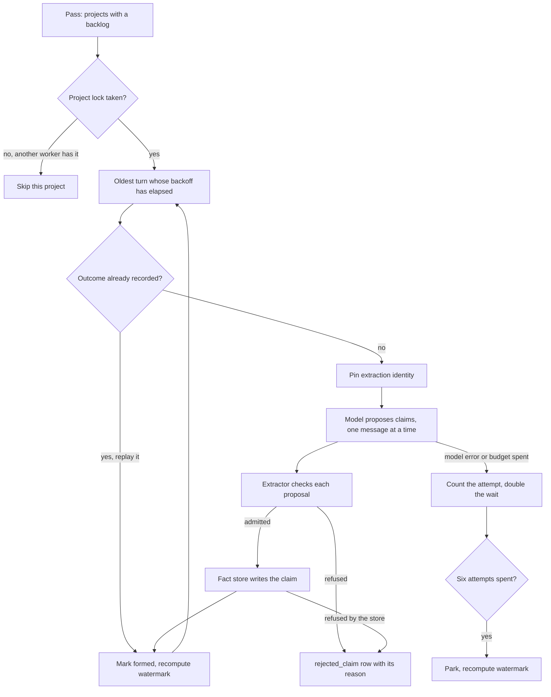
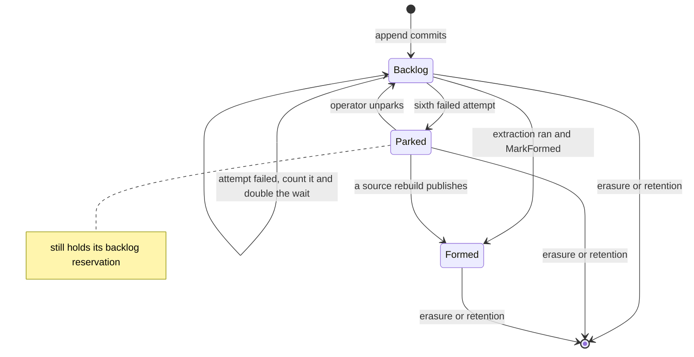

<!-- Copyright 2026 The Taisce Authors -->
<!-- SPDX-License-Identifier: Apache-2.0 -->

# Formation

Formation is the background work that turns a stored turn into facts. This page follows a turn from
the backlog through the model call and every check a proposal must pass, to the facts written, and
covers what happens to a turn that will not form.

**What you'll learn**

- why formation runs separately from the append, and what "formed" means;
- which processes run formation, and the settings that bound it;
- why several workers can run at once without stepping on each other;
- how a model's proposals are checked, and what is refused and why;
- how an admitted claim is written, including supersession and entity identity;
- what happens to a turn that keeps failing, and how an operator recovers it;
- the other work the worker drives: reports, compaction, notifications and health;
- what formation does when the model is slow or wrong, a worker dies, or two workers race.

Read [the write path](write-path.md) first. Formation starts where that page stops.

## Why formation is separate from the append

A turn is stored immediately and formed afterwards. Forming means one model call per message, and
putting that inside the append would make every agent's turn wait on a model.

So the project's `watermark` row carries two numbers:

- `log_offset` says a turn was stored, which the caller already knows;
- `formed_offset` is the highest offset whose turn has been through extraction with nothing
  unformed below it. This is what a recall depends on.

`GET /v1/freshness` reports both, together with the number of turns that were parked.

The formed watermark is recomputed from the backlog every time, never incremented. Two turns forming
at once finish in whichever order their model calls return. Incrementing would let the number run
past a turn still in flight, so a caller told "formed through 40" could be missing turn 12.

## Who runs it

The same binary serves every role. `TAISCE_ROLE` chooses the role, and `run` in
[main.go](../../cmd/taisce/main.go) wires it up.

| Role | HTTP routes | Formation driver |
|---|---|---|
| `all` (default) | the v1 API and MCP | yes |
| `api` | the v1 API and MCP | no |
| `worker` | `/health` and `/ready` on a loopback address only | yes |

The backlog lives in the database, not in a process. So an `api`-only deployment keeps storing turns
while the workers are stopped, for example during a provider incident, and the turns form when a
worker comes back. That is why the compose file runs one `api` service and a scalable `worker`
service ([compose.yaml](../../compose.yaml)).

`startDriver` needs three settings:

- `TAISCE_INFERENCE_ENDPOINT`;
- `TAISCE_INFERENCE_EXTRACTOR_MODEL`;
- `TAISCE_INFERENCE_ALLOWLIST`, the hosts allowed to receive message text (see
  [security](security.md)).

If any is missing, the process still starts and logs a `WARN` message beginning `MEMORY WILL NOT
FORM`. Storage, recall of what has already formed, and erasure all work without a model, and
refusing to start would make a first install fail in its first minute. The vocabulary is loaded
once, when the driver starts (`pg.LoadVocabulary`).

### The policy

`formation.DefaultPolicy` in [formation.go](../../internal/formation/formation.go) holds the bounds.
Only the turn budget is an operator setting.

| Field | Default | What it bounds |
|---|---|---|
| `MaxAttempts` | 6 | failed attempts before a turn is parked |
| `RetryAfter` | 10 s | first wait after a failure; doubles per attempt |
| `TurnBudget` | 5 min, from `TAISCE_FORMATION_TURN_BUDGET` | one attempt at one turn |
| `Interval` | 5 s | the wait between driver passes |
| `ReportsPerPass` | 4 | community reports written per project per pass |
| `SegmentsPerPass` | 4 | compaction segments written per project per pass |
| `NotificationsPerPass` | 16 | notification delivery attempts per pass |
| `SealInterval` | 5 min | how often the audit ledger is sealed |
| `RetentionInterval` | 1 h | how often expired rows are swept |

None of these numbers comes from a latency target, because none has been set. They were chosen for
the shape of the failure. With six attempts and waits of 10, 20, 40, 80 and 160 seconds between them,
a failing turn is parked after about five minutes of waiting, plus however long its six attempts
took.

## The driver's pass

`Driver.Run` in [driver.go](../../internal/formation/driver.go) runs a pass, waits one `Interval`, and
repeats. The wait is the same whether the pass found work or not, so a busy backlog does not turn the
driver into a tight loop hammering the database.

Each pass, in `Driver.Once`:

1. Records a heartbeat (see [health and progress](#health-and-progress)).
2. Asks `ScopesWithBacklog` which projects have turns that are neither formed nor parked. Projects
   are discovered from the log rather than configured, so a project created after the worker started
   is picked up.
3. For each of those projects, calls `Worker.Drain`. If the drain finished cleanly, it then runs the
   derived passes for that project: subjects and reports, compaction, and recording which
   notifications are owed. A project another replica is draining is counted as busy and skipped. A
   project that fails is logged and does not stop the others.
4. Attempts up to `NotificationsPerPass` due deliveries, across all projects.

Every `SealInterval`, the driver also seals the audit ledger and logs the head digest. Every
`RetentionInterval`, it sweeps expired rows, up to 500 per project per sweep. The first sweep runs on
the first pass, so an instance restarted after a long stop catches up on what should have expired
while it was down.

> [!NOTE]
> The derived passes run only for projects that had a backlog, and only after that project drained
> without error. A quiet project, with no new turns, gets no subject, compaction or notification
> pass.

That has three effects:

- Reports removed by an erasure, correction, retraction or fact rebuild are not rewritten until the
  project receives another turn.
- A gap that an erasure leaves in the compaction roll-up stays open just as long.
- A project with more unwritten reports than `ReportsPerPass` catches up only while turns keep
  arriving.

`taisce rebuild reports` runs the subject pass on demand. No command runs the compaction pass on
demand.

## Why several workers are safe

### One drain per project, under a session advisory lock

`Worker.Drain` takes its own connection and tries
`pg_try_advisory_lock(hashtext(namespace + "/" + project))`. If another session holds the lock, the
call returns `ErrScopeBusy` at once, and the driver moves on to the next project.

The lock is held across the whole drain, model calls included. A lock taken inside the transaction
that picks a turn would be released before the model call it was meant to protect. The lock is per
project, not per instance, so a busy project cannot starve a quiet one. Different projects form in
parallel on different workers; within one worker, projects are drained one after another.

A few details:

- `hashtext` is 32 bits, so two unrelated projects can hash to the same key. When they do, they take
  turns. Throughput suffers; correctness does not.
- The lock is released explicitly with a non-cancellable context. Otherwise the connection would go
  back to the pool still holding the lock, and the next borrower would hold a lock it knows nothing
  about.
- If the process dies, PostgreSQL releases the lock when the backend ends.
  `TestAWorkerThatDiesStrandsNeitherTheScopeNorTheTurn` kills the holding backend and shows another
  worker then forms the turn. `TestASecondDriverDoesNotFormTheSameTurnTwice` covers two drivers
  racing.

Fact identities are deterministic (see [writing an admitted claim](#writing-an-admitted-claim)). So
even if the lock failed, the same claim formed twice would resolve to one fact, not two. What the
lock adds is no duplicate model calls, consistent attempt counting, and never mixing two different
model answers for one turn.

### The formed watermark is recomputed under the row every append locks

`ObservationStore.MarkFormed` sets `formed_at`, but only if it is still empty, so marking twice is
harmless. It then locks the project's `watermark` row `FOR UPDATE` and recomputes `formed_offset`
(`advanceFormedWatermarkSQL`):

- one below the lowest turn that is neither formed nor parked;
- the highest stored offset, when there is no such turn;
- empty (NULL), when the unformed turn is at offset 0. A sentinel such as −1 would look like a real
  offset.

An append claims its offset by upserting the same row, so appends and recomputes queue up behind each
other. So do the recomputes done by parking, unparking, curated assertions and rebuilds. Two
recomputes can never interleave and overwrite each other's reads. The work under the lock is two
index lookups, not a model call. `TestTheFormedWatermarkNeverRunsPastAnUnformedTurn` holds this
property.

### One source at a time

Every transaction that writes a fact, a refusal or an extraction pin first takes `lockClaimSource`,
a transaction-scoped advisory lock on the namespace, project and source observation
([recordretraction.go](../../internal/infra/pg/recordretraction.go)). That serialises formation of a
source against a retraction, correction, recovery or rebuild of the same source. A hash collision
only delays unrelated work.

The remaining races are settled in the database:

- Two workers writing the same compaction segment hit a unique constraint, and the loser treats it
  as nothing to do.
- A report rewritten by the same writer is a no-op update.
- A notification delivery is claimed with `FOR UPDATE SKIP LOCKED`, so no two workers take the same
  one.
- Two current values for a single-value relation are refused by an exclusion constraint, whatever
  wrote them.

## One turn through formation

`Worker.Drain` picks turns one at a time with `NextUnformed`: the lowest offset that is neither formed
nor parked, and whose last failure is older than `RetryAfter × 2^min(attempts − 1, 6)`.

It takes the oldest first because the formed watermark sits just below the lowest unformed turn.
Forming newest-first would pin that number at the bottom while everything above it completed. The
backoff lives in the query, not in a sleep, so one failing turn neither spins nor blocks the worker
from moving on to the next.

Each attempt runs under a context bounded by the turn budget and calls `Former.Form`:

1. **Replay what is already recorded.** An authored assertion is re-asserted from what was authored
   (`ReplayCurated`). A source that a rebuild already reinterpreted is replayed from its recorded
   outcome (`ReplayGeneration`). Neither calls a model.
2. **Read the turn's messages** in order.
3. **Pin the extraction identity** before any model call (`FactStore.PinExtraction`). This commits
   even if the attempt then fails (see [pins](#receipts-pins-and-rebuilds)).
4. **Extract each message and write what survives.** Admitted claims go through
   `FactStore.AssertVersioned`, and every refusal becomes a row through `RejectVersioned`.
5. **Stop at the first model error.** Carrying on would form part of the turn and mark it done.

On success, the worker calls `MarkFormed`. On failure, it calls `RecordFormationFailure`, parks the
turn if its attempts are used up, and moves to the next turn. If the parent context was cancelled,
as at shutdown, the worker returns without counting an attempt, so a restart never uses up a turn's
retries.

> [!NOTE]
> A turn is not written atomically. Each claim is its own transaction. If the third message of a
> turn fails, the facts from the first two are already committed and visible to recall, even though
> the turn is not formed and freshness does not count it.

A retry extracts every message again. Identical claims resolve to the facts already written; a claim
the model words differently on the retry is written alongside them. If the turn is eventually
parked, the facts written before the failure stay. No test pins this behaviour.

## Extraction: what a model may propose, and what survives

### The model is a port

`extract.Model` in [extract.go](../../internal/extract/extract.go) has one method,
`Propose(ctx, message, vocabulary)`. It returns `Proposal` values, not `domain.Claim` values. A
proposal has no byte-span field, so a model has no way to supply a span. Preventing an unverified
span from reaching storage is the reason the [`internal/extract`](../../internal/extract/) package
exists.

The shipped implementation is `inference.Model` in
[extractor.go](../../internal/infra/inference/extractor.go). It calls `/chat/completions` on an
OpenAI-compatible endpoint.

- It does no retries of its own, because retrying is a backlog decision the worker owns.
- Its HTTP client timeout equals the turn budget, so the deadline that fires is the one the operator
  set.
- It reads at most 1 MiB of the response.
- A non-200 response is an error that includes the provider's body. That error is stored, truncated
  to 2,000 characters, in the observation's `formation_error` column, where erasure can reach it,
  rather than in a log file, where it cannot.

### The prompt is data, compiled in

The wording lives in [prompts/extraction.yaml](../../internal/infra/inference/prompts/extraction.yaml).
[prompt.go](../../internal/infra/inference/prompt.go) embeds it with `go:embed` and parses it once at
startup. It is never read from disk at runtime. A prompt the filesystem could change would let anyone
who can write next to the binary change what gets extracted, and extraction feeds the write path.

The loader requires seven non-empty sections: `task`, `relations`, `quote_rule`, `polarity`, `tense`,
`reply_shape` and `data_boundary`.

- The `relations` section must contain `{{relations}}` exactly once. The code renders the vocabulary
  there from the database: one line per relation with its name, object kind and description, in the
  database's order.
- The file also records the model contract: temperature 0 and `response_format` `json_object`.
- The code fixes the section order and always puts `data_boundary` last.
- A broken file panics at startup, because a binary whose embedded prompt does not parse must not
  start.

Editing the prompt changes behaviour, so a prompt change is checked against its regression corpus
before it ships.

The message goes in the user turn, as `Speaker: <role>` followed by the content between two markers.
The markers carry a random 24-character hex identifier, chosen after the content is known and chosen
again in the unlikely case the content already contains it (`userPrompt`, `newFence`). An attacker
who writes a fixed delimiter into their own text therefore cannot close the block early. This is a
weak defence, and the prompt file says so: it does not stop a determined attacker. What limits the
damage is the speaker rule described below.

### Reading the reply

`decodeEnvelope` finds the first JSON object with a `claims` key, trying at most 32 candidate opening
braces. Models often emit stray prefixes and code fences, and treating those as failures would throw
away correct extractions and eventually park good turns. Once found, the envelope is decoded strictly.

A reply with no envelope at all is an error, not an empty result. An empty result means "this message
asserts nothing", which is the ordinary case, so reading a broken reply as empty would make a
misconfigured model look like a quiet conversation.

### The admission checks, in order

`Extractor.Extract` applies these checks to each proposal and stops at the first that fails. The order
files each refusal under the most specific reason.

| # | Check | Refusal reason | Why here |
|---|---|---|---|
| 1 | The relation is in the vocabulary (`Ontology.Lookup`) | `unmapped_relation` | A relation outside the set is never an edge |
| 2 | The subject is not an unresolvable term, such as a pronoun | `unresolvable_subject` | Before the quote: a claim about nothing is wrong whether or not its quote exists |
| 3 | The quote is found in the message (`Locate`) | `unlocatable_quote` | Nothing can be cited without it |
| 4 | Polarity is `asserted` | `not_asserted` | A denial cites perfectly and is still not a fact |
| 5 | Tense is `present`, or `past` on an event relation | `not_current` | A past state would answer "where do they live" with a place they left |
| 6 | The same relation and ends did not already appear in this message | `duplicate_claim` | A repeat would spend a bundle row on a fact already held |

Polarity and tense each accept exactly one value. An empty or unknown value is refused, because a
model forgetting a field is routine, and treating the absence as "asserted" or "present" would write
facts nobody vouched for.

An admitted claim takes its object type from the vocabulary when the model gave none. Its validity
starts at the message's `occurred_at`. Its confidence is whatever the model reported.

### Span verification

`Locate` looks for the model's quote in the message: first an exact match, then a match that treats
any run of whitespace as a single space. The span it returns indexes the original bytes, never the
normalised copy.

- **Case is never ignored.** A model that changed the case retyped rather than copied, and a
  tolerance wide enough for that is wide enough to match a sentence the model made up.
- **The first occurrence wins.**
- **The stored quote is the message's own text** at that span (`message.Content[start:end]`), not
  the model's version of it.

So every admitted claim quotes its message exactly, by construction, without relying on the model.
`TestEveryReturnedSpanReproducesItsQuote` and `TestASpanIsCorrectInBytesWhenTheTextIsNotASCII` hold
this.

### The closed vocabulary

[Migration 0003](../../internal/migrate/sql/0003_a_closed_predicate_vocabulary.sql) seeds 39
relations, and a foreign key from `fact.predicate` makes the set closed rather than advisory. The
reference is `RESTRICT`, so retiring a relation that facts still use fails loudly instead of deleting
memory.

- Migration 0010 adds a composite key on `(predicate, cardinality)`, so the copy of cardinality on
  each fact can never disagree with the vocabulary.
- Migration 0054 adds the `event` flag.
- No later migration adds or removes a relation. `TestTheVocabularyStaysWithinItsDeclaredBounds`
  keeps the size between 30 and 50. Too few relations and real claims have nowhere to go, so memory
  is lost as unmapped refusals. Too many and near-duplicate relations come back, split across a set
  nobody can hold in their head. The test makes growing the set a deliberate change.

| Semantic type | Relations |
|---|---|
| identity | `has_name`¹, `has_role`¹, `works_at`, `member_of`, `lives_in`¹, `born_in`¹ ², `speaks`, `has_contact`, `has_timezone`¹ |
| preference | `prefers`, `dislikes`, `interested_in` |
| capability | `knows_about`, `uses`, `learning` |
| intent | `intends_to`, `committed_to`, `responsible_for`, `blocked_by` |
| social | `knows`, `works_with`, `manages`, `related_to` |
| possession | `owns`, `has_access_to` |
| structure | `part_of`, `instance_of`¹, `located_in`¹, `depends_on`, `same_as` |
| authorship | `created`², `contributed_to`², `participated_in`² |
| temporal | `occurred_on`¹ ², `scheduled_for`¹, `due_on`¹ |
| state | `has_status`¹ |
| constraint | `requires`, `prohibits` |

¹ Single value: at most one current value per subject; eleven relations in all.
² Event: a past-tense report is admitted and stays true, because "I was born in Cork" does not stop
being true. The event flag is not rendered into the prompt, so adding it did not change the prompt.

`same_as` records that somebody said two things are the same. Entity resolution never acts on it.

### The speaker rule

`bindSpeaker` in [speaker.go](../../internal/infra/pg/speaker.go) runs inside each claim's
transaction. It checks whether either end of the claim is a first-person term listed in
`speaker_term`, such as "I" or "me".

- **Neither end is a speaker term.** There is no gate. The fact is stored under the role of the
  message it came from.
- **One end is a speaker term, and the message's stored role is not `user`.** The claim is refused
  as `not_spoken_by_principal`. An assistant's "so you work at Ensera" is the assistant's inference,
  and a fetched document's "I" is somebody else.
- **One end is a speaker term, the role is `user`, but the attribution does not bind.** The claim is
  refused as `unresolvable_subject` (`ErrUnboundSpeaker`). This covers an observation with no data
  subject, and a stored subject or message role that does not match.
- **The claim binds.** The speaker resolves to a separate entity keyed by the observation's data
  subject, displayed as `speaker`.

So a `tool` or `assistant` message may state facts about named third parties, and they are stored
labelled with that role. What such a message can never do is write a claim that speaks for the
person. Recall returns only user-role facts unless the caller asks for other roles; see
[the read path](read-path.md).

The rule reads the role stored with the message, and the client that wrote the turn declared that
role. It is only as trustworthy as that client.

### Refusals are rows, and they keep their words

Every refused proposal is written to `rejected_claim` with its relation, statement, quote, reason and
extractor identity. The relation column deliberately has no foreign key, so unmapped relations can be
recorded verbatim.

Why keep the words? A count per reason cannot tell one missing relation asserted five hundred times
(fixed by adding one vocabulary row) from five hundred different relations asserted once (noise). The
words can. Because those rows hold somebody's words, each is registered for erasure like any other
derived row. A retry does not duplicate them: a row's identity is derived from the source, ordinal,
relation, statement, quote, reason and extractor identity (`rejectedIdentity`).

A check constraint limits the reasons to eight (migration 0053): the six in the table above, plus
two the fact store raises:

- `not_spoken_by_principal`, from the speaker rule;
- `entity_name_limit`, when an end's name is longer than the bound or is one spelling too many for
  one entity. The rest of the turn still forms;
- `conflicting_value`; see [supersession](#supersession-is-a-constraint-not-a-lock).

A claim that a person has retracted is counted as retracted, not written as a refusal row.

The content-free records live elsewhere: the per-turn counts `Former.Form` returns, the formation
health counters, and the parked-turn listing.

## Writing an admitted claim

`FactStore.AssertVersioned` in [factstore.go](../../internal/infra/pg/factstore.go) writes one claim in
one transaction, in this order:

1. **Refuse a claim with no cardinality.** Cardinality decides whether the claim replaces an old
   value, and it comes from the vocabulary.
2. **Take the source lock**, then **bind any speaker reference** (above).
3. **Check the extraction pin.**
4. **Refuse a claim a person has retracted** from this source.
5. **Derive the fact's identity** (`sourceClaimID`): a name-based UUID over the project, source,
   message ordinal, relation, and the kind and normalised key of each end. If that fact exists, it
   wins. If it was lost, it is restored from its receipt. Neither case invents a new citation.
6. **Resolve both ends** to entities (below).
7. **Choose the knowledge timestamp.** For a single-value relation this is the later of the database
   clock and one microsecond after the latest current knowledge it could replace. A clock that stepped
   backwards therefore cannot produce a reversed range.
8. **Close the current value**, for single-value relations only (below).
9. **Insert the fact, then its evidence.** The fact carries its `valid` range, its `known` range and
   the message's role. The evidence carries the source observation, message ordinal, quote, byte span
   and extractor identity. The ordinal is part of the evidence key, because a span taken against the
   wrong message of a turn would still resolve, just to the wrong sentence.
10. **Register the fact for erasure and keep its receipt**, so the recorded outcome can be restored
    later without a model.

### Supersession is a constraint, not a lock

`fact_single_cardinality_excl` is an `EXCLUDE USING gist` constraint over project, subject, relation,
overlapping `valid` and overlapping `known`, for single-value facts whose subject is resolved.
[Migration 0010](../../internal/migrate/sql/0010_supersession_is_a_constraint_rather_than_a_lock.sql)
created it, and migration 0032 added `known`.

A lock would be correct only as long as every write path remembered to take it. The constraint is
correct because the database will not store the violation, whichever path tries.

`supersedeSQL` does the replacement. It finds the current value that started strictly earlier,
copies its interval to `fact_history` with erasure registrations, and closes its `valid` range at the
new value's start, so the two intervals meet exactly. The constraint is the backstop, and it leads to
three outcomes worth knowing:

- **Two current values from one message** share one start time, so neither can close the other. The
  second insert is refused. The store names the violation `ErrConflictingValue`, and formation
  records it as `conflicting_value`. The first value in message order wins, and the turn completes
  rather than failing and parking.
- **An earlier-dated claim that arrives after a later one** is not closed by the supersede
  statement, which only closes strictly earlier starts. Its insert overlaps the current value and is
  refused the same way. Out-of-order arrival is answered by a correction, never by an invented
  interval.
- **Many-value relations** accumulate. Only the same claim repeated from the same source resolves to
  the same fact.

`TestASingleCardinalityFactSupersedesRatherThanAccumulates` and
`TestTheDatabaseRefusesTwoOverlappingSingleCardinalityFacts` hold this.

### Entity identity

`resolveEntity` resolves a named end by its normalised name: lowercased, with whitespace collapsed
and trimmed (`domain.NormalizeName`). It upserts on `(scope, normalized_name)` for named entities.

- The entity type is an attribute, not part of the key. One thing seen once as a `place` and once as
  a `thing` should be one node, not two halves of what is known about it.
- The canonical name is kept as first seen.
- A name longer than 4,096 bytes is refused.
- A blank end resolves to nothing. The fact is still stored, and traversal skips that end.

Resolution never merges by meaning. Over-merging puts two people's facts on one node, and no later
read can undo that. Under-merging costs recall one hop and leaves the entity reachable under its own
name. Entity embeddings can suggest candidates for a caller to judge, but they never resolve.

Each source's exact spelling is kept in `entity_name_receipt`, owned by that source
([entitynames.go](../../internal/infra/pg/entitynames.go)). The entity's alias list is a display
cache of at most 64 spellings, rebuilt from those receipts when needed.

A 65th spelling fails the claim's transaction. That is not a recorded refusal reason, so it fails the
whole turn, which is then retried and eventually parked.

## A turn that will not form

`RecordFormationFailure` increments `formation_attempts`, stamps `formation_failed_at`, and keeps the
reason in `formation_error`, truncated to 2,000 characters. The reason lives on the observation so
that erasing the turn also erases a provider message that may quote it. Recording a failure against a
turn that has since formed, or been erased, does nothing.

When attempts reach `MaxAttempts`, `Park` sets `parked_at` and recomputes the watermark in the same
transaction.
[Migration 0009](../../internal/migrate/sql/0009_a_turn_that_will_not_form_is_parked_not_lost.sql)
requires a parked turn to have been attempted, and makes parked and formed mutually exclusive.

Parking moves the formed watermark past the turn, so one bad turn cannot freeze a project's memory.
That makes `formed` mean "formed, except these", which is acceptable only because the exception is
visible: freshness reports `parked`. A parked turn keeps its backlog reservation, and its observation
and messages are untouched. Facts written before the failing message stay, as described above.

### Recovering a parked turn

Recovery is deliberate:

- `taisce formation parked --project <name>` lists a page of 1–200 parked turns with metadata only:
  id, offset, attempts and time. Never content or provider errors.
- `taisce formation unpark --project <name> <uuid>` runs `ObservationStore.UnparkAudited`. It clears
  the attempts and the error, recomputes the watermark (which can move it down, since the turn is
  unformed again), and writes a `formation.unpark` ledger row in the same transaction. The principal
  is a UUID generated per invocation, because the operator's database connection is the authority.
  See [operating the backlog budget](../06-ingestion-budget.md).
- A source rebuild that publishes also clears `parked_at`.

The states come from three columns on `observation`:

- **Backlog:** `formed_at` and `parked_at` are both empty; `formation_attempts` counts failures.
- **Formed:** `formed_at` is set, and never cleared. Reinterpreting a formed turn is a rebuild, not a
  repair.
- **Parked:** `parked_at` is set.

Erasure and retention delete the row from any state. Authored assertions and artifacts are written
straight into Formed and never pass through the backlog.

## Receipts, pins and rebuilds

**Receipts.** Every admitted fact keeps a `fact_receipt`, written in the same transaction: the exact
record, its evidence, its entity identities and its extraction identity. A model's interpretation,
and the moment it became knowledge, cannot be recomputed from the words alone. So
`taisce recover facts` restores missing facts from receipts without calling a model, first checking
the quote against the surviving message bytes ([recovering recorded facts](../15-fact-recovery.md)).

**Pins.** `Extractor.PipelineVersion` in [identity.go](../../internal/extract/identity.go) stamps every
attempt with `extract/v2:<sha256>`. The digest covers:

- the proposer's own identity: model name and endpoint origin, its compiled request and parse code,
  and the prompt file;
- a hash of the compiled `extract.go`;
- the vocabulary, in order;
- the sorted set of unresolvable terms.

Credentials and message content are excluded. A proposer that cannot identify itself gets the fixed
label `extract/v1`, which proves nothing about which model ran.

`PinExtraction` records the identity in `source_extraction` before the first model call, and later
writes for that source must match it. So a worker restarted with a different model or prompt cannot
mix two interpretations in one turn: it fails with `ErrExtractionChanged` before calling the model.

What this means for operators: a turn already attempted under the old configuration fails every
attempt under the new one, and parks. It completes only under its original configuration or through
an explicit rebuild.
`TestConfiguredExtractionIdentitySurvivesRecoveryAndRefusesMixedSourceRetries` holds this.

**Rebuilds.** Reinterpreting stored turns under a new extractor is `taisce rebuild project`. It
publishes one source at a time, while `GET /v1/freshness` reports a `rebuilding` object. See
[governance](governance.md#rebuild-and-recovery) and
[fact generations and rebuild](../20-generation-rebuild.md).

## The turn budget

`TAISCE_FORMATION_TURN_BUDGET` takes a positive Go duration such as `5m` or `900s`. Anything else
refuses startup (`configuredTurnBudget`). It bounds one attempt twice: as the deadline the worker
sets, and as the extraction client's HTTP timeout.

A conversation turn is far below the default. The setting exists for document-sized turns, and
[splitting documents into segments](write-path.md#documents) is the better answer to those.

Two things do not follow the setting:

- **The health window.** The formation health window (`FormationHealthMaxAge`, 330 seconds) is a
  constant sized for the five-minute default. A worker inside an attempt longer than that writes no
  heartbeat until the attempt ends, and fails readiness in the meantime.
- **The rebuild commands.** `Rebuilder.rebuild` bounds each source by the default five minutes,
  whatever the setting says. `rebuild project` and `rebuild reports` use the default outright.

## Derived work the worker drives

### Subjects and reports

After a drain, `Subjects.Run` in [subjects.go](../../internal/formation/subjects.go) partitions the
project's graph and writes the reports that are missing.

- **The graph.** Every current fact with both ends resolved is an edge, weighted by how many
  relations join the two entities (`CommunityStore.Graph` in
  [communitystore.go](../../internal/infra/pg/communitystore.go)).
- **The partition.** [`internal/community`](../../internal/community/) groups entities by density
  against a resolution, deterministically, with no randomness. A group with more than 24 members is
  split again at a stricter density. Both numbers, `Resolution` = 0.05 and `MaxSize` = 24, are marked
  provisional in the code.
- **Identity.** A community's identifier is derived from its level and sorted members, so a subject
  whose membership did not change keeps its identifier and its report. `Replace` reconciles the new
  partition against the old one instead of rewriting it.
- **Writing.** `Unwritten` returns communities with no report, or with a report by a different
  writer (`written_by`), deepest level first, up to `ReportsPerPass`.
  [`internal/report`](../../internal/report/) builds each report's material from the facts and their
  quotes within `ReportBudget`, 12,000 characters. A parent too large to fit is described from its
  children's reports.
- **Publishing.** `CommunityStore.Write` locks every source observation, compares each one's
  `fact_revision` with the revision the material was read at, and registers the report to every
  source. If a source changed or disappeared while the model was writing, publication refuses.

When a report's facts change, the report is deleted rather than kept stale, and a later pass writes
it again. A deployment with no report model still forms subjects, and just writes no prose. One
community the model could not describe does not stop the others.

The pass reads every current fact in the project and reconciles every community row, on every pass
in which the project had new turns. Its cost therefore grows with the size of the project's graph.
That is the first place this pass will slow down as a project grows. It has not been measured.

### Compaction segments

`Compaction.Run` in [compaction.go](../../internal/formation/compaction.go) rolls up each data
subject's formed history along the time axis ([compaction](../33-compaction.md)):

- The newest eight turns stay verbatim (`Verbatim`).
- Every run of eight older formed turns becomes a level-1 segment, every eight level-1 segments a
  level-2 segment, and so on up to level six (`Branch`, `MaxLevel` in
  [`internal/compaction`](../../internal/compaction/)).
- Material over 48,000 characters (`MaxMaterialCharacters`) is cut from the oldest turn, and the cut
  is counted.
- The summariser's prompt is the compiled-in
  [compaction.yaml](../../internal/infra/inference/prompts/compaction.yaml).
- `SegmentStore.Write` registers a segment to every observation it covers. It refuses if the range no
  longer holds the turns the plan counted, and treats a segment another worker wrote first as nothing
  to do.
- Only observations with a data subject are compacted.

### Notifications

After the other derived passes, the driver reads the watermark they left behind
([being told that memory formed](../34-notifications.md)).

- For each live endpoint the project registered, `NotificationStore.Owed` records a delivery. A
  unique constraint on the endpoint and `formed_through` makes this idempotent, so most passes insert
  nothing.
- Deliveries are claimed with `FOR UPDATE SKIP LOCKED`; a dead worker releases its claim by losing
  its connection.
- Each delivery is signed and carries only a project, two offsets and a parked count.
- A failure is retried up to six times, with the wait doubling from five seconds. A `4xx` answer is
  final at once. An exhausted delivery is parked where an operator can list it.

Delivery never runs inside a formation transaction. A send there would either roll back a turn
because somebody's endpoint was down, or swallow the failure. Which destinations are allowed, and the
checks at registration and send time, are in [security](security.md).

### Health and progress

The driver writes a heartbeat at the start of every pass and after every attempt, using the
connection it already holds. It goes to one aggregate `formation_health` row: heartbeat time, formed
count, failed attempts, and last progress and failure times (`RecordFormationHealth` in
[operationalhealth.go](../../internal/infra/pg/operationalhealth.go)). Nothing in it names a project,
subject, observation or error. There is no separate timer, so a stuck drain cannot look healthy.

- With `TAISCE_REQUIRE_FORMATION=true`, API readiness also needs a heartbeat from some worker within
  330 seconds.
- A worker's own readiness, on its loopback address (default `127.0.0.1:8082`), needs its own recent
  progress.
- `taisce health` returns the full snapshot over the operator connection
  ([operational health](../07-operational-health.md)).

A fresh heartbeat does not prove that the provider can form every turn, or that every project is
moving.

### What formation does not drive: embeddings

Message, entity and report vectors belong to explicit, immutable embedding generations. The
formation driver builds none of them. An operator starts, builds and activates generations with
`taisce embeddings`, `taisce entity-embeddings` and `taisce report-embeddings`.

- **Messages.** `taisce embeddings follow --watch` keeps an active message generation caught up with
  new turns ([message embedding generations](../22-message-embeddings.md)).
- **Entities and reports.** A generation is a fixed snapshot. A new named entity makes every entity
  generation in the project stale, and any report change makes every report generation stale
  ([community-report embeddings](../25-report-embeddings.md)). Search against a stale generation
  refuses before calling the provider, until a replacement generation is built and activated.

The shipped compose file runs no embedding follower. On a project that keeps forming, entity and
report candidate search therefore stops answering after the first new entity or report, until an
operator acts. [The read path](read-path.md) covers how recall reports a surface that did not run.

## When things go wrong

### The model is slow

- An attempt that runs past the turn budget is cancelled, counted and retried with a doubling wait.
  After six attempts the turn is parked, and the project's watermark moves past it.
- While a worker waits on a model, it holds the lock on that one project. Its other projects wait
  for the next pass, but other workers can take them. Adding workers is how formation throughput
  grows.
- The derived passes are bounded by `ReportsPerPass` and `SegmentsPerPass`, so a slow report or
  summary model cannot hold a project for an unbounded number of calls.
- A provider outage fails every turn at once. The doubling wait means turns take about five minutes
  of failures to park, and parked turns keep their reservations. So the backlog budget fills, and new
  writes get `429` rather than growing without bound
  (`TestProviderOutageCannotGrowTheBacklogByParkingAndRecoveryRestoresAdmission`).

### The model is wrong

- Every check above is about the form of a claim, not whether it is true.
- A relation outside the vocabulary, a paraphrased quote, a denial, a hedge, a past state and a
  pronoun subject are all refused and recorded with their words.
- A malformed reply is an error that is retried and eventually parked, never read as "nothing
  asserted".
- A well-formed, correctly quoted, wrong claim from a user message is admitted. The evidence span is
  what lets a reader check it, and correction and retraction are how a person fixes it.
- Text planted in a document or tool result can at worst become a fact about a third party, labelled
  with the `tool` or `assistant` role, which recall leaves out by default. It cannot become a
  statement by the person.

### A worker dies mid-transaction

- The claim transaction in flight rolls back. Claims already committed stay, and a retry resolves
  them to the same identities.
- PostgreSQL releases the project lock when the backend ends, and another worker forms the turn.
- The attempt that died is never counted, because `RecordFormationFailure` never ran.

That last point has a limit: a turn whose processing reliably crashes the process is retried without
its attempts being counted, so it never parks.

### Two workers race

- The second worker to reach a project finds the lock held and moves on.
- Appends and watermark recomputes queue up behind each other on the watermark row.
- Formation, retraction, recovery and rebuild of one source queue up behind the source lock.
- Segments and reports settle their races through constraints and no-op updates.
- Deliveries are claimed with `SKIP LOCKED`.
- The exclusion constraint refuses a second current value, however it arrived.

## Where to go next

- [The write path](write-path.md): how a turn gets into the backlog that formation drains.
- [The read path](read-path.md): what recall returns from what formation wrote, and how freshness
  bounds it.
- [Governance](governance.md): erasure, retention, corrections, retractions and rebuilds against
  formed memory.
- [Security](security.md): model egress, the notification destination policy, and the speaker rule in
  the threat model.
- [PostgreSQL concurrency](../postgresql/concurrency.md) and
  [data model](../postgresql/data-model.md): the locks and tables named here.
- [Operating the backlog budget](../06-ingestion-budget.md) and
  [operational health](../07-operational-health.md): the runbooks.
