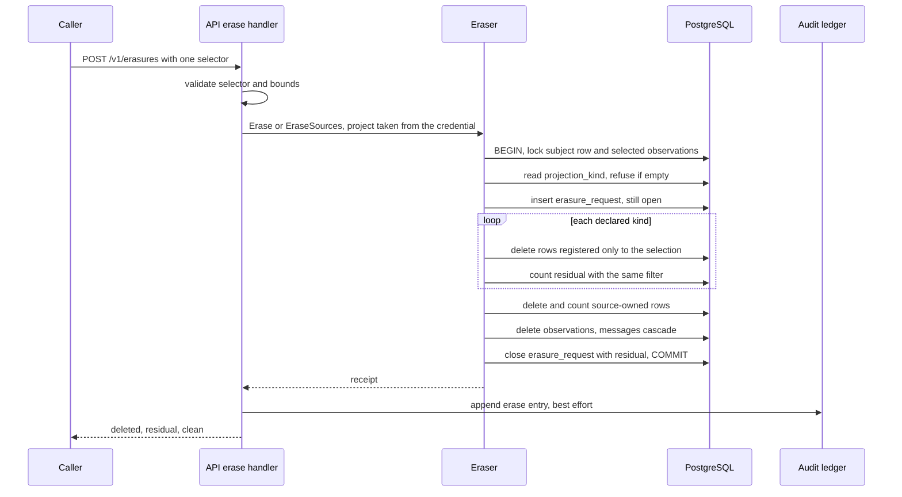
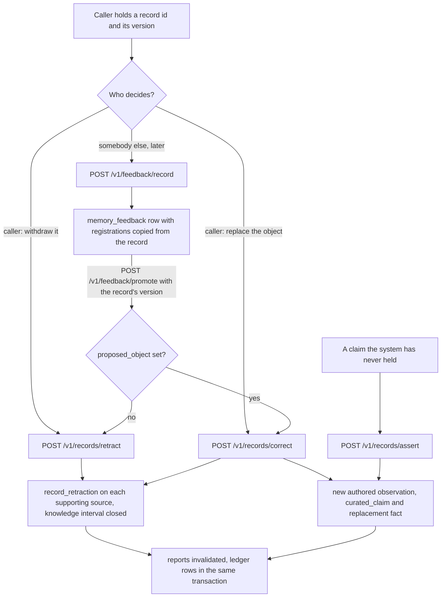

<!-- Copyright 2026 The Taisce Authors -->
<!-- SPDX-License-Identifier: Apache-2.0 -->

# Governance

Governance is how memory that has already been stored is corrected, withdrawn, erased, exported and
accounted for. This page explains each operation as the code does it today, and says plainly where
each guarantee stops.

**What you'll learn**

- the one principle underneath all of it: the observation log is the authority, and everything else
  is registered to it;
- how erasure works, what its receipt proves, and what it cannot reach;
- how to withdraw a wrong entity without erasing anyone's words;
- how export and retention work, and their current gaps;
- how retraction, correction, assertion and feedback change what memory believes;
- how rebuild and recovery work;
- what the audit ledger records, how it seals itself, and what it cannot prove.

Read [the architecture overview](overview.md) and [the write path](write-path.md) first. They
explain what an observation is and how formation turns one into facts.

## The principle: one authority, everything else registered

An **observation** is one turn as it arrived: its messages, who they are attributed to, and when
they were written. The observation log is the only authority on what was said.

Everything formation makes from it is a **projection**: chunks, facts, entities, their history,
refused claims, embeddings, community reports and compaction segments. Every projection row records
which observation produced it, and on whose behalf.

That record is a row in `projection_dependency`, called a **registration**. Each registration names a
**projection kind**, and the kinds are rows in `projection_kind`.
[Migration 0007](../../internal/migrate/sql/0007_a_projection_kind_declares_where_it_lives.sql) links
the two with a foreign key, so a projection of an undeclared kind cannot be registered at all. A new
kind of derived data fails the first time it is written, instead of being silently missed by an
erasure later.

The kinds declared today:

| Kind | Table | Kept when another person also registered it |
|---|---|---|
| `chunk` | `chunk` | yes |
| `fact` | `fact` | yes |
| `entity` | `entity` | yes |
| `rejected_claim` | `rejected_claim` | yes |
| `fact_history` | `fact_history` | no |
| `community_report` | `community_report` | no |
| `segment` | `segment` | no |
| `message_embedding` | `message_embedding` | no |
| `entity_embedding` | `entity_embedding` | no |
| `report_embedding` | `report_embedding` | no |
| `agent_artifact` | `agent_artifact` | no |
| `feedback` | `memory_feedback` | no |

The last column is `survives_sharing`, added by
[migration 0019](../../internal/migrate/sql/0019_a_kind_declares_whether_sharing_saves_it.sql). It
separates two kinds of shared row:

- An entity is a **shared identity**. `Dublin` means the same thing to everyone who mentioned it, and
  keeping it when one of them leaves discloses nothing about them.
- A community report is **shared text**. It is prose written from several people's words, and each
  person's material is in it. Keeping it because somebody else also contributed would leave the
  departing person's words behind.

The column defaults to `false`. A kind added by someone who never read the migration therefore
deletes too much rather than leaking. An over-deletion is visible to whoever lost the data; a leak is
visible to nobody.

### Rebuild, never repair

A projection is not maintained by editing it. When the rules that produce it change, it is derived
again from the observations. When an observation is erased, the projections only it supported are
deleted with it, and anything derived later starts from what survived
([erasurestore.go](../../internal/infra/pg/erasurestore.go)).

That is what makes a residual of zero a **property of how the system is built**, rather than
something someone had to check for. There are three reasons:

1. The eraser iterates the registry (`declaredKinds`), not a hard-coded list of tables. A kind
   declared by a migration is covered without changing the eraser.
2. The delete and the residual count use one filter, in one transaction, before the observations
   are deleted. So the count cannot be a meaningless zero from a filter that no longer matches
   anything.
3. Nothing is re-derived from an erased source afterwards, because the source no longer exists.

**What this does not cover.**

- The foreign key guarantees every registration names a declared kind. It does not guarantee every
  projection row has a registration. Artifacts require one through deferred constraints, and
  `FeedbackStore.Record` refuses to write feedback without one. For the other kinds, the writers'
  code and the tests are what hold it. A projection row written with no registration would be
  invisible to erasure, and its residual would read zero.
- The source-owned tables described below are listed in the eraser's code, not in the registry.
- `agent_artifact` is registered for governance but cannot be re-derived. Registration marks it for
  erasure; it is not a promise the row can be rebuilt.

### Source-owned input is not a projection

Some rows are human or governance input tied to one observation. A model cannot regenerate them, so
they are **source-owned**:

| Table | What it holds |
|---|---|
| `curated_claim` | The structured claim behind an authored assertion or correction |
| `record_retraction` | A withdrawal instruction held by a supporting source message |
| `fact_receipt`, `fact_receipt_history` | The recorded state recovery restores from |
| `source_extraction` | The extraction identity first pinned for a source |
| `entity_name_receipt` | A name spelling, owned by the source that used it |
| `fact_generation`, `fact_generation_record` | Rebuild lineage |
| `data_subject`, `subject_retry` | The subject registry and its retry receipts |

A fact's evidence is not in this list, and does not need to be: a fact's identity includes the turn
and the ordinal it came from, so every evidence row names its own fact's turn, and the row goes when
the fact does, by cascade. The walk still runs one delete over evidence as a guard, and reports
`fact_evidence_orphaned` if it ever removes a quote that escaped that cascade. In a healthy project
it removes nothing and the key is absent.

These rows go when their observation goes, and each is deleted and counted by name in the erasure
walk. Back them up together with the observations: recovery reads them, and nothing can reconstruct
them if they are lost.

## Erasure

### One path, two ways to select

`POST /v1/erasures` names either a data subject (`data_subject_id`) or a set of source observations
(`source_observation_ids`). It must name exactly one of them.

- **A subject erasure** removes everything a person's turns produced, and the person's registry
  entry.
- **A source erasure** removes a set of turns by their own ids. This covers material with no data
  subject: a document stored project-wide, a file ingested by mistake, or a takedown. Ingestion
  already writes the observation ids to its manifest, so you already hold what a source erasure
  needs. A source erasure never touches the data-subject row: the person's other turns survive, and
  so does the person.

Both ways walk the same path. `erasureSelector` in
[erasurestore.go](../../internal/infra/pg/erasurestore.go) renders the selection once, as a filter by
attribution or by id, and every statement in the walk takes `(scope, selector)` and nothing else. Two
separate walks would have produced two receipts with different meanings under one name; one walk
keyed two ways produces one meaning.

The request's limits are checked in the handler ([api.go](../../internal/api/api.go),
`Server.erase`):

| Request | Answer |
|---|---|
| Neither selector | `400` |
| Both selectors | `400` |
| More than 10,000 source ids (`maxErasureSources`) | `400` |
| A source id that is not a UUID | `400` |
| An id from another project | Matches nothing, because every filter is scoped to the project first. The receipt reports zero deleted |
| A retry of a completed erasure | Answered, not refused: zero deleted, zero residual |

Erase a larger document in several requests, each with its own receipt.

### What one erasure does

The walk is `Eraser.erase`. Each step is where it is for a reason.

**Locks first.** A subject erasure locks the `data_subject` row. Both kinds then lock the selected
observations `FOR UPDATE`, in id order. This serialises the erasure against registry updates and
against formation of the same turns. A source accepted after the erasure commits is new data, not a
retry of the erased one.

**The registry is read per erasure, never cached.** A cache would be a copy of the one thing that
must never be stale. An empty registry is refused outright, because it would produce an empty
residual that looks like a clean sweep and proves nothing.

**The receipt is opened before anything is deleted.** The `erasure_request` row exists from the
start of the transaction and is closed at the end. Its constraint
`erasure_residual_with_completion_chk` in
[0001_the_spine.sql](../../internal/migrate/sql/0001_the_spine.sql) requires `residual` to be set
exactly when `completed_at` is. An erasure cannot claim a residual it did not finish counting.

**Each kind is deleted, then counted, through its registrations.** `selectErasableSQL` picks the
projection ids the selection registered. For a kind that survives sharing, it skips any projection
that another person or source also registered. `countResidualSQL` runs the same filter after the
delete. So a shared entity that stays is correctly not counted as residual.

**Source-owned rows are deleted and counted by name**, in this order:

- rebuild lineage (`eraseGenerationMetadataTx`);
- name spellings (`removeEntityNamesTx`);
- the evidence quotes of shared facts;
- withdrawal instructions;
- curated claims;
- formation receipts (`receiptOwnershipSQLFor`);
- extraction pins.

A receipt belongs both to the source that recorded a fact and to any later source that replaced it,
so erasing either one reaches it.

**The observations go last.** Deleting them cascades the registrations away. If the observations went
first, every residual count would run against a filter that matches nothing, and read zero. Zero would
then mean "nothing was checked", not "nothing survived".

The whole walk is one transaction. A crash leaves nothing half-erased. A concurrent formation, or a
concurrent erasure of the same subject, cannot be counted as this erasure's residual or as its work.

### The receipt: `deleted`, `residual` and `clean`

The response carries `deleted` and `residual`, both per kind, plus `clean`. `clean` is
`Erasure.Clean` in [domain.go](../../internal/domain/domain.go): true when every residual value is
zero. The two maps only mean something together:

- `deleted` alone cannot tell a thorough erasure from one that found nothing;
- `residual` alone cannot tell a clean sweep from a subject who was never here.

`residual` has a key for:

- each declared projection kind;
- `fact_generation_record` and `fact_generation`;
- `entity_name_receipt`;
- `record_retraction` and `curated_claim`;
- `fact_receipt_history` and `fact_receipt`;
- `source_extraction`;
- `data_subject`, for subject erasures only.

What `clean` does **not** say:

- **Some deletions are not re-counted.** The observations and their messages are deleted by a
  statement whose filter is the selection itself. That shows in `deleted.observation`, but has no
  residual key. Shared-fact evidence quotes are deleted and appear in neither map.
- **A shared fact or entity survives, by design.** A fact supported by another source is kept, and
  so is the statement written when it first formed. Only the erased source's quote goes.
- **What other people said about this person survives.** A subject erasure removes the person's own
  turns. A fact drawn from somebody else's turn about them belongs to that other person's
  observation, and so does an entity named after them that someone else also mentioned. To remove
  those, erase the other observations by source, or withdraw the entity (below).

The receipt is kept in `erasure_request` indefinitely, and an operator can list receipts with
`POST /manage/v1/erasures/list`. A receipt holds:

- the selector: the subject id or the source ids;
- the caller's `reason`;
- the times;
- the residual.

It holds no content. It does hold the subject identifier, which is only pseudonymous if the
application made it so ([subject inventory](../19-subject-registry.md)), and a free-text reason that
nothing limits except the request body size.

### What erasure does to reports and segments

A community report and a compaction segment are both model-written prose, and both are declared not
to survive sharing.

**Reports.** A report registered to any erased observation is deleted, even if other people
contributed to it. The subject pass writes a replacement from what survived.

Deleting a fact or its evidence also fires `invalidate_fact_reports`
([migration 0031](../../internal/migrate/sql/0031_reports_follow_source_fact_revisions.sql)). The
trigger advances each source's `fact_revision` and deletes every report registered to those sources.
A report's registration carries the revision it was written from, under a foreign key, so a report
that has fallen behind its sources cannot stay registered.

**Report history is given up on purpose.** A report is destroyed, not kept as a superseded version,
when its facts change. The only way to keep an old report row would be to drop its registrations, and
a report with no registrations would be invisible to erasure. The cost is a window: a recall that
would have returned a theme returns none until the subject pass or `taisce rebuild reports` writes it
again.

**Segments.** A segment stands in for a range of one person's turns. Erasing any turn it covers
deletes the segment, and the compaction pass writes a new one from what survived
([migration 0055](../../internal/migrate/sql/0055_a_segment_stands_in_for_the_turns_it_covers.sql)).

### What erasure cannot reach

The residual is a query against live rows, inside the database that holds them. It proves that no
visible row matching the selection survives. It proves nothing about copies outside that query's
reach.

**The model provider.** Formation sent the erased turns' text to an OpenAI-compatible endpoint for
extraction, and embeddings, reports and segments sent derived text the same way. Whatever the
provider, or a proxy in front of it, logged or kept is outside this system. An erasure cannot reach
it, and a receipt cannot count it.

**Backups.** A base backup or archived WAL segment taken before the erasure still contains the erased
rows, until it ages out under your backup policy.

> [!WARNING]
> Restoring to a point before an erasure brings the data back, and loses the `erasure_request` row
> with it. Nothing in Taisce re-applies an erasure after a restore. If you need that, keep the
> receipts outside the database and replay them. (This follows from the design; no test exercises
> it.)

**WAL, replicas and the heap.**

- A streaming replica applies the delete and catches up with the primary.
- WAL kept on the primary for replication slots or archiving holds the old row images until it is
  recycled.
- In the table files, a deleted row is a dead tuple until `VACUUM` marks its space reusable, and even
  then the bytes remain until something overwrites the page.

The residual is a count of visible rows. It is not a statement about physical storage.

**Clients.** Whatever an application or agent framework holds is out of reach: context windows,
caches, and any store of its own. That is one reason sessions are kept in Taisce as artifacts (see
[sessions](#sessions)).

**Deliberate survivors.** Some things are designed to outlive an erasure because they hold no
content:

- the audit ledger, which holds no subject;
- rebuild job checkpoints;
- formation health counters;
- per-operation retry-key digests, which stop an erased operation from being replayed.

The MCP surface offers no erasure at all.

## Withdrawing an entity

An entity is an inference: the extractor decided that some words name a thing, and that the thing is
this node. When that inference is wrong, every claim anchored to the node is wrong with it. Two people
merged into one, or a phrase read as an organisation, are typical cases. Erasure is the wrong tool
here: it is about a person's data, and this is the system's own mistake.

`POST /v1/entities/purge` takes an entity id, a reason and `confirm`
([the identity behind a record](../29-entity-inspection.md)). `RecordStore.PurgeEntity` in
[entitypurge.go](../../internal/infra/pg/entitypurge.go) always runs the whole transaction:

1. Lock the entity.
2. Count what the purge would cost other people:
   - the distinct data subjects whose claims stand on the entity;
   - the claims from turns attributed to nobody;
   - the supporting turns.
3. Delete, in order:
   - the evidence of every fact whose subject or object is the entity;
   - those facts;
   - the entity's name receipts;
   - the entity itself.
4. Count what still refers to the entity, inside the same transaction.

Without `confirm`, the transaction rolls back. With it, the same transaction commits.

**The preview is the purge, rolled back.** It is not a separate query that tries to match it. A count
computed by one set of queries and a delete done by another are two filters with one name. They agree
until somebody edits one of them, which is the day an operator approves a preview and gets something
else. The price is that a preview holds the purge's locks for the length of its transaction.

**The words stay.** A purge removes the node and the claims standing on it, and leaves the
observations and messages untouched. Those words are the evidence that the extractor got it wrong,
and the input a better extractor will be given. A later rebuild may propose the entity again, which
is correct. If you need the words gone, use erasure by subject or by source.

A purge is a write, so a read-only credential is refused. An unknown id, a malformed id and another
project's entity all get the same `404`. The ledger records `entity.purge` for both the preview (with
magnitude zero) and the purge (with the number of rows removed).

**What it does not cover.**

- **A purge leaves no receipt row.** Its only lasting trace is the ledger entry, which is written
  after commit on the best-effort path described under [the audit ledger](#the-audit-ledger).
- **Recovery can bring the facts back.** A purge does not delete the facts' formation receipts, and
  `taisce recover facts` restores any receipt whose fact row is missing, re-creating the entity from
  the receipt's snapshot. (This is read from
  [factreceipt.go](../../internal/infra/pg/factreceipt.go); no test runs a recovery after a purge.)

## Export

`POST /v1/exports` answers "what do you hold about this person". It requires a `data_subject_id`: an
export without one would be a copy of the whole project. Both read-only and read-write credentials may
call it ([authorization.go](../../internal/api/authorization.go)). It is a `POST` even though it only
reads, because a subject id in a URL would end up in access logs and proxy logs.

`Exporter.Export` in [exportstore.go](../../internal/infra/pg/exportstore.go) reads in one read-only
`REPEATABLE READ` transaction, so every section reflects the same instant. It returns:

- **The person's messages.** These are what every projection derives from.
- **The person's registry and retry rows**: `data_subject` and `subject_retry`.
- **The source-owned rows of their observations**: withdrawal instructions, curated claims, extraction
  pins, name receipts (without their hash), rebuild lineage and formation receipts.
- **Every registered projection, one section per declared kind**, found through
  `projection_dependency` by the person's subject id. This includes `rejected_claim`: those rows are
  the person's own quotes that did not become facts.

**Export walks the same registry erasure does, for the opposite failure.** A kind missing from an
erasure leaves data behind, and the residual count catches it. A kind missing from an export leaves
data out, and nothing would catch that. Reading `projection_kind` means every kind erasure deletes is
a kind export produces. Rows are rendered with `to_jsonb`, so a column added by a migration appears
without anyone editing the exporter. The response's `rows` field gives the count per section, so an
export can be compared with an erasure receipt without parsing either.

**How it is bounded.** Only by being one person in one project. There is no paging, no cursor and no
size limit. The whole export is built in memory and written as one response, subject to the HTTP
server's two-minute write timeout ([main.go](../../cmd/taisce/main.go)).

There is no export by source observation. A document stored without a subject can be erased but not
exported.

## Retention

**Retention is erasure driven by a clock instead of a request.** A project's policy is
`project.retention`, an interval. Null means keep indefinitely, and a value of zero or less is refused
by `project_retention_chk`
([migration 0012](../../internal/migrate/sql/0012_a_project_is_a_row_with_settings.sql)). What expires
is the observation, never a projection on its own schedule: a fact that outlived its message would
have a citation pointing at nothing.

**The deadline is stamped when a turn arrives.** `stampRetentionSQL` in
[observationstore.go](../../internal/infra/pg/observationstore.go) sets
`retention_until = now() + retention`. The policy in force when a turn arrived governs it, and the
date can be read directly rather than worked out.

So shortening a policy applies to what arrives next. It does not silently delete what was within
policy yesterday; removing data already held is an erasure, with a receipt. Two other deadlines are
stamped the same way:

- **Artifacts** get the shorter of the artifact lifetime and the project policy.
- **Registered subjects** get an `inactive_after` deadline at registration. It takes effect only once
  no attributed observation survives, so the mapping needed to govern surviving data is never removed
  first.

**Sweeping follows stored deadlines, not the current policy.**

- **When.** The worker's `Driver.SweepRetention` runs every `Policy.RetentionInterval`, one hour by
  default ([formation.go](../../internal/formation/formation.go)).
- **Which projects.** `ObservationStore.ScopesWithRetention` finds projects with a due stored
  deadline, using the partial index from
  [migration 0038](../../internal/migrate/sql/0038_retention_work_follows_stored_deadlines.sql). So an
  artifact can expire under an indefinite project policy, and changing a policy to indefinite does not
  cancel deadlines already stamped.
- **What goes.** `RetentionStore.Sweep` in
  [retentionstore.go](../../internal/infra/pg/retentionstore.go) takes up to 500 due observations per
  project per pass, `FOR UPDATE SKIP LOCKED`. It deletes their registered projections under the same
  sharing rule erasure uses, then their evidence, registrations, messages and observations; cascades
  take the source-owned rows. `expireUnusedSubjects` in
  [subjectretention.go](../../internal/infra/pg/subjectretention.go) then removes registry entries
  whose deadline has passed and that no surviving observation still names.

**What it does not cover today.**

- ~~**A sweep leaves only a log line.**~~ Fixed: a sweep that deletes anything writes a
  `retention_sweep` receipt in the transaction that deleted it, holding the counts per kind, and
  appends a `retention.sweep` entry to the ledger under the system principal.
- ~~**Expired memory stays readable until it is swept.**~~ Fixed: a fact carries the deadline of the
  turns supporting it, and recall, citations, records, record history and passage search all refuse
  what has passed it. The sweep still does the deleting, on its own schedule; what changed is that
  nothing answers from expired memory in the meantime.
- ~~**There is no supported way to set the policy.**~~ Fixed: `taisce project retention <name>
  <days|indefinite>` on either path, `POST /manage/v1/projects/retention` on the surface, and
  `ProjectStore.SetRetention` underneath. Whole days, and deadlines already stamped are not
  rewritten.

## Changing what is believed

Four operations change what the system holds true. They share three rules:

- **Attribution comes from the credential, never from the body.** A body that could name its own
  author would make attribution a claim instead of a fact.
- **Words are never edited in place.** A saved citation must keep pointing at the bytes it cited.
- **Each operation commits atomically with its ledger entries.** If the ledger write fails, the whole
  operation rolls back.

### Retraction

`POST /v1/records/retract` withdraws 1 to 20 records, each with the version the caller read
([retracting a record](../13-record-retractions.md)). `RecordStore.Retract`
([recordretraction.go](../../internal/infra/pg/recordretraction.go)):

- closes each record's knowledge interval;
- leaves its validity and evidence untouched;
- stores a withdrawal instruction on each supporting source message;
- invalidates affected reports.

Current recall stops returning the claim. A read `as_known_at` an earlier instant still returns it,
because the system did believe it then.

**The instruction is the lasting part.** It is keyed by a SHA-256 signature over the relation and the
normalised ends. Formation checks it before asserting a claim from that message, so a paraphrase or a
lost derived row cannot bring the claim back. An independent later source may assert it again. A
stale version gets `409`.

### Correction

`POST /v1/records/correct` replaces the object and statement of a current record, keeping its subject,
relation and attribution ([correcting a record](../14-record-corrections.md)). In one transaction it:

- retracts the original;
- appends a new user-role observation holding the submitted statement;
- asserts the replacement through the shared fact-writing path;
- stores the structured claim in `curated_claim`.

The original's knowledge end equals the replacement's knowledge start, to the instant. The original
stays citable with its unchanged words, and its withdrawal names the editor and the replacement.

The replacement cites the new message. Its evidence reports `extractor_version: curated/v1` and
`authored_by`, with confidence zero. This records what an editor asserted; it is not a model's
estimate and not proof of truth. Formation replays a curated source from its stored claim without
calling a model, and refuses if the claim is missing or its identity changed.

### Independent assertion

`POST /v1/records/assert` writes 1 to 20 claims the application states directly, with nothing
extracted ([authoring a cited record](../17-authored-assertions.md)). `RecordStore.AssertRecords` is
in [recordassertion.go](../../internal/infra/pg/recordassertion.go).

Each claim becomes a new authored observation with exact evidence, attributed to the credential, with
the cardinality and object type the vocabulary dictates. Each claim carries a required retry key:

- an identical retry returns the original record with `replayed: true`;
- reusing a key with different content, or for an erased source, conflicts.

After erasure, only the key's digest remains, as a tombstone.

### Feedback, and promoting it into a correction

Every operation above changes an answer the moment it commits. Feedback does not. It lets somebody
report that a record looks wrong without deciding what is true ([reporting a doubt](../35-feedback.md)).

**Recording.** `FeedbackStore.Record` in [feedbackstore.go](../../internal/infra/pg/feedbackstore.go)
writes a `memory_feedback` row: a note, an optional proposed object, and the reporting credential. It
writes no fact, moves no watermark and invalidates no report.

**Why a table of its own.** A column on `fact` would put an unreviewed complaint one forgotten filter
away from being served as knowledge. A separate table cannot be read by accident.

**Erasure reaches feedback automatically.** Feedback copies the target record's own registrations:
the same sources, the same subjects. So it is reached by exactly the erasures that reach the record
it is about, and `Record` refuses when there is nothing to copy. It is declared not to survive
sharing, where the fact is: a record two people support is kept when one leaves, but the feedback one
person wrote about it is not.

**Promotion.** `FeedbackStore.Promote` runs the correction (when a proposed object is present) or the
retraction (when it is not) through the same record store, inside its own transaction. Promotion is
not a third way for a fact to come into existence. The caller supplies the **target record's**
version, because the record may have changed since the feedback was written.

The result is an ordinary record, authored by whoever promoted it. The ledger records both
`feedback.promote` and the `record.correct` or `record.retract` it ran, so who reported and who
decided stay distinguishable. Feedback can be promoted once; a second attempt gets
`409 feedback_already_promoted`.

**What an agent may do.** An agent can record feedback through the MCP tool `report_feedback`,
because recording changes nothing. Promotion is deliberately not a tool: a model deciding that a
complaint becomes a belief is exactly what that surface is built to refuse.

## Identity and owned storage

### The subject registry

A project may register a subject and receive a random UUID to use as `data_subject_id`
([subject inventory](../19-subject-registry.md)). The application's own account reference then lives
in one registry row, instead of being repeated through every derived table.

- **References are exact.** They are case-sensitive bytes, unique within a project, with no
  normalisation, alias history or merging.
- **Metadata stays out of everything downstream.** It never reaches a model, a displayed claim, the
  ledger or a metric label.
- **Changing a reference does not rewrite attribution.** Existing memory keeps its subject UUID.

A random UUID is **pseudonymous, not anonymous**. It verifies no human, and it does not narrow what a
project credential can read ([separating content access](../16-content-access.md)). Erasing a subject
deletes its registry row and counts it. Retry payloads are cleared, and only the key digests remain as
tombstones.

### Agent artifacts

An artifact is opaque application bytes stored under a declared owner
([agent state and files](../18-agent-artifacts.md)). Each artifact has its own completed observation.
It creates no message, chunk, fact or embedding, and it is registered as the `agent_artifact` kind, so
erasure, export and retention find it through the registry.

**Limits.** By default a project may hold:

- 256 KiB per object;
- 16 MiB in total;
- 128 objects;
- a 720-hour lifetime.

`taisce artifact limits` changes these through the administrative connection, up to 512 KiB per
object.

**What it does not cover.** The application declares ownership, and the bytes are never inspected.
Erasing the declared subject removes the whole artifact, but it cannot find a person mentioned inside
someone else's file. Artifacts are authoritative storage: no model can rebuild a deleted one, so back
them up.

### Sessions

An adapter keeps a framework's serialised agent session as an artifact under the person it belongs
to. `artifact.get` and `artifact.delete` accept an optional `data_subject_id`. `ArtifactStore.Get` and
`ArtifactStore.Delete` in [artifactstore.go](../../internal/infra/pg/artifactstore.go) apply it as a
filter in the selecting query, so another person's session is answered exactly like one that does not
exist. A session therefore expires with the person's retention and goes with their erasure, with no
second store to sweep.

The filter applies only when the field is sent. A project credential can still open every object in
its project.

## Rebuild and recovery

### Fact generations

`taisce rebuild facts --project --source --key` reinterprets one stored turn under the current
extraction identity ([fact generations and rebuild](../20-generation-rebuild.md)).

**Preparation.** `Rebuilder.Rebuild` in [rebuild.go](../../internal/formation/rebuild.go) reads the
source at one snapshot, bounded to 256 messages and 1 MiB. It runs the model before any cut-over lock
is taken.

**Publication** is one transaction (`FactStore.ApplyGeneration` in
[factgeneration.go](../../internal/infra/pg/factgeneration.go)). It:

- re-checks the source;
- retires only the source's earlier model-derived facts, closing their knowledge rather than deleting
  them;
- writes the new facts;
- records `fact_generation` and `fact_generation_record` lineage;
- writes a `formation.rebuild` ledger entry.

**What reinterpretation cannot override.** A human correction keeps its message's subject and relation
slot. A withdrawal still blocks its claim. The same key and identity replay the committed result
without another model call.

### Rebuilding a project, visibly

`taisce rebuild project` runs a sequence of those per-source publications under one durable job. The
machinery is `ProjectRebuilder.RunPage` in
[projectrebuild.go](../../internal/formation/projectrebuild.go) and `RebuildJobStore` in
[rebuildjob.go](../../internal/infra/pg/rebuildjob.go).

- **Fixed range.** The job captures the log's upper bound when it starts; later appends belong to a
  later job.
- **Stable keys.** Each source gets a key derived from the job and its offset, so a lost
  acknowledgement never costs a second model call.
- **One active job per project.** A unique index enforces it, and a session advisory lock plus a
  leased fencing token stop a replaced runner from publishing.
- **Bounded invocations.** Each invocation handles at most 100 sources.
- **Audited control.** Starting and cancelling a job are recorded on the ledger atomically.

**Job rows carry no memory.** They hold only offsets, configuration digests and counts: no source id,
subject or text. They survive erasure, like a watermark does.

**Mixed interpretation is visible, not prevented.** While a job runs, a project holds the old reading
of sources it has not reached and the new reading of those it has. This is intended. Every atomic
alternative would either put a permanent extra filter on the busiest read, or stop the project
learning for the whole job.

What you get instead is a report: `GET /v1/freshness` carries a `rebuilding` object while a job is
active, with the offsets reinterpreted and the sources acknowledged and skipped. Replacement of
single-value facts still works per subject and relation across both readings, so no single-value
relation ends up with two current values.

### Reports after a rebuild

A rebuild changes facts, and the invalidation trigger then removes the affected reports. The worker's
subject pass writes them back at `Policy.ReportsPerPass`, four per project per pass.
`taisce rebuild reports` runs the same pass on demand, up to 100 per invocation.

A report also stores a digest of what wrote it: the model, the code and the prompt file. A changed
writer makes the pass treat the report as missing. A rebuild's output lists what it left stale, with
the next step for each.

### Operator recovery

Recovery restores **missing** derived rows from source-owned receipts, with no model call. It never
overwrites a row that survives.

- **`taisce recover facts`.** [recovery.go](../../cmd/taisce/recovery.go) calls
  `FactStore.RecoverFacts`, which pages through up to 100 receipts per call within a 30-second
  deadline. It restores missing facts and repairs missing support on kept facts. If source bytes no
  longer match a receipt, or kept rows conflict, the whole page is refused
  ([recovering recorded facts](../15-fact-recovery.md)).
- **`taisce recover chunks`.** Restores message chunks under their recorded identities.
- **`taisce formation unpark`.** Resets one parked turn and corrects its freshness watermark.

Each writes its ledger entry inside its own transaction, and a refused ledger write rolls the
recovery back. The principal on these entries is a random invocation id that the CLI prints. It is not
a person's identity; tying it to a person is the job of whatever controls access to the operator
connection. An erased or expired source is never reconstructed.

## The audit ledger

### What it records

`audit_entry` ([migration 0013](../../internal/migrate/sql/0013_the_audit_ledger.sql)) records that a
principal performed an operation on a project at a time, how much it touched, and whether it was
allowed:

| Column | Holds |
|---|---|
| `operation` | The operation's name. A `CHECK` constraint allows only a closed set, extended by the migration that adds each operation |
| `principal` | A credential id, or an operator invocation id |
| `principal_kind` | `credential`, `operator` or `system` |
| `project` | The project the operation touched |
| `magnitude` | How much it touched: rows deleted, records changed, facts returned |
| `outcome` | Allowed or refused |
| `occurred_at` | When |

**It never holds content**: no data subject, question, quote or message text. That is what settles the
tension between a ledger and erasure:

- a ledger an erasure could delete would lose the record of the deletion first;
- a ledger an erasure could not touch would be personal data surviving the erasure.

Holding nothing a person could ask to have removed makes append-only unconditional. The price: a
person can be told that recalls happened, by which credential and when, but not which of their
memories were read.

**The operation name is part of the API.** A request is recorded under its operation name, and a name
the constraint does not allow is an insert the database refuses. So a route cannot be served under an
operation the ledger cannot record. Migrations
[0056](../../internal/migrate/sql/0056_the_ledger_admits_what_an_operator_does.sql) and
[0057](../../internal/migrate/sql/0057_the_ledger_admits_withdrawing_an_entity.sql) are examples.

**Two write paths.**

- **Atomic.** Retraction, correction, assertion, feedback, artifact and subject changes, rebuild
  publication, start and cancel, recovery and unparking write their entry inside their own
  transaction. If the entry fails, the operation fails.
- **Best effort.** Every other request, including erasure, entity purge, export, recall and observe,
  is recorded by `Server.record` in [api.go](../../internal/api/api.go) after the operation
  completes. A failed append is logged and ignored. A ledger that could fail a request would be one
  more thing that must be up for memory to work ([auditstore.go](../../internal/infra/pg/auditstore.go)).
  The cost is that an erasure or a purge can commit and leave no ledger row; only the erasure has a
  receipt of its own.

### How it seals itself

**Append-only against the application.** `BEFORE UPDATE` and `BEFORE DELETE` triggers refuse to change
or remove an entry. They do not stop someone who can drop the triggers: the table's owner, or a
superuser.

**Seals.** [Migration 0017](../../internal/migrate/sql/0017_the_ledger_seals_itself.sql) adds
`audit_seal`. A seal covers a contiguous range of entries and stores two digests:

- `entries_digest`: SHA-256 over the entries' named fields in a fixed order (`audit_entries_digest`);
- `digest`: SHA-256 over the previous seal's digest followed by this seal's entries digest.

The first seal chains to 32 zero bytes. Seals are append-only through the same triggers. So rewriting
a sealed entry changes its seal's digest, and every digest after it.

**Why batches.** Chaining every entry to the one before it would make every recall wait on every
other. That would be a cost on every call to defend against a rare case.

**Who seals.** The worker seals every `Policy.SealInterval`, five minutes by default, and logs the head
digest in `Driver.Run` ([driver.go](../../internal/formation/driver.go)).

**Operator commands.**

- `taisce audit seal` seals on demand, prints the head, and tells you to record it somewhere the
  database cannot reach.
- `taisce audit verify` recomputes every seal (`AuditStore.Verify`) and reports the first failure by
  what it means: an altered entry; a re-linked chain, which is what removing a seal looks like; or a
  seal whose digest disagrees with its own contents. It exits non-zero on failure, and always says how
  many entries no seal covers yet.

With an operator credential, the same two operations are `POST /manage/v1/audit/seal` and
`/audit/verify`, and each is itself recorded.

### What it proves against someone with database access

**What it proves.** Entries in a sealed range have not changed since the seal was taken, *measured
against a head digest obtained from outside the database*: from the process log, or from a head the
operator wrote down.

**Without an outside head, it proves only internal consistency.** Someone who can drop the triggers
can delete the ledger, rebuild it and re-seal it from scratch, and `verify` will pass. Nothing inside
the database can tell. The head in the log pipeline is the only thing a rebuilt chain cannot match,
and it is only as independent as that pipeline: an operator who also controls log collection
controls both halves.

**What it does not prove:**

- **Anything since the last seal.** Entries written after the last seal are covered by nothing. The
  window is the seal interval, plus any time the worker was not running.
- **Completeness.** Best-effort appends mean an operation can happen without an entry. More
  importantly, the ledger records what passed through the application. Someone with a direct database
  connection can read or delete memory with SQL and leave no entry at all. Holding
  `TAISCE_ADMIN_DSN` is outside what the ledger can account for.
- **Who a principal really is.** The memory role inserts entries, and the principal on an entry is
  whatever the process says. A compromised service can write entries naming any credential. It can
  also insert a bogus seal, which makes verification fail: detectable, but disruptive.
- **The CLI's direct audit path.** `taisce audit seal` and `verify` over the administrative
  connection do not record themselves, and the worker's periodic seals are recorded only in the log.

## Operations at a glance

In the table below:

- **Project RW** is a read-write project credential.
- **Project RO** is a read-only project credential.
- **Operator** is an operator credential on `/manage/v1`.
- **Operator DB** is the administrative database connection the CLI uses (`TAISCE_ADMIN_DSN`, falling
  back to the memory connection, in `adminPool`).

| Operation | Who may call it | What it changes | What it records |
|---|---|---|---|
| `POST /v1/erasures` | Project RW | Deletes the selected observations and messages, every projection registered only to them, and their source-owned rows; a subject erasure also deletes the registry row | `erasure_request` receipt with selector, reason and residual, in the transaction; `erase` ledger entry after commit, best effort |
| `POST /manage/v1/erasures/list` | Operator | Nothing | `erasure.list` |
| `POST /v1/entities/purge` without `confirm` | Project RW | Nothing: the purge runs and rolls back | `entity.purge` at magnitude zero, best effort |
| `POST /v1/entities/purge` with `confirm` | Project RW | Deletes the entity, the facts on it, their evidence and name receipts; keeps the words | `entity.purge` at rows removed, best effort; no receipt row |
| `POST /v1/exports` | Project RO or RW | Nothing | `export` at rows returned, best effort |
| Retention sweep | The worker, no credential | Deletes expired observations and their registered projections, then unused expired subjects | A log line only |
| `POST /v1/records/retract` | Project RW | Closes knowledge; writes a withdrawal instruction on each supporting source; invalidates reports | `record.retract`, in the transaction |
| `POST /v1/records/correct` | Project RW | Retracts the original; adds an authored observation, a curated claim and a replacement fact | `record.retract` and `record.correct`, in the transaction |
| `POST /v1/records/assert` | Project RW | Adds an authored observation, a curated claim, a fact and a retry receipt | `record.assert` counting new records, in the transaction |
| `POST /v1/feedback/record` | Project RW | Adds a feedback row with copied registrations; no fact | `feedback.record`, in the transaction |
| `POST /v1/feedback/list` | Project RO or RW | Nothing | `feedback.list`, best effort |
| `POST /v1/feedback/promote` | Project RW | Runs a correction or a retraction; marks the feedback promoted | `feedback.promote` with `record.correct` or `record.retract`, in the transaction |
| `POST /v1/subjects/register`, `/update` | Project RW | Registry row and retry receipt | `subject.register` or `subject.update`, in the transaction |
| `POST /v1/artifacts/put`, `/delete` | Project RW | Artifact source, bytes and quota | `artifact.put` or `artifact.delete`, in the transaction |
| `taisce rebuild facts` | Operator DB | A new generation for one source; earlier generated facts closed | `formation.rebuild`, in the publication transaction |
| `taisce rebuild project`, `cancel` | Operator DB | Job checkpoint and per-source generations | `formation.rebuild.start`, `formation.rebuild.cancel`, atomic |
| `taisce rebuild reports` | Operator DB and a model | Writes missing or stale reports | Nothing on the ledger |
| `taisce recover facts` | Operator DB | Restores missing facts and support from receipts | `formation.recover` with an invocation principal, in the transaction |
| `taisce formation unpark` | Operator DB, or Operator | Resets one parked turn and its watermark | `formation.unpark`, in the transaction |
| `taisce audit seal`, `verify` | Operator DB | Adds a seal, or nothing | Nothing on the direct path; `audit.seal` or `audit.verify` through `/manage/v1` |

## Where to go next

- [Security](security.md): the trust boundaries and threat model these mechanisms serve.
- [Roles and grants](../postgresql/roles-and-grants.md): which database identity can perform which of
  the operations above.
- [Data model](../postgresql/data-model.md): the tables named here and how they relate.
- [Formation](formation.md): how projections and their registrations are written in the first place.
