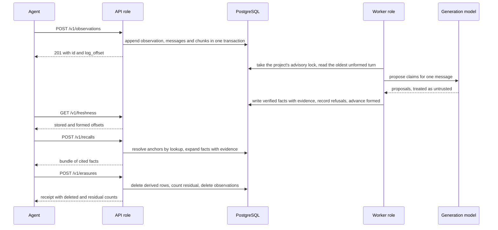
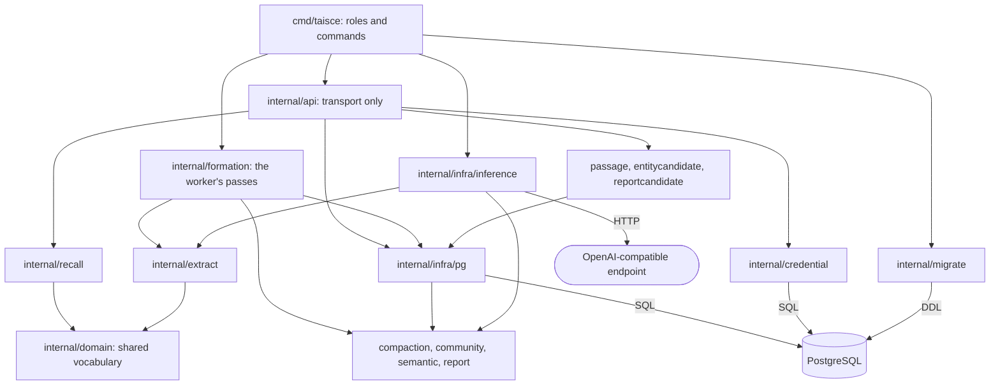

<!-- Copyright 2026 The Taisce Authors -->
<!-- SPDX-License-Identifier: Apache-2.0 -->

# Architecture overview

Taisce is one Go service in front of PostgreSQL. It stores what an agent observes, turns that into
cited facts in the background, and answers questions from those facts. This page is the map for the
rest of the architecture section.

**What you'll learn**

- the four things Taisce does that a plain vector store does not;
- the one journey every feature serves: observe, form, recall, erase;
- which processes the single binary can run as, and why;
- how the code is layered, and where the rules live;
- the three database identities, and what separates them;
- exactly where a model is called, and where it never is.

If you want the short, plain-words version first, read [how it works](../start/how-it-works.md).

## What Taisce is for

Taisce is memory for agents. An agent writes what it observes. Later it asks a question and gets
back claims, each carrying the exact words it came from. An operator can export what is held about
a person, and can erase it with a receipt that counts anything that survived.

It is one open-source service. You run one instance per organisation, on infrastructure you control.
Inside an instance, the unit of isolation is the **project**. Every credential belongs to exactly
one project, and a request never names a project: the credential decides it. That way there is no
field a caller could set to reach someone else's data.

Taisce has two kinds of reader:

- **Developers building agents.** They reach memory through an adapter for their framework, the HTTP
  API, or the MCP route.
- **Whoever operates the instance**, often the same person. The management surface and the portal
  are for them.

## What it does beyond storing passages

Storing text and returning the passages most similar to a question is not enough for memory. Taisce
adds four properties, and each one shapes the schema rather than sitting on top of it.

| Property | What it means | Where it lives |
|---|---|---|
| Answers from entities, not passages | A question is resolved to the entities it names. The answer is what is known about them, and passages are read only as evidence | [`internal/recall`](../../internal/recall/) |
| Time is first-class | Validity is a range. Replacing an old value is enforced by a database constraint. A read can ask about any instant | [`internal/infra/pg`](../../internal/infra/pg/) |
| The words behind every claim | Each fact carries a byte span into the stored message it came from. The system finds the span; it never trusts one from the model | [`internal/extract`](../../internal/extract/) |
| Proof of what was deleted | Erasure walks every registered kind of derived data and counts what survived, in the same transaction | [erasurestore.go](../../internal/infra/pg/erasurestore.go) |

The first property is the reason for the architecture. Similarity search costs more as the corpus
grows, and it only finds a fact when the question shares words with the sentence that recorded it.
Anchoring on named entities ties the cost of a recall to one neighbourhood of the graph, and makes a
fact reachable by the name of what it is about.

The other three follow from how memory is used. A claim about a person that cannot show its source
cannot be corrected. A claim with no time attached cannot be replaced when things change. And a
memory that holds personal data but cannot show that it forgot someone is a liability.

## The journey

Everything in Taisce serves one end-to-end journey: observe, store, form, recall, erase.

### Observe and store

`POST /v1/observations` carries a **turn**: one or more messages, each with its speaker's role, and
optionally the person (data subject) the turn is about. `ObservationStore.Append` in
[observationstore.go](../../internal/infra/pg/observationstore.go) writes the observation, its
messages and one chunk per message in a single transaction.

The turn's **log offset** is claimed inside that transaction, under a row lock on the project's
watermark row. A database sequence would leave a gap whenever a transaction rolled back, and a
single gap would stall the "formed" number forever.

The append returns as soon as the turn is stored. It does not wait for a model. The
[write path](write-path.md) covers this step in depth.

### Form

Forming a turn means asking a model what each message asserts. That takes far longer than a write,
so it happens in the background, after the append has returned. This is why freshness is two
numbers: `stored` says a turn arrived, and `formed` says it is in memory with nothing unformed below
it.

The `Driver` in [driver.go](../../internal/formation/driver.go) finds projects with waiting work and
drains each one under a per-project advisory lock, oldest turn first. A second worker finds the
project busy and moves on, so several workers are safe without any other coordination.

For each message, the extractor in [`internal/extract`](../../internal/extract/) decides which of the
model's proposals may become claims:

- the quote must be found in the message's own bytes, and the system computes the span;
- the relation must be in a closed vocabulary, enforced by a foreign key;
- the speaker rule is applied per message, never per turn.

A refused proposal is written down with its reason, not silently dropped. After a project is
drained, the same driver runs two more bounded passes: the subject pass writes community reports,
and the compaction pass rolls long histories up into segments ([compaction](../33-compaction.md)).
The [formation page](formation.md) covers all of this in depth.

### Recall

`POST /v1/recalls` takes a question. Every window of up to four words is normalised the same way
entity names are, and looked up against stored names (`longestAnchor` in
[recall.go](../../internal/recall/recall.go)). The entities found are the **anchors**. No model is
involved in this step.

The recaller then returns the currently valid facts about the anchors, with their evidence. It walks
one hop by default and two when asked. Everything stays inside the credential's project and under a
budget (`recall.DefaultBudget`: 16,000 characters and 200 rows; the operator can set a different
character budget). A bundle that was cut says so with `truncated`.

If the operator turns on an embedding revision, recall can also use **semantic surfaces**: entity
candidates when exact anchoring found nothing, community reports for questions that name nothing,
and source passages to fill any budget left. Each surface is capped by constants in
[surfaces.go](../../internal/recall/surfaces.go). A surface that fails is listed in `degraded`, and
the rest of the bundle still answers. The [read path](read-path.md) covers this in depth.

### Erase

`POST /v1/erasures` names either a data subject or a set of source observations. Both walk the same
path. `Eraser.Erase` in [erasurestore.go](../../internal/infra/pg/erasurestore.go) does everything in
one transaction, in this order:

1. Delete every derived row whose registrations all belong to the selection.
2. Count what survived, using the same registrations.
3. Only then delete the observations.

The order matters. Deleting the observations first would cascade the registrations away, and the
count would then run against nothing and always report zero. A derived row that someone else's
observation also supports, such as an organisation several people mentioned, is kept, and keeping
it is not counted as residual. The [governance page](governance.md) covers erasure, export and the
audit ledger.

> [!NOTE]
> The receipt counts rows in this database. It says nothing about copies outside it: text already
> sent to a model provider, a response already delivered to a caller, or a backup taken before the
> erasure.

## One binary, several processes

There is one image and one binary, [`cmd/taisce`](../../cmd/taisce/). Its subcommand and
`TAISCE_ROLE` decide what a process does.

Serving reads and forming the backlog are different workloads. The API is limited by the database.
Formation is limited by a model, and you may want to pause it during a provider incident while reads
carry on. Those are reasons to *run* the two apart, not to *build* them apart: two binaries would
mean two images, two version numbers that can disagree, and migrations that have to land in both.

| Process | How it is chosen | Listens on | Database identity | Calls a model |
|---|---|---|---|---|
| `serve`, role `all` | default: `TAISCE_ROLE` unset or `all` | `TAISCE_ADDR` (`:8080`): memory routes, `/mcp`, `/health`, `/ready` | memory and registry | generation for formation; embedding if a revision is set |
| `serve`, role `api` | `TAISCE_ROLE=api` | as above | memory and registry | embedding only, and only if a revision is set |
| `serve`, role `worker` | `TAISCE_ROLE=worker` | `TAISCE_HEALTH_ADDR` (`127.0.0.1:8082`), loopback only: `/health` and `/ready` | memory | generation |
| `serve`, role `manage` | `TAISCE_ROLE=manage` | `TAISCE_MANAGE_ADDR` (`127.0.0.1:8081`): `/manage/v1`, and `/portal/` when switched on | administrative | none |
| `bootstrap` | subcommand; runs once and exits | nothing | administrative | none |
| operator commands (`project`, `credential`, `audit`, `formation`, `recover`, `rebuild`, `health`, `artifact`, the embedding commands) | subcommand | nothing | administrative, or HTTP to the manage role for `project`, `credential` and `audit` when `TAISCE_MANAGE_API` is set | `rebuild` uses generation; the embedding commands use embedding |
| `embeddings follow` | subcommand | nothing | memory, checked like a serving pool | embedding |
| `ingest`, `conformance` | subcommand | nothing | none: they are HTTP clients of the API | none |

Roles are dispatched in [main.go](../../cmd/taisce/main.go) (`run`) and
[managerole.go](../../cmd/taisce/managerole.go) (`runManage`). Subcommands are dispatched in
[commands.go](../../cmd/taisce/commands.go) (`dispatch`). A misspelt role is refused at startup
rather than defaulted, because a typo that quietly gave every pod both halves would undo the split.

Three properties make it safe to run these side by side:

- **Formation is safe to replicate.** It holds a per-project advisory lock, and the backlog lives in
  the database, not in a process. Pausing the workers means turns pile up; nothing is lost.
- **The manage role is a process of its own.** Creating a project runs DDL, and the serving
  identities deliberately cannot run DDL. Instead of giving the memory server an administrative
  connection, the management surface runs in a separate role that holds one.
- **Every process reserves its connections at startup.** `migrate.CheckConnectionBudget` in
  [connectionbound.go](../../internal/migrate/connectionbound.go) refuses to start a process whose
  pool the database could not satisfy. Two processes starting at the same instant can still race, so
  a write that cannot get a connection is answered as retryable.

[Deployment](deployment.md) shows how these processes are arranged on one machine or in a cluster.

## How the code is layered

The layering follows one rule: every correctness argument lives in a package that can be read and
tested without a database or a model. Transport and storage sit around it and decide nothing it
decides.

Arrows mean "imports". From the centre outwards:

- **The shared vocabulary.** [`internal/domain`](../../internal/domain/) holds the types both the
  read path and the write path use: roles, claims, anchors, facts and limits. It has no I/O, no clock
  and no database.
- **Pure decision packages.** These import only the standard library and `domain`, and they hold
  the rules that have tests named after them:
  - [`internal/recall`](../../internal/recall/): anchoring and the budget;
  - [`internal/extract`](../../internal/extract/): everything that happens to a model's output
    before it may become a claim;
  - [`internal/compaction`](../../internal/compaction/): the roll-up and context assembly;
  - [`internal/community`](../../internal/community/): splitting the entity graph into subjects;
  - [`internal/semantic`](../../internal/semantic/): the text an entity is found by;
  - [`internal/report`](../../internal/report/): what a report may say.
- **Ports.** Each interface is declared by the package that uses it, not in a shared package.
  Examples: `extract.Model`, `report.Model`, `formation.Summariser`, `recall.Store`,
  `recall.Semantic`, and the `Embedder` and `Store` interfaces of the three retrievers.
- **Adapters.** [`internal/infra/pg`](../../internal/infra/pg/) implements the stores in SQL.
  [`internal/infra/inference`](../../internal/infra/inference/) implements the model ports over the
  OpenAI-compatible HTTP interface. Its prompts are YAML files compiled into the binary with
  `go:embed`, never read from disk at runtime.
- **Transport.** [`internal/api`](../../internal/api/) parses, authorises, calls and renders. Its
  package comment states the boundary: the span rule, the closed vocabulary, the speaker rule and the
  residual count all live below it.

**Where the layering is not strict.** The orchestration packages
([`internal/formation`](../../internal/formation/), [`internal/api`](../../internal/api/) and the
three retrievers) import concrete `pg` store types directly instead of depending only on ports. So
only the pure packages can be tested in isolation. The orchestration is tested against a real
PostgreSQL deployment instead.

## Three database identities

The service connects to PostgreSQL as three different login roles. What separates them is a
**grant**, which no SQL statement can get around, rather than a rule every query has to remember.

| Identity | Login | Held by | May | May not |
|---|---|---|---|---|
| Memory | `taisce_data` | `serve` in roles `all`, `api` and `worker`; `embeddings follow` | read and write the memory namespace (`memory` by default) | read the `control` namespace, create schemas, own application objects |
| Registry | `taisce_control` | `serve` in roles `all`, `api` and `worker` | read the credential registry in `control` | write credentials, read memory |
| Administrative | the database owner | `bootstrap`, the `manage` role, operator commands | run DDL, create and reconcile roles, issue and revoke credentials | nothing is withheld |

`migrate.EstablishPlanes` in [planes.go](../../internal/migrate/planes.go) creates the two serving
identities. The memory identity is simply never granted access to `control`; that missing grant *is*
the boundary.

The server refuses to start unless both DSNs are set. `TAISCE_REGISTRY_DSN` never falls back to the
memory DSN, because that fallback would put credentials within reach of every memory query without
anyone choosing it.

The boundary is checked, not assumed. `migrate.NewRuntimePool` in
[privileges.go](../../internal/migrate/privileges.go) validates every new physical connection: its
role flags, inherited roles, roles reachable through `SET ROLE`, object ownership and grants. A pool
connected as an administrator, or as a role that has quietly gained a privilege, is refused. The
[roles and grants page](../postgresql/roles-and-grants.md) lists the grants.

**What this does not cover.** `taisce_data` serves every project in the instance. Isolation
*between* projects comes from the project predicate on every query plus foreign keys that keep
related rows in one project. It is not a grant. A compromised process holding the memory login can
read every project. The privilege check runs when a connection is opened, so an administrator who
changes grants later is not noticed until the next new connection.

## Where a model is called, and where it is not

Two kinds of model are reached, both over the same OpenAI-compatible interface and both behind the
same allowlist. A **generation** model writes text, and runs on the write side. An **embedding**
model turns text into a vector.

| Operation | Process | Model | When |
|---|---|---|---|
| Extracting each stored message | worker (or `all`) | generation | every turn, after the append |
| Community reports | worker | generation | the subject pass, bounded per pass |
| Compaction segments | worker | generation | the compaction pass, bounded per pass |
| `taisce rebuild facts`, `rebuild project`, `rebuild reports` | operator command | generation | when an operator runs it |
| Building, searching and following embedding generations (`embeddings`, `entity-embeddings`, `report-embeddings`) | operator command | embedding | when an operator runs it |
| `POST /v1/passages/search`, `/v1/entities/candidates`, `/v1/reports/candidates` | API | embedding, of the question | only when `TAISCE_INFERENCE_EMBEDDING_REVISION` is set |
| `POST /v1/recalls`, semantic surfaces | API | embedding, of the question | only when a revision is set, and only for the surfaces that run |
| Observe, freshness, exact recall, contexts, citations, records, feedback, erasure, export, every management operation | API or manage | none | never |

For the serving process, generation calls are built in exactly one place: `startDriver` in
[main.go](../../cmd/taisce/main.go). The API role never starts the driver. The embedding retrievers
are built only by `configuredPassages`, `configuredEntityCandidates` and
`configuredReportCandidates` in [passages.go](../../cmd/taisce/passages.go), and each returns nothing
when the revision is unset.

So, precisely:

- **No generation model is ever called on the read path.** Anchors are found by lookup. A context is
  assembled from segments the worker already wrote, never summarised on demand.
- **By default, no model of any kind is called on the read path.**
- **When the operator sets an embedding revision**, the API embeds the question for the semantic
  surfaces and the three search routes. If the provider fails, recall lists the surface in
  `degraded` and still answers from exact anchors. The dedicated search routes refuse.

A slow or missing generation provider therefore delays formation but never an answer. A slow
embedding provider, when one is configured, affects the semantic surfaces and leaves the exact path
alone.

A process with no generation endpoint still starts. It stores turns, recalls whatever is already
formed, and erases. It also logs at startup that memory will not form, because a system that stores
and never extracts looks like memory that is broken.

## Principles that recur

A few arguments decide most questions in this codebase. Once you know them, most of the code is
predictable.

### Entities first, passages as evidence

A recall starts at the entities a question names. Passages are read to support what was found, and
a passage returned by similarity is labelled as evidence, never promoted to a fact. This keeps the
cost of a recall tied to a neighbourhood instead of the whole corpus.

The trade-off: a question that names something differently from how it was stored will miss. The
optional semantic anchors exist to cover that gap.

### PostgreSQL is the only required dependency

There is no separate vector store, graph engine, message broker, cache or object store. Each would
be a second place data lives, and a second place an erasure would have to prove it covered. The
residual count means "nothing survived" only while there is one place for something to survive in.

So vectors are columns on the rows they describe. The fact table, with resolved entity ends, is the
edge list. The observation log is the ordered, durable queue. The model endpoint is configuration,
not a dependency: an instance with none still stores, recalls and erases.

### Fail closed, and say why

Every default is chosen for what happens when someone forgets to set something:

- an inference allowlist that is unset permits no host;
- the registry connection must be named separately from the memory one;
- a misspelt role is refused;
- a worker binds only loopback;
- the portal's routes do not exist until switched on;
- a process that cannot have its connections refuses to start instead of failing on somebody's
  write.

Error messages name the setting and the reason, because the operator reading one is deciding what
to change.

### Model output is untrusted input

Text that reaches a model was written by someone else, and an instruction in a prompt does not bind
the model. So whatever a model returns is checked on its way to storage by code that does not rely
on the model's cooperation:

- the quote must be found verbatim in the message;
- the relation must be in the closed vocabulary;
- a claim that speaks for a person binds only to that person's own message.

Prompts are compiled in, so a deployment runs exactly the prompt that was reviewed. A model's
proposal is a different type from a stored claim (`extract.Proposal` is not a `domain.Claim`), so it
cannot carry a span the system did not verify.

**What this does not cover.** These checks bound the *shape* of what is stored and prove where it
came from. They do not make a model's reading of a sentence correct. A claim can pass every check and
still misread a real quote. The citation is what lets a person see that and correct it.

### Rebuild, never repair

The observation log is the only authoritative table. Every other table is a projection: derived from
the log and re-derivable from it, as the header of the first migration,
[`0001_the_spine.sql`](../../internal/migrate/sql/0001_the_spine.sql), says.

A projection that is wrong, or that an erasure removed, is rebuilt from the surviving observations
rather than patched in place. So after an erasure, anything derived later comes only from content
that is still there. The same idea is why reports are rewritten from what survives, and why the
operator's `rebuild` commands exist ([fact generations and rebuild](../20-generation-rebuild.md)).

## Where to go next

- [Deployment](deployment.md): compose, the Helm chart, reaching a model, and every `TAISCE_*`
  variable.
- [Write path](write-path.md) and [formation](formation.md): from an append to a formed fact.
- [Read path](read-path.md): anchoring, expansion, budgets and the semantic surfaces.
- [Governance](governance.md) and [security](security.md): erasure, export, the ledger, and what
  each boundary protects.
- [PostgreSQL overview](../postgresql/overview.md) and [data model](../postgresql/data-model.md): the
  database layer that carries every guarantee above.
- [The HTTP API, by task](../developers/http-api.md): the operations from a caller's side.
