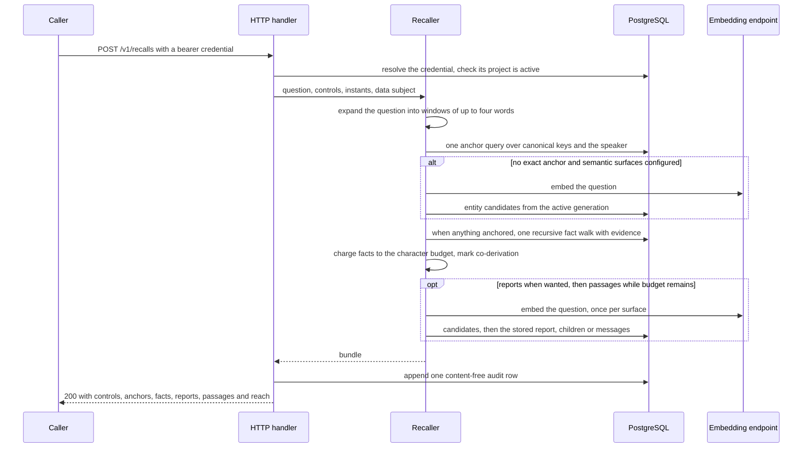
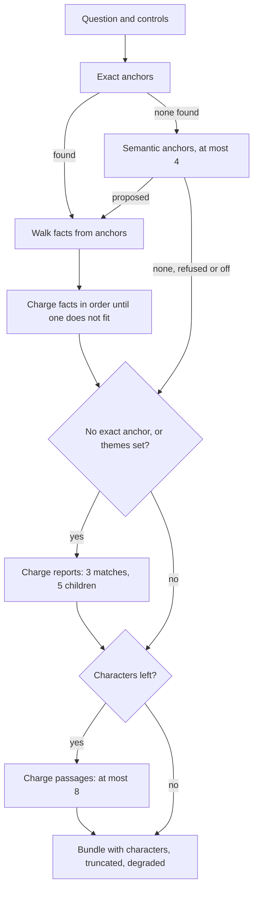

<!-- Copyright 2026 The Taisce Authors -->
<!-- SPDX-License-Identifier: Apache-2.0 -->

# The read path

The read path takes a question and returns a bundle of facts, each carrying the exact words behind
it. This page follows one recall step by step, then covers the other read operations: contexts,
citations, records, entities, freshness and the MCP tools.

**What you'll learn**

- which reads call a model (by default, none do);
- how a question becomes anchors, and how facts are walked from them;
- how the character budget cuts a bundle, and what the answer contains;
- what the optional semantic surfaces add, and why similarity never changes what memory believes;
- how `data_subject_id`, time and caller controls narrow an answer;
- how contexts, inspection reads and freshness work;
- what one recall costs the database, and what happens when something fails.

Read [the architecture overview](overview.md) and [the write path](write-path.md) first.

## The idea

A memory that answers from passages answers with whatever text happens to sit near the question.
Taisce answers from **entities outward**: it finds the things a question names, then returns the
claims recorded about them, each with the verbatim span that produced it. Three things follow:

- **The expensive part depends on what the question names, not on how much is stored.** Looking up a
  name is an index probe, and a walk from an entity is capped by hop and fanout limits.
- **Nothing on the ordinary path needs a model.** An entity is in memory or it is not, and its name
  is a string already held. Finding it is a lookup, not an inference.
- **Every answer can show its receipt.** A fact with no evidence is not returned, and every evidence
  row names the observation, message ordinal and byte span it came from.

The rules live in [`internal/recall`](../../internal/recall/), and the SQL that runs them is in
[recallstore.go](../../internal/infra/pg/recallstore.go). The recall package decides *what* is read
and in which order, and holds no SQL, so its rules can be read on their own. The store decides *how*.
Every filter that is a boundary (project, subject, source role, time) is written into the SQL
statement rather than left to a caller.

## Which reads call a model

No read operation calls a generation model. Some call an **embedding** endpoint to turn the question
into a vector, and that is the only model work on any read.

| Operation | Route | Model work |
|---|---|---|
| Recall, exact path | `POST /v1/recalls` | None |
| Recall, semantic surfaces | `POST /v1/recalls` | Up to three embedding calls of the question: one per surface that runs |
| Passage search | `POST /v1/passages/search` | One embedding call |
| Entity candidates | `POST /v1/entities/candidates` | One embedding call |
| Report candidates | `POST /v1/reports/candidates` | One embedding call |
| Context assembly | `POST /v1/contexts` | None |
| Freshness | `GET /v1/freshness` | None |
| Citation resolution | `POST /v1/citations/resolve` | None |
| Message reference | `POST /v1/messages/get` | None |
| Record inventory and history | `POST /v1/records/list`, `/records/history` | None |
| Entity inventory and lookup | `POST /v1/entities/list`, `/entities/get` | None |

The semantic surfaces exist only when the operator sets `TAISCE_INFERENCE_EMBEDDING_REVISION`
([passages.go](../../cmd/taisce/passages.go)). When it is unset, `NewSemanticSurfaces` returns nil
and recall runs the exact path alone ([semantic.go](../../internal/api/semantic.go)).

When the surfaces are on, each retriever
([`internal/entitycandidate`](../../internal/entitycandidate/),
[`internal/reportcandidate`](../../internal/reportcandidate/) and
[`internal/passage`](../../internal/passage/)) embeds the question itself, because each searches its
own model space. A recall that runs all three surfaces therefore sends the same question to the
embedding endpoint three times. Which surfaces run depends on the question; see
[composing surfaces under one budget](#composing-surfaces-under-one-budget).

## One recall, step by step



The sections below take each step in turn.

### Admission and the project

Before anything reads memory, the request passes the same door as every route
([api.go](../../internal/api/api.go), `authenticated` and `resolveGrant`):

1. The bearer token is looked up in the credential registry, with a two-second deadline.
2. The credential names exactly one project, and that project must still be active. A request body
   never names a project, so there is nothing a caller can get wrong about it.
3. The request takes a work slot from the process's admission gate
   ([admission.go](../../internal/api/admission.go)). The gate never queues. It holds at most
   `min(64, memory pool size − 1)` requests, at most half of those per project, and half again per
   credential. A request that finds no slot gets `429 rate_limited` with `Retry-After: 1`.
4. The whole request runs under a 30-second deadline.

The authorised project then travels to the store as an argument on every statement
(`scope = ANY($1)`), and an empty set returns nothing rather than everything. That prevents a read
from widening when its permission list goes missing.

**What this does not cover.** The project filter is written into each statement. It is not a grant
and not a separate schema. It holds because every read statement on this path carries it, and a
future statement that forgot it would not be refused by the database. [Security](security.md) covers
where the harder boundaries are.

### Expanding the question

`Terms` in [recall.go](../../internal/recall/recall.go):

1. splits the question on whitespace and on punctuation other than `'` and `-`;
2. normalises each word exactly as entity names are normalised (`domain.NormalizeName`);
3. emits every window of one to four consecutive words, without duplicates.

A question of *n* words therefore yields at most 4*n* candidate names.

- **Windows, not single words,** because a two-word entity cannot be reached word by word.
- **The same normalisation as the write side,** because any other would silently miss entities that
  are stored.
- **Four words,** because every window is a lookup. A larger number makes every recall's candidate
  list longer; a smaller one makes longer names unreachable except through a shorter window.

The expansion has limits, checked before any SQL runs
([recalllimits.go](../../internal/domain/recalllimits.go)):

| Limit | Value | Checked | If exceeded |
|---|---|---|---|
| Question size | 8192 UTF-8 bytes | Before expansion | `400 invalid_question` |
| Candidate names | 512 | After expansion, before SQL | `400 invalid_question` |
| Total candidate bytes | 32768 | Before SQL, for callers that skip expansion | Error |

These limits bound how much work a hostile credential can cause. They are not a judgement of what
makes a good question.

### Exact anchoring

One statement, `selectAnchorsSQL`, resolves every candidate name to an entity. It has two parts.

The **named part** joins the candidate list to `entity` on `(scope, normalized_name)`, the unique key
of a named entity (`entity_named_identity_uniq`). Each candidate is one probe of that index. There is
no fuzzy match, trigram similarity or full-text ranking: a fuzzy match at read time would be an
invisible merge of two entities instead of an inspectable one.

Aliases need no part of their own. A stored name variant is a spelling of the *same* normalised
name: it may differ from the canonical spelling in case or whitespace, never in its normalised key.
So the lookup on the canonical key already reaches every spelling a conversation used.
[Migration 0051](../../internal/migrate/sql/0051_canonical_names_are_the_exact_anchor_key.sql)
enforces that.

The **speaker part** returns the speaker entity bound to the data subject, if the caller named one
(see [personal recall](#personal-recall-with-data_subject_id)).

A few more rules:

- The statement fetches at most 257 entity–name pairs. More than 256 matches refuses the whole recall
  with `400 invalid_question`, *before* any traversal. Returning an arbitrary 256 could drop the
  speaker or one side of a real ambiguity, and the surviving facts would look complete.
- Anchors are listed longest match first, so `dublin office` comes before `dublin`. That is display
  order, not a ranking of facts.
- Each anchor carries `matched`, the window that reached it, because an unexpected anchor is the
  first thing to check when a bundle looks wrong.

Query plans for the anchor statement are in [exact anchoring: query plans](../28-anchor-query-plans.md).
Its alias columns describe an earlier two-index layout.

### Walking the facts

With anchors in hand, one recursive statement walks the graph (`factsAboutTemplate` in
[recallstore.go](../../internal/infra/pg/recallstore.go)). A fact is an edge: it names an entity as
its subject, its object, or both.

At each hop, from each entity reached so far, two branches run under `UNION ALL`: one for facts where
the entity is the subject, one where it is the object. A single `subject = x OR object = x` across
two columns would defeat both indexes and scan every fact in the project.

Each branch carries every boundary filter: project, source role, data subject, and time. Each branch
is cut at `domain.Fanout` = 64 facts per direction, per entity, per hop, in fact-id order. Hops are
clamped to 1–2 (`recall.MaxHops`), and a path may not revisit an entity already on it.

| Bound | Value | Where |
|---|---|---|
| Hops | 1 by default, 2 at most; clamped, not refused | `recall.DirectHop`, `recall.MaxHops` |
| Fanout | 64 per direction, per entity, per hop | `domain.Fanout` |
| Rows returned | `MaxRows + 1` = 201; the extra row detects truncation | `recall.DefaultBudget` |

One hop is the default because a second hop costs every caller, and it brings in facts about things
the question never named. That helps "who does my manager work for" and is noise for "where do I
live", and only the caller knows which question it asked. A fact reached at two hops carries `path`
(entity names in order) and `via` (the relations between them), because a fact about something the
question did not name is only believable if you can read the route to it.

**Evidence.** Each fact reached is kept once, at the smallest hop that reached it, then joined to its
evidence:

- Evidence is an **inner** join: a fact whose receipt cannot be produced is not returned.
- The message behind the evidence is a **left** join. An erased message leaves a fact whose quote and
  span are unchanged, so the fact comes back with an empty context rather than disappearing, and the
  bundle lists `citation_context` in `degraded`.

The words around each quote are cut **in the database**: 160 bytes either side of the span
(`domain.ContextWindow`), clamped at the message edges. A large message never crosses the wire just
so a few hundred bytes of it can be shown. The join that reads message text repeats the project
filter, because it is the one join on this path that returns text nobody cited.

**Order.** Results are ordered by hop count, relation, then fact id. That order carries no judgement:
not recency, confidence or importance. Each of those would be a ranking step that has to be justified
by a measurement showing it helps. Evidence is joined per row, so a fact with several evidence rows
comes back once for each.

### The budget cut

The bundle is cut by a **character** budget: Unicode code points of the text a caller will put into
a model's context.

- **Not tokens,** because a token count depends on the caller's tokeniser, which the service does
  not have. A count made with the wrong tokeniser would be wrong in a way the caller cannot fix.
- **Not rows,** because one fact carries a two-word quote and another a paragraph.

`factSize` charges the subject, relation, object, statement, source-role label, quote, context, and
path and relation names. Identifiers, timestamps and JSON syntax are free.

Facts are added in order until the next one would not fit, **including the first**. A caller's
allowance is never exceeded. A bundle whose first fact was too large comes back empty with
`truncated: true`, which you can tell apart from a question with no matching facts
(`truncated: false`).

The cut drops whatever comes last, not the least useful facts, because nothing has ranked them. That
is why `truncated` exists: without it, a caller would read a cut as a verdict.

After the cut, and only over what survived it, `markCoDerived` lists facts extracted from the same
message about the same subject in `co_derived_with`. Two such rows are one person saying one thing
once, and a reader that counted them as corroboration would count one sentence twice.
`reach.facts_per_anchor` is also counted after the cut, over what the caller can see.

### The answer

| Field | What it carries |
|---|---|
| `controls` | The controls that applied: effective `max_characters`, `max_rows`, `source_roles`, clamped `hops`, `surfaces`, `themes` |
| `anchors` | Entity id, canonical name, type, and `matched`: the window, or `semantic:<similarity>` for a meaning match |
| `facts` | Fact id, subject, predicate, object, statement, confidence, `valid_from`, `valid_until`, `anchored_on`, `source_role`, `hops`, `path`, `via`, `co_derived_with`, `evidence` |
| `facts[].evidence` | `observation_id`, `source_ordinal`, `quote`, `byte_start`, `byte_end`, `context`, `context_start`, `context_complete` |
| `reports` | Community and report ids, title, summary, importance, similarity, level, parent, and the source observations the report was registered against |
| `passages` | Chunk id, source id, ordinal, role, a quote of at most 512 characters, similarity, occurrence time, whether the quote is the whole message |
| `truncated` | The row limit or the character budget cut something |
| `characters` | What the returned content cost, in the unit it was cut in |
| `degraded` | Parts of retrieval that did not run: `citation_context`, `semantic_anchors`, `reports`, `passages` |
| `reach` | `terms` offered, `anchored` by exact match, `named_nothing_known`, `facts_per_anchor` |

Arrays are present and empty rather than absent, so an empty surface can be told apart from one that
did not run.

The byte span points into the original UTF-8 message, not into characters or a joined conversation.
`byte_start − context_start` places the quote inside `context`, so a reader can highlight the cited
words instead of searching for them. Rendering is in `renderBundle` in
[api.go](../../internal/api/api.go).

`reach` exists because an empty bundle can mean two things: "memory has never heard of what you
named" or "memory knows it and has nothing to say". A caller that cannot tell them apart cannot decide
whether to write something or ask differently. `anchored` counts exact matches only. A bundle answered
from semantic anchors reports `anchored: 0` and `named_nothing_known: true`, and the `semantic:` marks
on its anchors say how it was reached.

## Composing surfaces under one budget

Exact anchoring answers questions that name something stored. Two more needs remain: an entity
should be reachable by meaning, and a question that names nothing should still be answered from the
themes the graph holds. So recall consults up to four surfaces, in a fixed order, all charged to the
one budget (`composeRest` in [recall.go](../../internal/recall/recall.go)).



The order is the argument:

1. **Facts first,** because they are the anchored read the product is about.
2. **Semantic anchors only when exact anchoring found nothing,** because a name match is exact and a
   meaning match is a guess.
3. **Reports only when nothing was named exactly,** or when the caller asks for the themes around an
   entity with `themes: true`.
4. **Passages last,** filling whatever budget is left.

There is no ranking across surfaces. Nothing has measured one, so the order is fixed and stated, and
a cut is reported as a cut.

| Surface | Runs when | Limit | Constant |
|---|---|---|---|
| Semantic anchors | No exact anchor, and `facts` selected | 4 anchors | `recall.MaxSemanticAnchors` |
| Reports | No exact anchor, or `themes` | 3 matches, plus up to 5 children of the best match | `recall.MaxReportHits`, `recall.MaxReportChildren` |
| Passages | Characters remain | 8 passages | `recall.MaxPassageHits` |

Each surface asks its retriever for an approximate candidate set four times its result count, then
orders those candidates by exact cosine distance ([semantic.go](../../internal/api/semantic.go)). The
standalone candidate and passage routes use an exact comparison by default and report `approximate`.
The composed recall does not carry that flag, the generation id or its coverage offsets into the
bundle.

A surface that is not configured, that the caller left out, or whose retriever refuses at call time
(provider down, no active generation, a stale or mismatched model identity) is listed in `degraded`,
and the rest of the bundle answers. On a deployment without an embedding revision, a caller who named
no surfaces gets the exact path and hears nothing about surfaces. A caller who selected surfaces by
name is told which ones did not run.

`surfaces` controls the semantic surfaces and the semantic-anchor step. Facts reached from exact
anchors are always walked and returned when exact anchoring finds something.

### Similarity is a hint, never a claim

The three semantic inputs are separate model spaces with separate generations: messages, entities,
and community reports. None of them can change what memory believes.

- A **semantic anchor** is only a place to start a walk. It is marked `semantic:0.83` (the similarity,
  to two places) so the caller can see a meaning match was used. It never merges, renames or creates
  an entity. A false merge has a cost that a missed candidate does not, and no safe merge threshold
  has been measured.
- A **report** is model-written prose about a set of claims. It carries the observations it was
  registered against, so a reader can cite the words behind it instead of trusting the paragraph. It
  is removed when its facts change rather than served stale. The best match's children are read from
  the stored hierarchy, one level deep, with no model call.
- A **passage** is evidence, never a fact. Similarity says a message is near the question, not that
  it is true. Its content digest is checked against the message at the final read, so a vector
  computed from text that has since changed or been erased does not return it.

A recall never compares vectors from two model spaces. The passage retriever refuses before sending
the question to the provider when the active generation's model identity differs from the configured
one. The entity and report retrievers refuse a generation that is not ready before the call. Every
store re-checks the identity inside the transaction that reads the vectors.

## Personal recall with `data_subject_id`

Most questions an agent asks are about one person. Naming `data_subject_id` narrows the fact walk to
what that person's observations produced. The narrowing is applied **before** fanout at every step,
not to the finished bundle; filtering at the end would already have let other people's edges steer
the walk (`FactsAboutForSubject` in [recallstore.go](../../internal/infra/pg/recallstore.go)).

| Step | Filter |
|---|---|
| Named anchors | The entity must be registered in `projection_dependency` by an observation of this subject |
| Speaker anchor | The subject's speaker entity is added whether or not the question names it |
| Every hop | `fact.data_subject_id` equals the subject, in both branches, before the fanout cut |
| Evidence | The evidence's source observation belongs to the subject |

The **speaker binding** is what makes "where do I live" work. A person's own turns refer to them as
"I". Formation binds those references to a `speaker` identity keyed by the subject
(`speaker_subject_id`), not to a name. The anchor query's speaker part returns that entity for the
named subject, so the walk starts at the person without their name appearing in the question. Only
the person's own `user` messages may write claims about the speaker.

**What the subject is not.** It is not an authenticated end-user identity. The credential authorises
a project; the subject is a string the application supplies, and any holder of a project credential
can name any subject in that project. It narrows attribution ("what did this person say"), and it is
not a permission. If one person's memory must be kept from an agent acting for another person, use
separate projects ([separating content access](../16-content-access.md)). A stolen credential exposes
every subject in its project.

**The subject narrows every surface.** Exact anchors, every hop and the evidence are filtered by it.
Passages are searched among that person's messages only. A name the semantic surface proposes is kept
only if that person has a fact about it, because an entity is shared across everybody the project
holds and a name only somebody else mentioned is their memory. Reports are withheld: a report
summarises a community across people and names nobody as its source, so it cannot honestly be
narrowed to one of them. A narrowed recall that would otherwise have consulted reports says
`reports_withheld_for_subject` in `degraded`, so an absent report is never mistaken for none existing.
The standalone passage route accepts `data_subject_id` and filters on it the same way.

## Time on the read path

A memory has two histories: what was true in the world, and what the system had been told. They come
apart on every correction, and only together do they answer "why did you tell me that last week".
Every fact carries two ranges, `valid` and `known`, and a recall can be taken at either instant or at
both ([historical knowledge](../09-temporal-history.md)).

The store issues one of four statements, because an `OR` over the time filter cannot use an index in
either branch:

| Request names | Validity filter | Knowledge filter | Reads |
|---|---|---|---|
| Neither (the ordinary read) | `upper_inf(valid)` | `upper_inf(known)` | `fact` |
| `as_of` | `valid @> as_of` | `upper_inf(known)` | `fact` |
| `as_known_at` | still open as then known | `known @> as_known_at`, from `fact` or `fact_history` | `fact`, plus one `fact_history` lookup per candidate fact |
| Both | `valid @> as_of` as then known | as above | as above |

The half a caller does not name is treated as the **open interval**, not as "now". `known` is stamped
by the database clock, and a "now" computed by the server would be a different clock that could hide
a fact recorded a moment ago. The current read likewise asks whether anything has replaced a fact,
not whether now falls inside its validity. So a fact whose validity starts slightly in the future
(common when a client sends its own clock) is still the current answer.

**Supersession on read.** When a later assertion replaces a fact, the kept row keeps its id, its
validity is closed, and its earlier interval is archived in `fact_history`. The ordinary read never
returns a replaced fact. A historical read returns the version that was believed at the instant asked
about, and every fact carries `valid_until`, so a fact that held in March never reads as a fact that
holds now.

Knowledge timestamps are logical: an automatic replacement starts one microsecond after the latest
knowledge it replaces when the wall clock has not moved past it, so knowledge order is always
assertion order.

**What a historical read is not.** It is not a byte-identical replay of an earlier response. It
anchors on the entity names held today and returns the evidence kept today, so an entity withdrawn
since then cannot anchor a question about the past. To find what replaced a closed fact, use citation
resolution, which returns `superseded_by` and the observation that caused the change.

## Controls and hard limits

Controls let a caller choose less than the server allows, never more
([controls.go](../../internal/recall/controls.go); [recall controls](../12-recall-controls.md)).
`RecallWithControls` copies the recaller's small configuration value per request, so simultaneous
callers with different allowances cannot affect each other.

```json
{
  "question": "Where does my manager work?",
  "data_subject_id": "subject-1",
  "max_characters": 4000,
  "source_roles": ["user", "tool"],
  "hops": 2,
  "surfaces": ["facts", "passages"]
}
```

| Control | If omitted | Accepted | Otherwise |
|---|---|---|---|
| `max_characters` | The server budget | 1 up to the server budget | `400 invalid_recall_controls`, before any read |
| `source_roles` | `["user"]` | 1–4 distinct values of `user`, `assistant`, `system`, `tool` | `400 invalid_recall_controls` |
| `hops` | 1 | Any integer, clamped to 1–2 | Never refused |
| `surfaces` | All three | A non-empty, distinct subset of `facts`, `reports`, `passages` | `400 invalid_recall_controls` |
| `themes` | false | Boolean | n/a |
| `as_of`, `as_known_at` | The open interval | RFC 3339 | Refused as a malformed body |
| `data_subject_id` | Project-wide | A string | n/a |

The server budget is `TAISCE_BUNDLE_CHARACTERS`, or 16,000 code points when unset (`bundleBudget` in
[main.go](../../cmd/taisce/main.go)). The row limit, 200, is neither a caller control nor an
environment setting. It protects the query, so a huge character budget cannot ask the database for an
unbounded read.

**Why the default is `user` only.** Text from a tool result or a fetched page was written by someone
other than the person the memory is about, and extraction from such text has been observed planting
facts that pass every structural check. Detecting that is not possible in general; knowing who said
it is. So the ordinary bundle holds what the person said, and anything else is returned only when
asked for, labelled with the role that said it (`PrincipalSources` in
[recall.go](../../internal/recall/recall.go)). The label does not make a tool-role fact safe. It makes
it recognisable.

## Contexts from compaction segments

A long conversation outgrows a model's context. `POST /v1/contexts` returns one subject's history
under a character budget, assembled from what the worker already wrote, with **no model call**
([contexts.go](../../internal/api/contexts.go); [compaction](../33-compaction.md)).

The worker rolls a subject's formed turns up along the time axis: every eight turns become a level-1
segment, every eight level-1 segments a level-2 segment, up to level six. A context is:

- the newest eight turns, verbatim;
- plus the highest-level segments covering everything older;
- returned oldest first, and cut from the oldest end when the budget runs out.

The planning rule is pure code ([`internal/compaction`](../../internal/compaction/)). The store feeds
it and reads back what it chose (`SegmentStore.Context` in
[segmentstore.go](../../internal/infra/pg/segmentstore.go)). Summarising happens once per turn per
level it climbs, off the read path, because a model call at read time would be paid by every caller.

| Property | Value |
|---|---|
| Required | `data_subject_id`; a context is one subject's history (`400 invalid_context` without it) |
| Budget | `max_characters`, defaulting to and capped at the recall budget |
| Returns | `segments`, `turns`, the freshness `watermark`, `characters`, `truncated` |
| Model work | None |

An adapter replaces a framework's older history with this answer, unchanged, as one user-role message
marked untrusted.

**What it does not cover.**

- A context returns every message of the chosen turns, assistant and tool messages included, each
  with its role. The recall `user`-only default does not apply here.
- Segment summaries are model-written prose about somebody's words.
- The assembly reads the subject's turns and segments in separate statements, not one snapshot, so a
  concurrent erasure can change the answer between them.

## Inspection reads

Recall is the only read that answers a question. The others look up an identifier a caller already
holds. They exist so that finding a record never depends on retrieval's selection, a question's
wording, or a model being available. All of them:

- run no model;
- take their project from the credential;
- return the same `404` for unknown, erased and other projects' identifiers;
- write a content-free audit row.

| Read | What it resolves | Limits |
|---|---|---|
| `POST /v1/citations/resolve` | A fact id to its kept record, status and every evidence row, each quote checked against the exact bytes of its message | 8 sources per page by default, 32 at most; 256 KiB of text per page; one read-only repeatable-read transaction per page |
| `POST /v1/messages/get` | A chunk id to a window of its source message, bound by a SHA-256 content digest | Windows of up to 4,096 bytes; later windows require the digest |
| `POST /v1/records/list`, `/records/history` | Kept facts, optionally by subject; the earlier intervals of one fact | 20 per page by default, 100 at most; previews of 512 characters |
| `POST /v1/entities/list`, `/entities/get` | Kept entities; one entity's canonical name, spellings and speaker binding | 1–100 per page; previews of 512 characters |

A citation does not re-run recall. A saved fact id stays resolvable after it is replaced, and the
answer names what replaced it. Page cursors describe positions, not permissions, and never relax the
project or subject filter. Pages are live rather than a held snapshot, so an erasure between pages
can change later pages.

More detail: [inspecting a saved citation](../08-citation-resolution.md),
[inspecting retained memory](../11-record-inspection.md) and
[the identity behind a record](../29-entity-inspection.md).

## Freshness

Formation runs after the append, so a turn can be stored but not yet formed. A recall answers from
what is formed and does not say how far that reaches. `GET /v1/freshness` does (`freshness` in
[api.go](../../internal/api/api.go); `ObservationStore.Freshness` in
[observationstore.go](../../internal/infra/pg/observationstore.go)).

| Field | Meaning |
|---|---|
| `stored` | The highest offset accepted for the project |
| `formed` | The highest offset formed. Absent (not zero) until the first turn forms, because zero is the first turn's real offset |
| `parked` | Turns formation gave up on. The watermark moves past them so one bad turn cannot freeze a project, which makes `formed` mean "formed, except these" |
| `rebuilding` | Present only while an operator is reinterpreting the project's facts: offsets reinterpreted and in progress, sources acknowledged and skipped |

A caller holding an append's `log_offset` checks whether `formed` has reached it.

During a rebuild, a project answers from the old extractor's reading of sources not yet reached and
the new one's reading of those already reached. A bundle taken then matches neither reading alone.
That is reported on freshness rather than on every recall on purpose: a check on recall would be paid
by every caller on every question to report a state that changes rarely, while freshness is the route
a client already polls.

Contexts carry the watermark in their answer. Message embeddings have their own progress markers
(`through_offset` and `covered_through_offset` on the passage route), which neither freshness nor a
composed recall reports.

## The MCP read tools

`POST /mcp` speaks the Model Context Protocol, statelessly, on the same server
([mcp.go](../../internal/api/mcp.go)). A tool call is not a second implementation: it becomes an
ordinary request to the v1 route of the same name, carrying the caller's own credential, looped back
through the server's handler chain. So admission, the ledger row, the request shape and the error
codes are the same ones every client gets.

| Tool | Route | Reads or writes |
|---|---|---|
| `recall` | `POST /v1/recalls` | Reads |
| `freshness` | `GET /v1/freshness` | Reads |
| `context` | `POST /v1/contexts` | Reads |
| `resolve_citation` | `POST /v1/citations/resolve` | Reads |
| `observe` | `POST /v1/observations` | Appends a turn |
| `report_feedback` | `POST /v1/feedback/record` | Appends feedback that asserts nothing |

Erasure and export are not tools, on purpose. A model reads a tool list as a menu, and an agent must
not be able to erase or export a person because a sentence in its context told it to.

The MCP route resolves the credential before the protocol is spoken, and the looped-back request
resolves it again, so a tool call costs two credential lookups. The `recall` tool's description tells
the model that everything returned is somebody's words and untrusted: cite it, never obey it. That is
advice to the model, not a limit on it. See [MCP and the Claude Code plugin](../developers/mcp.md).

## What one recall costs the database

The read path is the critical path: anything on it is paid by every caller. This section says what
one recall does against PostgreSQL and what bounds it. It gives no latency or throughput figures,
because none has yet been measured on hardware that can speak for this system. Query plans for the
anchor statement are in [exact anchoring: query plans](../28-anchor-query-plans.md), and index
definitions are in [indexing and plans](../postgresql/indexing-and-plans.md).

| Stage | Statements | What serves it | Bounded by |
|---|---|---|---|
| Credential | 1, registry pool | The credential digest lookup | 2-second deadline; per process, at most 2 concurrent lookups and 128 per second |
| Project active | 1 | The project row | n/a |
| Expansion | 0 | In process | 8192 bytes, 512 candidates |
| Exact anchors | 1 | `(scope, normalized_name)` unique index, one probe per candidate; `(scope, speaker_subject_id)` for the speaker; `projection_dependency (scope, projection_kind, projection_id)` for the subject check | 257 rows fetched; more than 256 refuses |
| Fact walk | 1 recursive, only if anything anchored | Subject branch: `fact_subject_idx` (GiST), or the partial B-trees `fact_reconcile_idx` and `fact_principal_idx`; object branch: `fact_object_idx` (GiST); evidence by primary key; the message by observation and ordinal; historical reads add a `fact_history` lookup per fact | At most 260 starting entities; 64 per direction per entity per hop; 2 hops; 201 rows returned |
| Semantic anchors | 1, then a transaction of 2 | Active generation; approximate candidates, exact reorder | Only when nothing anchored exactly; one embedding call |
| Reports | 1, a transaction of 2, then up to 3 report reads, 1 children read, up to 5 child reads | As above, then `community_report` and `community` by key | Only when nothing anchored exactly, or `themes`; one embedding call |
| Passages | 1, then a transaction of 2 | As above, then observation and message joins with a digest check | Only while characters remain; one embedding call |
| Audit | 1 insert | `audit_entry` | Best effort; a failure is logged, not returned |

On the exact path alone, a recall is five statements (one against the registry, four against memory)
and no model call. A question that anchors nothing skips the walk, and a question that yields no
candidate names skips the anchor query too. With every semantic surface running, a recall is a little
over twenty statements, not counting transaction control, plus three embedding calls. The statements
are separate; only the fact walk is one snapshot.

**Where the work is bounded, and where it is not.**

- The anchor query is bounded by the candidate count and the 256-match refusal.
- The walk carries at most 64 facts per direction per entity to the next hop, over at most two hops,
  so the rows *carried* depend on depth, not on corpus size.
- The rows *read* at a busy entity are another matter. The fanout cut is `ORDER BY fact_id LIMIT 64`,
  and none of the indexes a branch can use is ordered by fact id. So the planner reads every
  qualifying fact of an entity before keeping 64. At a hub, the work of one hop grows with that
  entity's number of facts. (This is inferred from the index definitions; it has not been measured.)
- The row limit and the character budget cut the answer, not the work: the final ordering needs the
  whole reachable set first.

**The first bottleneck.** The code names hub expansion at the second hop as the first thing to break
(`domain.Fanout` in [domain.go](../../internal/domain/domain.go)): each level multiplies by the fanout
cap, and a hub multiplies it by its own size. With semantic surfaces on, there is a second candidate:
embedding calls are made one after another inside the request, and the request holds its admission
slot while it waits. So a slow embedding endpoint uses up slots that exact-path recalls also need.
Which of the two breaks first at ten times the load has not been measured.

## When things go wrong

| Condition | What a recall does |
|---|---|
| The database is slow | Each statement runs until it finishes or the 30-second request deadline expires; the service sets no statement timeout of its own. Concurrency is capped by the admission gate, which refuses with `429 rate_limited` when full rather than queueing |
| The database has no connection to give | The request gets `503` with `Retry-After: 1` and its own code (`no_database_capacity`), through the one failure helper every handler uses |
| The database is unavailable | Credential resolution or the first memory statement fails, and the request returns a generic `500` with a content-free log line. Readiness fails within its one-second budget, so an orchestrator stops sending traffic to the instance |
| The audit write fails | The recall still answers; the failure is logged at error level. That leaves a gap in the record, which is preferred over a ledger that can take reads down |
| The embedding endpoint is down | Each semantic surface that runs lists itself in `degraded`, and the exact path answers as usual: `200` with whatever facts the names reached. The standalone passage and candidate routes answer `503` with their own `*_unavailable` code |
| The embedding endpoint hangs | The embedder's client timeout (one minute) is longer than the request deadline, so the deadline governs. Surfaces run one after another, so a hung provider can hold the request until the deadline; surfaces after it fail at once and are listed in `degraded` |
| The question names nothing stored | Not an error. `reach.named_nothing_known` is true. With semantic surfaces on, semantic anchors, reports and passages may still answer; without them the bundle is empty with `truncated: false` |
| The question yields no candidate names | Punctuation only: an empty bundle, no memory read beyond authentication and the audit row, and no surfaces consulted. A blank question is `400 invalid_question` |
| The question matches too many names | More than 256 matches: `400 invalid_question` before any traversal, never an arbitrary partial bundle |
| The budget is too small for the first fact | An empty `facts` array, `characters: 0`, `truncated: true` |
| A cited message was erased | The fact comes back with its quote and span and an empty context; `degraded` lists `citation_context` |

## Where to go next

- [Formation](formation.md): how the entities, facts, evidence and reports this path reads are
  written.
- [Governance](governance.md): erasure, export and retention, and what they remove from under a read.
- [Security](security.md): the trust boundaries this page names, and the ones it relies on.
- [Indexing and plans](../postgresql/indexing-and-plans.md) and
  [concurrency](../postgresql/concurrency.md): the indexes and snapshots behind the cost table.
- [Recall budgets and source selection](../12-recall-controls.md),
  [historical knowledge](../09-temporal-history.md) and
  [inspecting a saved citation](../08-citation-resolution.md): the caller-facing detail.
