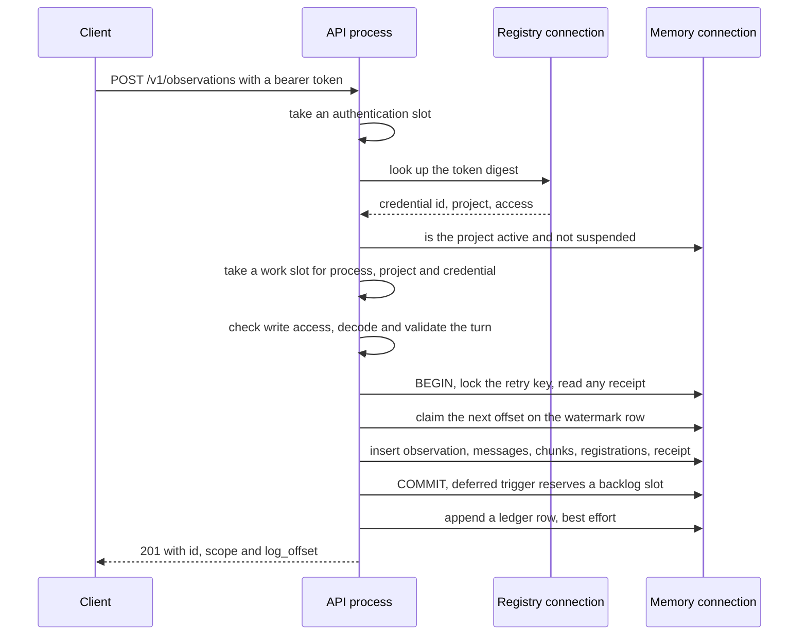

<!-- Copyright 2026 The Taisce Authors -->
<!-- SPDX-License-Identifier: Apache-2.0 -->

# The write path

This page follows one write from the moment an HTTP request arrives to the moment its turn is safely
stored. It stops at "stored": turning a stored turn into facts is [formation](formation.md), which
runs afterwards and separately.

**What you'll learn**

- what a `201` from `POST /v1/observations` promises, and what it does not;
- how requests are admitted before they touch the database;
- how a request is authenticated and authorised;
- what a valid turn looks like, and the size limits;
- how retries with an idempotency key stay safe;
- what the append transaction writes, and the backlog reservation that bounds it;
- what the audit ledger records;
- the other inputs that share the log: assertions, artifacts, sessions and documents;
- what happens when a write arrives twice, the database is down, or the process dies.

Read the [architecture overview](overview.md) first for the parts of the system. The
[HTTP API guide](../developers/http-api.md) shows the same operation from a caller's side.

## What "stored" promises

A `201` from `POST /v1/observations` means the turn is in PostgreSQL and will survive a crash. All
of the following commit in one transaction, or none of them do:

- the observation row;
- one row per message, and one chunk per message;
- the erasure registration for each chunk;
- the retention deadline;
- the retry receipt, when there is an idempotency key;
- the backlog reservation;
- the advance of the project's log offset.

It does **not** mean a model has read the turn. Forming a turn takes one model call per message.
Holding the request open through that would make an agent wait on its own memory write, at the speed
of the slowest provider response of the day.

So the append returns first, and the `log_offset` in the response is the caller's receipt. Whether a
recall can see the turn yet is a separate question. `GET /v1/freshness` answers it with two numbers:

- `stored`: the highest offset written;
- `formed`: the highest offset with nothing unformed below it.

## One observation, end to end

The order is deliberate:

- everything cheap and local runs before anything that holds a database connection;
- everything that could refuse the caller runs before anything that writes;
- everything the write consists of commits together;
- the ledger row comes last and cannot fail the request.

The handler chain is `Server.authenticated`, then `Server.authorized`, then `Server.observe`, in
[api.go](../../internal/api/api.go) and [authorization.go](../../internal/api/authorization.go). The
transaction is `ObservationStore.AppendIdempotent` in
[observationretry.go](../../internal/infra/pg/observationretry.go), which calls `appendTurnTx` in
[observationstore.go](../../internal/infra/pg/observationstore.go).

## Admission happens before the database is touched

The scarce resource on this path is database connections. A request waiting for one still holds a
socket, a goroutine and its body in memory. A queue in front of the pool would hide overload until
memory ran out. So each process builds a gate from its real pool sizes and refuses excess work
immediately, without queueing.

The gate is `Admission` in [admission.go](../../internal/api/admission.go), built by `NewAdmission`
from the memory and registry pool sizes when the server starts.

| Bound | Value | Where it is set |
|---|---|---|
| Concurrent memory work, per process | `min(64, memory pool max − 1)` | `NewAdmission` |
| Concurrent work for one project | half the process bound, rounded down, at least 1 | `NewAdmission` |
| Concurrent work for one credential | half the project bound, at least 1 | `NewAdmission` |
| Concurrent credential lookups | `min(2, registry pool max)` | `NewAdmission` |
| Authentication rate | refill of 128 per second, burst of 256 | `authRequestsPerSecond`, `authRequestBurst` |
| Smallest pools an API process accepts | 3 memory connections, 1 registry connection | `NewAdmission` |
| Deadline on a protected request | 30 seconds, carried into every database call | `Server.authenticated` |
| Deadline on the credential lookup | 2 seconds | `Server.resolveGrant` |

The per-project bound means a noisy caller gains nothing by creating more credentials: they all
share the project's ceiling, and one project cannot take every connection the process has. One
memory connection is always kept outside HTTP work, which is why a pool smaller than three is
refused at startup.

Refused work gets `429 rate_limited` with `Retry-After: 1` (`writeAdmissionRefusal`). Every slot is
released on return, cancellation or panic. The counters hold only identifiers of work currently
admitted, never tokens or client addresses.

A different failure is the database itself running out of connection slots. That is the
deployment's capacity, not this process's policy. It is answered `503 no_database_capacity`, also
with `Retry-After: 1`, by `Server.failed`. A caller retries both the same way; the separate code is
so an operator reading the logs can tell them apart.

**What admission does not cover.**

- The gate is per process. Several API replicas each have their own, and nothing here is a
  deployment-wide limit.
- Authentication happens before the caller is known, so the gate cannot be fair during an anonymous
  flood. Traffic protection in front of the deployment is still your job.
- The project-active check runs while the authentication slot is held, before a work slot is taken,
  so it uses a memory connection the work bound does not count.

## Who may write

A request carries a bearer token and nothing that names a project. The credential decides the
project, so a caller has no way to ask for a different one.

`credential.Store.Resolve` in [credential.go](../../internal/credential/credential.go):

1. refuses a token without the `tsk_` prefix before running any query, so a stranger cannot make the
   server do database work for free;
2. looks up the SHA-256 digest of the token on the registry connection, a separate read-only
   database identity.

A plain digest is enough because the token is 256 random bits, so there is nothing to guess. A slow
password hash would cost every request and protect nothing extra. An operator credential is refused
at this door with the same answer a stranger gets.

Absent, malformed, unknown and revoked tokens all get the same `401 unauthenticated`, so a stranger
cannot learn whether a token they hold is real. A credential whose project has been removed or
suspended gets the same answer. `ProjectStore.Active` checks this on every request, because no
foreign key can: the credential lives in the registry, the project lives in the memory namespace,
and a grant separates the two.

**Authorisation** runs next, before the body is read. `permitted` in
[authorization.go](../../internal/api/authorization.go) allows every operation for a `read_write`
credential. A `read_only` credential gets an explicit list of reads. `observe` is not on it, so a
reader gets `403 forbidden`, and the attempt leaves an attributed ledger row. An unknown access mode
is refused, and a new operation stays closed to readers until someone adds it to the list.

**What this does not cover.**

- A `read_write` credential can write any turn into its project, under any `data_subject_id` and
  any role label, until it is revoked.
- The subject is the application's label for a person, not a verified identity.
- Message roles are declared by the caller. Formation's speaker rule protects a person from a model's
  or a document's words only when the caller labelled those messages honestly.
- Nothing limits a credential to some of a project's people. Different content access needs
  different projects (see [separating content access](../16-content-access.md)).

## The observation contract

### The body is read strictly

`decode` in [request.go](../../internal/api/request.go) validates the whole JSON body before using
any of it. Go's standard decoder accepts duplicate keys, repairs invalid UTF-8 and stops after the
first value. Each of those lets the same bytes mean one thing to the caller and another to the
service, and on a write path that is a way to store something nobody sent.

The body must:

- be at most 1 MiB (`maxRequestBytes`);
- be valid UTF-8 with no unpaired surrogate escape (the decoder would silently change one to U+FFFD,
  altering the evidence before it was stored);
- be exactly one object, nested at most 128 levels deep;
- not repeat a key within an object, including keys that differ only in case (`foldJSONKey`),
  because the decoder would assign both to the same field;
- contain no field the operation does not define.

Any failure is `400 invalid_body`. The message never repeats the caller's content, because parser
errors can contain supplied keys or text, and those stay out of responses and logs.

### What a turn is

| Field | Meaning |
|---|---|
| `idempotency_key` | Optional UUID naming one logical write; see below |
| `data_subject_id` | Optional: the person the turn is about. Absent means project-wide |
| `occurred_at` | Optional RFC 3339 time of the turn. Absent means the server's clock at append |
| `messages[].role` | One of `user`, `assistant`, `system`, `tool`. The set is closed |
| `messages[].content` | The words, exactly as said. Must not be blank |
| `messages[].group_ordinal` | Optional atomic group; supplied for every message or for none |
| `messages[].occurred_at` | Optional per-message time; falls back to the turn's |

The message order in the array is its ordinal. Times are normalised to UTC.

`group_ordinal` marks messages that must stay together, such as a tool call and its result. When
supplied, groups start at zero, run in contiguous blocks in message order, and go up by one at a
time. When omitted, each message stands alone. A turn with a `tool` message must supply groups,
because roles alone cannot say which result answers which call.

The size limits are declared once, in [observationlimits.go](../../internal/domain/observationlimits.go):

| Limit | Value | Constant |
|---|---|---|
| Messages per observation | 64 | `MaxObservationMessages` |
| Content bytes per message | 65,536 (64 KiB) | `MaxMessageBytes` |
| Content bytes per observation | 262,144 (256 KiB) | `MaxObservationBytes` |
| Request body | 1 MiB | `maxRequestBytes` in request.go |

The handler checks the message count early (`ValidateMessageCount`). Every other rule lives in
`domain.Turn.Validate` in [domain.go](../../internal/domain/domain.go), and `AppendIdempotent` runs
it again for callers that do not come through HTTP. The handler has no validator of its own, because
a second definition of a turn would eventually drift from the one the store enforces. A refused turn
is `400 invalid_turn` with the domain's reason. Nothing is stored and no offset is used.

The observation row records the role of the turn's first message in `source_role`, so an operator
scanning the log can see who started it. Formation never reads that column. It reads each message's
own role, because a turn started by a person does not make a later assistant message speak for that
person.

## Retrying safely: one receipt per logical write

A client that sent a turn and lost the response cannot know whether it was stored. Deduplicating by
content would be wrong, because people repeat themselves on purpose. So the client names the logical
write with an `idempotency_key` it generates once and reuses on every retry. Receipts live in the
`observation_retry` table, added by
[migration 0021](../../internal/migrate/sql/0021_observation_retries_have_one_receipt.sql).

How `AppendIdempotent` handles a key:

1. The key must be a UUID in its 36-character form. Only the SHA-256 of its 16 bytes is stored, and
   it is scoped to the project, so one project's key never collides with another's.
2. A transaction-scoped advisory lock on the namespace, project and key digest serialises attempts
   that share a key. Attempts with different keys are ordered by the watermark row as usual.
3. The receipt row is read `FOR UPDATE`. If it exists, the request is compared against a
   fingerprint: SHA-256 over a fixed, versioned encoding (`retryTurnV1`) of the project, subject,
   times and messages in order. The fingerprint is taken before missing timestamps are filled in, so
   a retry that omits them still matches.
4. With no receipt, the turn is appended and the receipt inserted in the same transaction, so a
   crash cannot separate them.

| Situation | Answer |
|---|---|
| New key | New observation, `201` |
| Same key, same content | The original `id` and `log_offset`, `201`. No new reservation, no new formation |
| Same key, different content | `409 idempotency_conflict` |
| Same key after the observation was erased or expired | `409 idempotency_conflict`, permanently |
| No key | A new observation every time, even for identical content |

Erasure has to leave the key behind. A `BEFORE DELETE` trigger on `observation`
(`clear_observation_retry_payload`) clears the receipt's link to the observation and its
fingerprint, and keeps the key digest as a tombstone. If the key were forgotten, a retry still
queued somewhere could write the erased words back.

**What this does not cover.**

- A client that sends no key gets duplicates on retry.
- Tombstones grow by one small row per keyed write, forever, so include them in capacity planning.
- A tombstone is kept correlation metadata, not anonymity. Keys should be random, not derived from
  anything about a person. (The document importer below derives its keys; see its limits.)

## The transaction

`appendTurnTx` writes a new observation in this order:

1. **Claim the offset.** `claimOffsetSQL` upserts the project's `watermark` row. The first append
   gets offset 0, and each later one gets the previous offset plus one. The upsert holds that row's
   lock until commit, so appends to one project run one at a time, and a rolled-back append leaves no
   gap. This matters because `formed` means "the highest offset with nothing unformed below it". A
   database sequence would leave a gap on every rollback, and one gap would stall that number
   forever. `watermark_at` keeps the latest *turn* time rather than wall-clock time, so a backfill of
   last year's conversations does not report itself as current.
2. **Insert the observation**, with kind `turn`, its times, the first message's role and the data
   subject.
3. **Insert each message**, then one chunk per message, and register each chunk in
   `projection_dependency`. There is one chunk per message because evidence is a byte span, and a
   span only means something against the exact string it indexes. The registration is in the same
   transaction because erasure cannot see a derived row that was written but not yet registered, and
   that gap is exactly when a process dies.
4. **Stamp the retention deadline** from the project's policy (`stampRetentionSQL`). A project with
   no policy leaves it empty, which means keep. The policy in force when the turn arrived keeps
   governing it, so shortening a policy does not quietly delete what is already held.
5. **Insert the retry receipt**, when there is a key.
6. **Commit.** A deferred trigger now reserves a backlog slot. If it refuses, everything above rolls
   back, including the offset.

The cost is stated rather than hidden. Appends to one project wait on one row lock, held from the
offset claim to commit, and all projects meet briefly on the backlog counter at commit. The
throughput this allows has not been measured, so this page does not guess.

## The backlog reservation

The size limits bound one turn. They do not bound how many turns pile up while a model provider is
down, and without another limit the unformed backlog would grow until the disk filled. So every
unfinished turn holds a durable reservation in PostgreSQL
([migration 0025](../../internal/migrate/sql/0025_unfinished_observations_reserve_ingestion_capacity.sql)).

| Table | Holds |
|---|---|
| `ingestion_budget` | One row: `max_pending` (default 4096), `max_pending_per_project` (default 512), `pending` |
| `ingestion_project_usage` | Unfinished turns per project |
| `ingestion_reservation` | One row per unfinished turn, deleted with its observation by cascade |

A deferred constraint trigger on `observation` runs `sync_ingestion_reservation` at commit:

- **An unformed turn without a reservation.** The trigger increments the global counter (if below
  its limit), then the project counter (if below its limit), and inserts the reservation. If either
  is full, it raises an error tagged `ingestion_backlog_capacity`. `AppendIdempotent` maps that to
  `ErrIngestionCapacity`, and the handler answers `429 rate_limited` with `Retry-After: 1`.
- **A row that is no longer an unformed turn**, because it was formed, or was born formed like an
  assertion or an artifact. The trigger deletes the reservation, and a second deferred trigger
  decrements the counters.
- **A parked turn.** Parking does not touch `formed_at`, so a parked turn keeps its reservation.
  Otherwise, a provider outage would free room for unlimited new writes just by exhausting retries.

Erasure and retention release reservations through the cascade. A keyed replay returns its receipt
without asking for a reservation, so retrying an accepted write still works when the backlog is full.

The accounting happens at commit, after the ordinary locks are held, so the global row serialises
only that final step. A transaction working from an old repeatable-read snapshot fails with a
serialisation error rather than oversubscribing. The trigger functions are `SECURITY DEFINER` with a
fixed `search_path` of `pg_catalog, pg_temp`, refuse to run on any other table, and cannot be
executed by PUBLIC. The runtime identity can read the policy and the counters but not change them.

[Roles and grants](../postgresql/roles-and-grants.md) covers the identities, and
[operating the backlog budget](../06-ingestion-budget.md) covers inspecting and changing the limits.

**What this does not cover.**

- Slots count turns, not bytes. They do not reserve disk, and memory that has already formed keeps
  growing.
- The single global counter is a deliberate serialisation point, and its cost under load has not
  been measured.
- The database owner, or anyone allowed to mark observations formed, can bypass the accounting.

## What the ledger records

| Event | Operation and outcome | Principal | Magnitude |
|---|---|---|---|
| A new turn stored | `observe`, allowed | the credential's id | number of messages |
| A keyed replay | `observe`, allowed | the credential's id | 0 |
| A read-only credential tries to write | `observe`, refused | the credential's id | 0 |
| A credential whose project is gone or suspended | `authenticate`, refused | the credential's id | 0 |
| An absent, unknown or revoked token | `authenticate`, refused | fixed `unresolved`, kind `system` | attempts in the sample |

No ledger row ever contains message text, a subject identifier or an idempotency key.

Anonymous refusals are sampled by `refusedAuthBudget` in [auth_audit.go](../../internal/api/auth_audit.go).
Each process records at most 16 per minute, one write at a time, each with a one-second deadline,
and folds suppressed attempts into the next sample's magnitude. The presented token is never copied,
not even a prefix, because it is arbitrary input and a stranger could use it to put text into
permanent storage.

Refusals for invalid bodies, invalid turns, idempotency conflicts, admission and backlog capacity
leave no ledger row.

The `observe` row is written by `Server.record` after the transaction commits. A failure to write it
is logged and ignored, because a ledger that could fail writes is one an operator eventually turns
off. The cost: a process that dies between commit and the ledger insert leaves a stored turn with no
ledger row. Assertions, artifacts and corrections write their ledger rows inside their own
transactions instead. The worker seals the ledger periodically; see
[formation](formation.md#the-drivers-pass).

## Other inputs that are not conversation

Three other write operations store things that are not a conversation turn. They are summarised
here because they share the log and its offsets. Their lifecycle is covered in
[governance](governance.md).

### Independent assertions

`POST /v1/records/assert` lets an application state 1–20 claims directly
([authoring a cited record](../17-authored-assertions.md)). Each claim has a required retry key in
the same `observation_retry` table. The relation must be in the closed vocabulary, and the
vocabulary (not the caller) supplies cardinality and object type.

`AssertRecords` in [recordassertion.go](../../internal/infra/pg/recordassertion.go) appends each
statement as a user-role source through the same `appendTurnTx`. It then writes the fact, relabels
the source `curated` and marks it formed, all in one transaction, with no model call. The source
takes a log offset but never holds a backlog reservation. The formed watermark is recomputed in the
same transaction, so an assertion never moves freshness past an earlier turn that is still waiting.

Corrections, retractions and promoted feedback work the same way: each becomes an authored source.

### Agent artifacts

`POST /v1/artifacts/put` stores opaque application state and files
([agent state and files](../18-agent-artifacts.md)). Each artifact has its own `artifact`
observation with the `assistant` role, formed at creation and taking a log offset. It creates no
message, chunk, fact or embedding, calls no model, and reserves no backlog slot.

The bytes live in `agent_artifact`, registered for erasure. One object may be at most 512 KiB
decoded. Project defaults are 256 KiB per object, 16 MiB retained, 128 objects and a 720-hour
lifetime; see [artifactstore.go](../../internal/infra/pg/artifactstore.go).

### Sessions

An adapter stores a framework's serialised session as an artifact under the person it belongs to.
`artifact.get` and `artifact.delete` accept `data_subject_id` as a filter in the selecting query, so
another person's session is answered exactly like one that does not exist. A session is therefore
erased and expired along with the person's memory, with no second store to sweep.

Because all three share the project's offsets, `stored` in freshness counts them too. They are born
formed, so they never hold the formed watermark back.

## Documents

`taisce ingest` ([cmd/taisce/ingest.go](../../cmd/taisce/ingest.go), with the cutting rules in
[`internal/ingest`](../../internal/ingest/)) stores a document as a sequence of ordinary
observations, through the public API ([document ingestion](../32-document-ingestion.md)). It is the
one command in the binary that talks to the API rather than the database. A document that entered
memory through a private door would have no credential, no ledger row and no admission check, and
could produce citations no client could have made.

- **Credentials.** The address comes from `--api` or `TAISCE_API`. The token comes only from
  `TAISCE_TOKEN`, never from a flag, because flags are visible in the process list.
- **Formats.** `.txt`, `.md`, and one JSON shape (`title`, `text`, `occurred_at`) with unknown fields
  refused. Nothing is decompressed, so an archive is an unsupported format rather than a zip bomb.
- **Refusals.** A file is refused whole, before anything is sent, if it is over 16 MiB
  (`DefaultMaxFileBytes`), not valid UTF-8, contains a NUL byte, is empty, or is malformed.
- **Segments.** Each is at most `--segment-bytes` (`DefaultSegmentBytes`, 8 KiB; allowed range 256
  bytes up to the 64 KiB message limit). A cut prefers the end of a paragraph, then a sentence, then
  whitespace, then a character boundary. The segments join back to exactly the document's text.
- **Observations.** Each segment is one observation with one message, `group_ordinal` 0, the role
  `tool` by default (or `user` for the person's own writing), the optional subject, and the
  document's time.
- **Keys.** `ingest.Key` derives each segment's idempotency key from the document's digest, the
  segment's position, the role and the subject. Running the command again sends the same keys and
  gets back the receipts already held, so a rerun is a safe replay without a resume file. The key is
  a name-based UUID computed with SHA-256 under a fixed namespace and labelled version 5.
- **Capacity.** A full backlog (`429`) is waited out with backoff starting at one second and
  doubling up to 30 seconds, for up to `--capacity-wait` (default 5 minutes). A `409` stops the
  document.
- **Manifest.** Each document gets a manifest of digests, byte offsets, keys and receipts, never
  text. `--wait` polls freshness until formation reaches the last offset.

A segment is its own observation because a message is the unit formation extracts, retries, parks
and cites. So a long document is formed, retried and cited piece by piece, and the manifest's offsets
map a citation's byte span back into the file. To erase a document, erase its source observation ids
from the manifest ([erasing a document](../32-document-ingestion.md#erasing-a-document)).

**What this does not cover.** Import keys are derived from the document and subject rather than
random, and an erased document's keys stay behind as tombstones. So a later import of the same
document for the same subject is refused with `409` instead of being stored again. PDF, Office and
HTML files are not read.

## The MCP `observe` tool

`POST /mcp` speaks the Model Context Protocol over streamable HTTP, statelessly, answering as JSON
([mcp.go](../../internal/api/mcp.go)). The route first calls `resolveGrant`, which takes the
authentication slot, resolves the credential and checks the project. It takes no work slot.

Each tool call is then replayed through the server's own router as an ordinary request to the
matching v1 path, carrying the caller's `Authorization` header. Admission, authorisation, decoding,
validation and the ledger row are therefore exactly those of a REST call. A refusal comes back as a
tool error carrying the operation's status and code. A tool call resolves the credential twice: once
at the MCP route and once in the replayed request.

The route exposes six tools: `recall`, `observe`, `freshness`, `context`, `resolve_citation` and
`report_feedback` (`TestMCPListsExactlyTheSixToolsAndNoneDeletes`). None erases or exports. A model
reads a tool list as a menu, and forgetting a person has to stay an administrative act, not
something a sentence in a model's context can trigger.

The `observe` tool's schema is stricter than the REST API: it requires `idempotency_key`, and it has
no per-message `occurred_at`. The handler's decoding still decides what is accepted.

## When things go wrong

### The same write arrives twice

- With a key, the second arrival gets the first one's `id` and `log_offset`, a `201`, and a ledger
  row with magnitude 0.
- Concurrent arrivals with one key serialise on the key lock and share one receipt and one
  formation (`TestConcurrentObservationRetriesShareOneReceiptAndOneFormation`).
- The same key with a different body is `409`, and so is any reuse after erasure.
- Without a key, the two arrivals become two turns with two offsets, formed twice. Their facts carry
  different evidence sources and are not merged.

### The database is unavailable

- A process that cannot reach its database, or cannot open its pools within the database's
  connection budget, refuses to start rather than listening on a port it cannot serve.
- Readiness (`GET /ready`) answers `503` within its one-second budget
  ([operational health](../07-operational-health.md)).
- A request that cannot get a connection slot is `503 no_database_capacity` with `Retry-After: 1`.
  Any other database error is `500 internal`. That response and its log line name only the operation
  and the project, not the error text.
- A stalled transaction is cancelled by the 30-second request deadline, and PostgreSQL rolls it back.
- If the connection drops at commit, the client cannot know whether the turn was stored. The answer
  is always to retry with the same key.

### The process dies mid-request

- **Before commit:** PostgreSQL rolls the transaction back when the connection goes. No offset,
  receipt or reservation survives, because all of them were taken inside the transaction.
- **After commit, before the response:** the turn is stored. A retry with the same key gets the
  receipt. A retry without a key stores a second turn.
- **After commit, before the ledger row:** the turn is stored with no `observe` row.
- The admission counters are process memory and disappear with the process. There is nothing to
  clean up.

## Where to go next

- [Formation](formation.md): how a stored turn becomes facts, and what happens to one that will not
  form.
- [The read path](read-path.md): what a recall can see, and how freshness bounds it.
- [Governance](governance.md): erasure, export, retention, and the authored inputs listed above.
- [Security](security.md): the trust boundaries this page touches, in one place.
- [PostgreSQL concurrency](../postgresql/concurrency.md): the locks named here, side by side.
- [Operating the backlog budget](../06-ingestion-budget.md).
