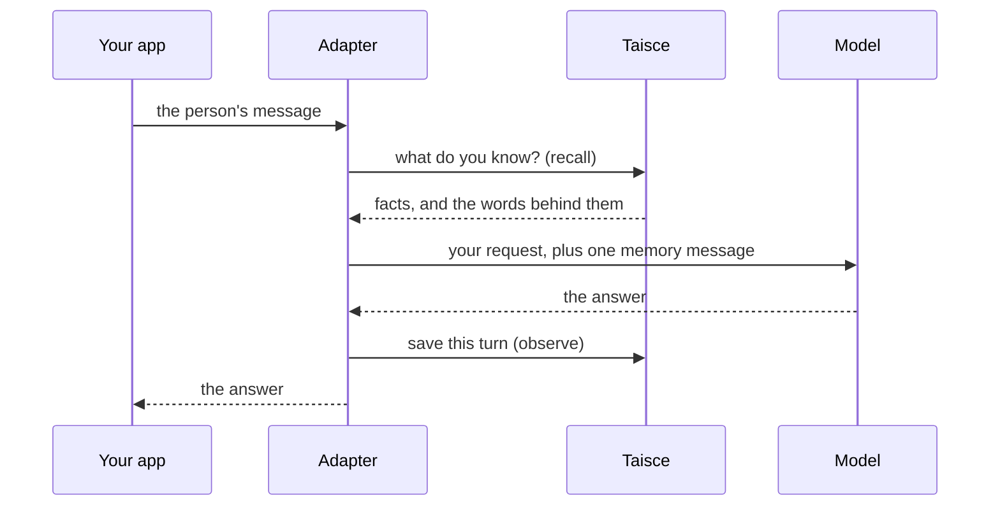

<!-- Copyright 2026 The Taisce Authors -->
<!-- SPDX-License-Identifier: Apache-2.0 -->

# Adapters

An adapter gives your agent a memory without changing how you build it. You add it to the framework
you already use, and on every turn it does two things:

1. **Before the model answers**, it asks Taisce what it knows about the person, and adds the answer
   to the request as one clearly marked message.
2. **After the model answers**, it saves the turn: what the person said and the model's final reply.

Taisce turns saved turns into facts in the background. The next time the person asks something,
even in a new conversation, the model gets those facts, each with the words it came from.



## Pick your adapter

| Language | Framework | What you add | Package |
|---|---|---|---|
| Python | Microsoft Agent Framework | `TaisceContextProvider`, a context provider | `taisce-agent-framework` |
| Python | LangGraph (`create_agent`) | `TaisceMemory`, agent middleware | `taisce-langgraph` |
| Java | LangChain4j | `TaisceChatModel`, which wraps your `ChatModel` | `ai.ensera.taisce:taisce-langchain4j` |
| Java | Spring AI | `TaisceMemoryAdvisor`, an advisor on your `ChatClient` | `ai.ensera.taisce:taisce-spring-ai` |
| .NET | Microsoft Agent Framework | `TaisceContextProvider`, an `AIContextProvider` | `Taisce.AgentFramework` |

- **Use the one for the framework you already have.** Each adapter plugs into a hook the framework
  already offers, so the rest of your agent stays as it is.
- **Each language also has a plain client:** `taisce` in Python, `ai.ensera.taisce:taisce-client`
  in Java and `Taisce.Client` in .NET. Use it if you want to call Taisce yourself.
- **Install from the registry you already use.** Python packages are on
  [PyPI](https://pypi.org/project/taisce-agent-framework/), .NET packages on
  [nuget.org](https://www.nuget.org/packages/Taisce.AgentFramework) and Java modules on
  [Maven Central](https://central.sonatype.com/namespace/ai.ensera.taisce); each guide has the
  install line. The code is in [taisce-python](https://github.com/ensera-ai/taisce-python),
  [taisce-java](https://github.com/ensera-ai/taisce-java) and
  [taisce-dotnet](https://github.com/ensera-ai/taisce-dotnet).
- **Building a coding assistant** rather than an agent of your own? Use [MCP](mcp.md) instead.

## What every adapter does

Every adapter behaves the same way, whatever the language, and
[one shared test suite](#the-conformance-suite) checks it.

**Memory is one message, marked untrusted.** It has the role `user`, never `system`. A model treats
a system message as an instruction, but a memory is only something somebody once said, and it could
contain text that reads like a command. So the adapter hands it over as data. Where the framework
has room for a mark, the message also carries `taisce.untrusted`. The
[security model](../architecture/security.md) explains why.

The message starts with the line `taisce-memory/v1 untrusted`, followed by one JSON document:

```text
taisce-memory/v1 untrusted
{"watermark":{"stored":12,"formed":11,"parked":0},"plan":{…},"facts":[…],"reports":[…],"passages":[…]}
```

- `watermark` says how far Taisce has got. `stored` is the newest saved turn and `formed` is the
  newest one turned into facts. When `formed` is behind, a missing fact may just not be ready yet.
- `plan` says what the recall did.
- `facts`, `reports` and `passages` are what recall found, unchanged. Each fact carries the quote
  it came from.

**No memory, no message.** If recall finds nothing, nothing is added.

**Only what people said is saved.** The adapter saves the person's message and the model's final
reply. It doesn't save tool calls, tool results, its own memory message, or history loaded from
earlier turns (those were saved when they happened).

**A failed turn isn't saved.** If the model call fails, nothing is stored.

**Reading can fail quietly. Saving never does.** If Taisce can't be reached before the model call,
the turn goes on without memory and your error callback is told. If saving fails, the adapter
raises an error in your code, because a lost turn would otherwise go unnoticed until somebody asked
for it.

**A retried turn is saved once.** Every save carries an idempotency key: an ID that lets Taisce spot
a repeat. The adapter builds it from the person, the conversation and the words of the turn, so the
same turn sent twice is stored once. The flip side is that the same words twice in one conversation,
say a second "yes" answered by a second "Done.", also count as one turn.

**Long conversations are replaced, not summarised.** When the history gets long, the adapter asks
Taisce for the person's context: summaries of older turns that Taisce wrote in the background, plus
the newest turns word for word. The model gets that instead of the old history. The adapter never
writes a summary of its own.

## The conformance suite

The conformance suite is one set of test cases that every adapter must pass against a real Taisce
deployment. The cases are in [`conformance/cases.json`](../../conformance/cases.json) in the
service repository, and the `taisce` command runs them.

| Case | What must hold |
|---|---|
| `memory_is_one_untrusted_user_message` | Memory arrives as one `user` message, marked untrusted. |
| `recall_failure_is_not_fatal` | If recall fails, the turn runs without memory and is still saved. |
| `write_failure_is_never_silent` | If saving fails, your code hears about it. |
| `store_only_on_success` | If the model fails, nothing is saved. |
| `filters_default_to_external_messages` | Only the person's message and the final reply are saved. |
| `no_synthetic_message_reaches_observe` | Messages the framework or the adapter wrote are never saved. |
| `compaction_hands_the_model_the_deployments_context` | A long history is replaced by Taisce's context, and the person's message stays. |
| `context_failure_is_not_fatal` | If the context can't be fetched, the history stays as it was. |
| `a_retried_turn_is_stored_once` | The same turn sent twice is saved once. |

For each case, the suite saves a few facts under a new, random person and runs one turn through
your adapter. A recording proxy sits between the adapter and Taisce, and can pretend a call failed.
Only the model is faked.

To run it, download the `taisce` command from the
[release](https://github.com/ensera-ai/taisce/releases/latest), check it against the release's
checksums, and point it at your deployment. Builds are published for `linux-amd64`, `linux-arm64`
and `darwin-arm64`. Run the built-in reference adapter first: if it passes, the deployment and the
suite are fine, and any failure after that is your adapter's.

```bash
V=v0.4.0 PLATFORM=linux-amd64   # or linux-arm64, darwin-arm64
curl -fsSLO https://github.com/ensera-ai/taisce/releases/download/$V/taisce-$V-$PLATFORM
curl -fsSLO https://github.com/ensera-ai/taisce/releases/download/$V/taisce-$V-checksums.txt
shasum -a 256 -c --ignore-missing taisce-$V-checksums.txt
install -m 0755 taisce-$V-$PLATFORM taisce

export TAISCE_API=http://localhost:8080
export TAISCE_TOKEN=$(docker compose logs --no-log-prefix bootstrap | awk '/^token:/ {print $2}')

./taisce conformance --reference
./taisce conformance --driver "/path/to/taisce-python/.venv/bin/python -m taisce_agent_framework.conformance"
```

Each adapter repository has its own driver:

| Adapter | How to run it |
|---|---|
| Python, Agent Framework | `taisce conformance --driver "python -m taisce_agent_framework.conformance"` |
| Python, LangGraph | `taisce conformance --driver "python -m taisce_langgraph.conformance"` |
| Java, LangChain4j | `scripts/conformance.sh langchain4j` |
| Java, Spring AI | `scripts/conformance.sh spring-ai` |
| .NET, Agent Framework | `scripts/conformance.sh` |

The scripts read `TAISCE_API`, `TAISCE_TOKEN`, `TAISCE_CASES` (the path to `cases.json`) and, if
`taisce` isn't on your `PATH`, `TAISCE_BIN`. The token is only ever read from the environment. The
run prints one JSON line per case and a summary, and exits with an error if any case fails.

> [!WARNING]
> The suite writes real data to the project your token opens. Use a project you keep for testing.

**Writing an adapter for another framework?** Your driver reads one JSON instruction per line and
writes one JSON report per line; the format is in
[`internal/conformance/protocol.go`](../../internal/conformance/protocol.go).
`taisce conformance --serve-reference` runs a working driver you can compare against. Your adapter
is done when it passes every case.

## No adapter for your language?

Use the [HTTP API](http-api.md) and do the same steps yourself:

1. Before the model call, ask `POST /v1/recalls` with the person's message, and read
   `GET /v1/freshness` for the watermark. If either fails, carry on without memory.
2. If recall found something, add one `user` message that starts with `taisce-memory/v1 untrusted`.
3. After a successful answer, save the person's message and the reply with
   `POST /v1/observations`. Build the idempotency key from the turn, so a retry is stored once. If
   the save fails, surface the error.

```bash
curl -sS -X POST "$TAISCE_API/v1/recalls" \
  -H "Authorization: Bearer $TAISCE_TOKEN" -H "Content-Type: application/json" \
  -d '{"data_subject_id": "alice", "question": "Where does Marta work?"}'
```

## Where to go next

- [How Taisce works](../start/how-it-works.md): what happens after a turn is saved.
- [Examples](../examples/overview.md): complete agents you can run.
- [Quickstart](quickstart.md): start a deployment on your machine.
- [Troubleshooting](troubleshooting.md): when a turn doesn't remember what it should.
