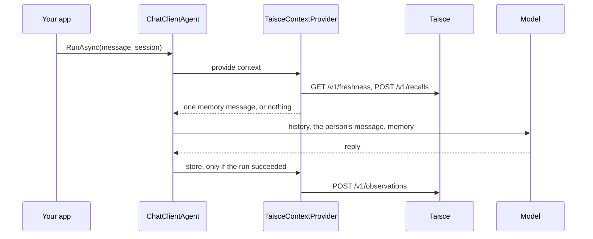

<!-- Copyright 2026 The Taisce Authors -->
<!-- SPDX-License-Identifier: Apache-2.0 -->

# .NET

The .NET adapter adds memory to **Microsoft Agent Framework** agents. Before the model answers, it
adds what Taisce knows about the person as one message. After the model answers, it saves the turn.
[Adapters](adapters.md) explains what every adapter does.

## Install

The packages are on nuget.org. You need the .NET 10 SDK. In your project:

```bash
dotnet add package Taisce.AgentFramework --version 0.1.1
```

| Package | What it is |
|---|---|
| `Taisce.Client` | The client. It depends on nothing outside .NET itself. |
| `Taisce.AgentFramework` | The adapter: a context provider, a compaction strategy, a session store and a text search. It brings in `Taisce.Client`. |

The adapter is built against Microsoft Agent Framework 1.20.0 and Microsoft.Extensions.AI 10.10.0.

If you use compaction, add this to your project file. The framework marks its compaction types as a
preview (diagnostic `MAAI001`), and the build stops on it otherwise:

```xml
<PropertyGroup>
  <NoWarn>$(NoWarn);MAAI001</NoWarn>
</PropertyGroup>
```

## Start Taisce

In an empty directory, from the published images (the [quickstart](quickstart.md) walks through it,
including the model Taisce needs to form facts):

```bash
curl -fsSLO https://raw.githubusercontent.com/ensera-ai/taisce/v0.3.1/compose.yaml
docker compose up -d
export TAISCE_API=http://localhost:8080
export TAISCE_TOKEN=$(docker compose logs --no-log-prefix bootstrap | awk '/^token:/ {print $2}')
```

Setup prints two tokens. Take the one on the line starting `token:`; the operator token is refused
on memory calls. The adapter itself reads no environment variables or configuration keys: your code
passes the address and token in.

## Example

A console app with two conversations. The person says something in the first; once Taisce has turned
it into facts, the second conversation asks about it.

```bash
dotnet new console -n MemoryDemo
cd MemoryDemo
dotnet add package Taisce.AgentFramework --version 0.1.1
dotnet add package Microsoft.Extensions.AI.OpenAI --version 10.10.0
```

Replace `Program.cs` with:

```csharp
using System.ClientModel;
using Microsoft.Agents.AI;
using Microsoft.Extensions.AI;
using OpenAI;
using Taisce;
using Taisce.AgentFramework;

string Env(string name) => Environment.GetEnvironmentVariable(name)
    ?? throw new InvalidOperationException($"{name} is not set");

// Your model: any OpenAI-compatible endpoint.
IChatClient model = new OpenAIClient(
        new ApiKeyCredential(Environment.GetEnvironmentVariable("OPENAI_API_KEY") ?? "local"),
        new OpenAIClientOptions { Endpoint = new Uri(Env("OPENAI_ENDPOINT")) })
    .GetChatClient(Env("OPENAI_CHAT_MODEL"))
    .AsIChatClient();

// One Taisce client, shared by every agent.
using var memory = new TaisceClient(Env("TAISCE_API"), Env("TAISCE_TOKEN"));

// One agent per person and conversation.
ChatClientAgent AgentFor(string person, string conversation) => new(model, new ChatClientAgentOptions
{
    AIContextProviders =
    [
        new TaisceContextProvider(memory, new TaisceContextProviderOptions
        {
            DataSubjectId = person,
            RunId = conversation,
            OnError = (stage, ex) => Console.Error.WriteLine($"taisce {stage} failed: {ex.Message}"),
        }),
    ],
});

var first = AgentFor("alice", "conversation-1");
var session = await first.CreateSessionAsync();
Console.WriteLine((await first.RunAsync("I moved to Cork last month for a new job.", session)).Text);

// Wait until Taisce has turned what it saved into facts.
var deadline = DateTimeOffset.UtcNow.AddMinutes(30);
while (true)
{
    var freshness = await memory.FreshnessAsync();
    if (freshness.Stored is not null && freshness.Formed == freshness.Stored) break;
    if (DateTimeOffset.UtcNow > deadline) throw new TimeoutException("facts did not form in time");
    await Task.Delay(TimeSpan.FromSeconds(5));
}

var second = AgentFor("alice", "conversation-2");
var later = await second.CreateSessionAsync();
Console.WriteLine((await second.RunAsync("Where do I live now?", later)).Text);
```

Run it against any OpenAI-compatible endpoint, such as a local Ollama:

```bash
export OPENAI_ENDPOINT=http://localhost:11434/v1 OPENAI_CHAT_MODEL=<a chat model the endpoint serves>
dotnet run
```

The second conversation shares nothing with the first except the person, so whatever it knows about
Cork came from memory. The wait loop checks the whole project, not just this turn, so on a busy
project it waits for everything to form.

## What happens on a turn



- **Recall.** The question is the person's newest message. The provider sends it with
  `DataSubjectId` and whichever controls you set — `MaxCharacters`, `SourceRoles`, `Hops`,
  `Surfaces`, `Themes`, `AsOf`, `AsKnownAt`; any option left `null` uses the server's default.
  Facts come back to the model as the server sent them, with every field it included.
- **The memory message** is one `ChatMessage` with role `user`, `AuthorName` `taisce`, and
  `AdditionalProperties["taisce.untrusted"]` set to `true`.
- **Saving.** After a successful run, the provider saves this turn's messages from the person and
  the assistant's text replies that carry no tool calls. It sends the time only when you set
  `Clock`; otherwise Taisce records when it received the turn.

When something fails, `OnError` hears about it, as `OnError(stage, exception)`:

| What failed | What happens | Stage |
|---|---|---|
| Recall is refused, or Taisce can't be reached | The model runs without memory. Nothing is thrown. | `recall` |
| Saving is refused, or Taisce can't be reached | `RunAsync` throws after the model has answered. | `observe` |
| The compaction context is refused, or Taisce can't be reached | The history stays as it was. Nothing is thrown. | `context` |
| Any call takes longer than the `HttpClient` timeout | `RunAsync` throws `TaskCanceledException`. If it happened during recall, the model never runs. | not called |

A refusal is a `TaisceException` with the HTTP `Status` and a `Code`; branch on the code.

## Options

**`TaisceClient`**

| Constructor | What it does |
|---|---|
| `new TaisceClient(baseUrl, token)` | Makes its own `HttpClient` with a 30-second timeout, and disposes it with the client. |
| `new TaisceClient(baseUrl, token, http)` | Uses your `HttpClient` and leaves it to you. It sets the `Authorization` header on it, so give Taisce an `HttpClient` of its own. |

The client is thread-safe. Make one per deployment and share it.

**In an application with a host builder**

```csharp
builder.Services.AddTaisceMemory(builder.Configuration);   // the "Taisce" section
// or in code:
builder.Services.AddTaisceMemory(o => { o.Endpoint = endpoint; o.Token = token; o.DataSubjectId = "alice"; o.Hops = 2; });
```

The section carries `Endpoint`, `Token`, `DataSubjectId`, `RunId`, `MaxCharacters`, `SourceRoles`,
`Hops`, `Surfaces` and `Themes`. Bind the token from a secret, never from source. The container gets
a `TaisceClient` and a `TaisceContextProvider`; the compaction strategy stays explicit, because when
a history is replaced is your decision.

**`TaisceContextProviderOptions`**

| Option | Default | What it does |
|---|---|---|
| `DataSubjectId` | `null` | The person the memory belongs to. `null` shares memory across the whole project. |
| `RunId` | `null` | The conversation. It goes into every turn's idempotency key. |
| `MaxCharacters` | the server's limit | How much memory text to fetch. A value above the server's limit makes every recall fail. |
| `SourceRoles` | the server's default, `["user"]` | Whose words may answer: any of `user`, `assistant`, `system`, `tool`. |
| `Hops` | the server's default | How far the walk may travel from an anchor. |
| `Surfaces` | all of them | Which surfaces may answer, such as `facts`, `reports`, `passages`. |
| `Themes` | the server's default | Whether thematic reports may answer. |
| `AsOf` | `null` | Answer as the world was at this time, rather than as it is now. |
| `AsKnownAt` | `null` | Answer with what was known at this time, rather than with everything learned since. |
| `Clock` | `null` | A `TimeProvider` that stamps each saved turn. `null` lets Taisce stamp it. |
| `OnError` | `null` | Called with `recall` or `observe` and the exception. |

**`TaisceCompactionOptions`**

| Option | Default | What it does |
|---|---|---|
| `DataSubjectId` | required | Whose history to fetch. |
| `MaxCharacters` | the server's limit | How much context text to fetch. |
| `Trigger` | `CompactionTriggers.MessagesExceed(40)` | When to compact, using the framework's own triggers. |
| `OnError` | `null` | Called with `context` and the exception. |

## Sessions and long conversations

### One provider per person and conversation

`DataSubjectId` is the person the memory is about, and `RunId` is the conversation. Options are fixed
when you build the provider, so share the client and build the provider, and the agent holding it,
per person and conversation.

Taisce doesn't check who `DataSubjectId` is: your token opens the whole project. Take it from your
own signed-in user, never from something the person or the model typed.

### Compaction

When the framework's compaction trigger fires, `TaisceCompactionStrategy` swaps the history the
model reads for Taisce's context: summaries of older turns plus the newest turns word for word, in
one untrusted `user` message. System messages stay, and so does the person's message. Register it
on the chat client, so it changes what the model reads and not what the session holds. This goes
with the example above, and needs `using Microsoft.Agents.AI.Compaction;`:

```csharp
var strategy = new TaisceCompactionStrategy(memory, new TaisceCompactionOptions
{
    DataSubjectId = "alice",
    Trigger = CompactionTriggers.TurnsExceed(20),
});

IChatClient compacting = new ChatClientBuilder(model)
    .UseAIContextProviders(new CompactionProvider(strategy))
    .Build();

var agent = new ChatClientAgent(compacting, new ChatClientAgentOptions
{
    AIContextProviders =
    [
        new TaisceContextProvider(memory, new TaisceContextProviderOptions
        {
            DataSubjectId = "alice",
            RunId = "conversation-3",
        }),
    ],
});
```

- **The context is fetched on every model call** while the history is over the trigger. In a tool
  loop that should mean once per call, since the framework runs the strategy before each one; that
  part hasn't been tested.
- **The session's own history never gets shorter,** so a saved session keeps growing.
- **The latest exchange can briefly drop out.** The context only holds turns Taisce has already
  formed into facts, and the strategy removes everything before the person's message. So an exchange
  that hasn't formed yet disappears from what the model reads until it does.

### Saving sessions

The framework can serialise a session, but it doesn't store it. `TaisceSessionStore` keeps it in
Taisce under the person it belongs to, so it goes when that person's data is erased.

```csharp
var sessions = new TaisceSessionStore(memory);
var sessionId = conversationId.ToString(); // a Guid you keep with the conversation

var loaded = await sessions.LoadAsync(agent, sessionId, "alice");
var session = loaded?.Session ?? await agent.CreateSessionAsync();

var response = await agent.RunAsync(input, session);

var saved = await sessions.SaveAsync(agent, session, sessionId, "alice", expectedVersion: loaded?.Version);
// pass saved.Version to the next save of this session
```

- **Every call needs the person.** Another person's session looks exactly like one that doesn't
  exist, and `LoadAsync` returns `null`.
- **The session ID must be a UUID.**
- **Pass the version you loaded.** If something else saved in between, the save is refused with
  `409 artifact_conflict`. Saving over an existing session without a version is refused the same
  way.
- **A missing session isn't an error.** `LoadAsync` returns `null`, and `DeleteAsync` treats it as
  already gone. Storage limits apply; see [agent state and files](../18-agent-artifacts.md).

## Testing

The adapter's own tests need no deployment. Run them from a checkout of
[taisce-dotnet](https://github.com/ensera-ai/taisce-dotnet):

```bash
dotnet test Taisce.Tests
```

To test against a real deployment, run the [conformance suite](adapters.md#the-conformance-suite)
from the `taisce-dotnet` checkout. With `TAISCE_API` and `TAISCE_TOKEN` exported:

```bash
export TAISCE_CASES=../taisce/conformance/cases.json   # set TAISCE_BIN too if taisce isn't on your PATH
scripts/conformance.sh
```

## Known limits

- **A slow server fails the turn.** A timeout is a cancellation in .NET, and the provider lets
  cancellations through, so `RunAsync` throws and `OnError` isn't called. If your agent must keep
  going without memory, catch `TaskCanceledException` around `RunAsync`.
- **The same words in the same conversation are one turn.** Two identical exchanges with the same
  `RunId` are saved once.
- **Retrying `RunAsync` isn't retrying the save.** It calls the model again, and a different reply
  is a different turn.
- **With `Clock` set, a late retry still folds.** When Taisce sees a key again it compares the turn,
  not its time, so a retry stamped at a different time gets the original receipt and the first time
  stands.
- **Streaming is untested.** Nothing checks how the provider behaves with `RunStreamingAsync`.
- **Passage search isn't marked untrusted.** `TaisceTextSearch.Provider` hands passages to the model
  through the framework's own formatting, without the memory prefix or the untrusted mark.

## Where to go next

- [Adapters](adapters.md): what every adapter does, and the conformance suite.
- [Python](python.md) and [Java](java.md): the other adapters.
- [HTTP API](http-api.md): the calls underneath.
- [Troubleshooting](troubleshooting.md): when a turn doesn't remember what it should.
