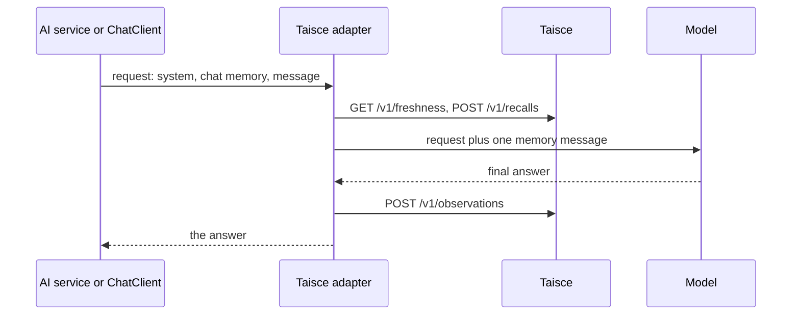

<!-- Copyright 2026 The Taisce Authors -->
<!-- SPDX-License-Identifier: Apache-2.0 -->

# Java

The Java adapter adds memory to **LangChain4j** and **Spring AI** agents. Before the model answers,
it adds what Taisce knows about the person as one message. After the model answers, it saves the
turn. [Adapters](adapters.md) explains what every adapter does.

## Install

The modules are on Maven Central, in the group `ai.ensera.taisce`. You need Java 21 or newer.

| Module | What it is |
|---|---|
| `ai.ensera.taisce:taisce-client` | The client, built on the JDK's HTTP client and Jackson. Comes in with either adapter. |
| `ai.ensera.taisce:taisce-langchain4j` | `TaisceChatModel`, for LangChain4j. |
| `ai.ensera.taisce:taisce-spring-ai` | `TaisceMemoryAdvisor`, for Spring AI. |

You pick the framework version: each adapter declares its framework as `provided`, so the version
your application brings is the one that runs. The adapter was built against LangChain4j 1.20.0 and
Spring AI 2.0.1.

For LangChain4j (the example below also uses LangChain4j's OpenAI-compatible model):

```xml
<dependencies>
  <dependency>
    <groupId>ai.ensera.taisce</groupId>
    <artifactId>taisce-langchain4j</artifactId>
    <version>0.1.1</version>
  </dependency>
  <dependency>
    <groupId>dev.langchain4j</groupId>
    <artifactId>langchain4j</artifactId>
    <version>1.20.0</version>
  </dependency>
  <dependency>
    <groupId>dev.langchain4j</groupId>
    <artifactId>langchain4j-open-ai</artifactId>
    <version>1.20.0</version>
  </dependency>
</dependencies>
```
```kotlin
repositories {
    mavenCentral()
}

dependencies {
    implementation("ai.ensera.taisce:taisce-langchain4j:0.1.1")
    implementation("dev.langchain4j:langchain4j:1.20.0")
    implementation("dev.langchain4j:langchain4j-open-ai:1.20.0")
}
```

For Spring AI, next to the Spring AI model starter you already use:

```xml
<dependencies>
  <dependency>
    <groupId>ai.ensera.taisce</groupId>
    <artifactId>taisce-spring-ai</artifactId>
    <version>0.1.1</version>
  </dependency>
  <dependency>
    <groupId>org.springframework.ai</groupId>
    <artifactId>spring-ai-client-chat</artifactId>
    <version>2.0.1</version>
  </dependency>
</dependencies>
```
```kotlin
repositories {
    mavenCentral()
}

dependencies {
    implementation("ai.ensera.taisce:taisce-spring-ai:0.1.1")
    implementation("org.springframework.ai:spring-ai-client-chat:2.0.1")
}
```

## Start Taisce

In an empty directory, from the published images (the [quickstart](quickstart.md) walks through it,
including the model Taisce needs to form facts):

```bash
curl -fsSLO https://raw.githubusercontent.com/ensera-ai/taisce/v0.3.2/compose.yaml
docker compose up -d
export TAISCE_API=http://localhost:8080
export TAISCE_TOKEN=$(docker compose logs --no-log-prefix bootstrap | awk '/^token:/ {print $2}')
```

Setup prints two tokens. Take the one on the line starting `token:`; the operator token is refused
on memory calls. The adapter itself reads no environment variables: your code passes the address
and token in.

## LangChain4j

`TaisceChatModel` wraps the model you already have. LangChain4j reads its chat memory before it adds
the new message, so a chat memory can't add anything for the current turn; the model is the one
place that sees the whole request and the whole answer. Your `ChatMemory` stays yours.

This command-line agent remembers across runs. Each run is a new process with an empty chat memory,
so anything it knows about an earlier run came from Taisce.

```java
import ai.ensera.taisce.client.TaisceClient;
import ai.ensera.taisce.langchain4j.TaisceChatModel;
import dev.langchain4j.memory.chat.MessageWindowChatMemory;
import dev.langchain4j.model.chat.ChatModel;
import dev.langchain4j.model.openai.OpenAiChatModel;
import dev.langchain4j.service.AiServices;
import java.util.Map;
import java.util.UUID;

public class MemoryAgent {
    interface Assistant {
        String chat(String message);
    }

    public static void main(String[] args) {
        ChatModel model = OpenAiChatModel.builder()
                .baseUrl(System.getenv("MODEL_BASE_URL"))
                .apiKey(System.getenv("MODEL_API_KEY"))
                .modelName(System.getenv("MODEL_NAME"))
                .build();
        TaisceClient taisce = new TaisceClient(System.getenv("TAISCE_API"), System.getenv("TAISCE_TOKEN"));

        ChatModel withMemory = new TaisceChatModel(
                model,
                taisce,
                "alice",                           // whose memory this is
                "run-" + UUID.randomUUID(),        // this conversation
                Map.of(),                          // recall options; empty uses the server's defaults
                (stage, e) -> System.err.println("taisce " + stage + " failed: " + e.getMessage()),
                40);                               // compact after 40 messages; 0 turns it off

        Assistant assistant = AiServices.builder(Assistant.class)
                .chatModel(withMemory)
                .chatMemory(MessageWindowChatMemory.withMaxMessages(60))  // must be larger than 40
                .build();

        System.out.println(assistant.chat(String.join(" ", args)));
    }
}
```

Run it twice, and give Taisce time to form facts in between. Any OpenAI-compatible endpoint works
for the model, such as DeepSeek's:

```bash
export MODEL_BASE_URL=https://api.deepseek.com/v1 MODEL_API_KEY=$DEEPSEEK_API_KEY MODEL_NAME=deepseek-flash

mvn -q compile exec:java -Dexec.mainClass=MemoryAgent -Dexec.args="Marta works at Ensera."

# "formed" catches up with "stored" once Taisce has turned the turn into facts
curl -s "$TAISCE_API/v1/freshness" -H "Authorization: Bearer $TAISCE_TOKEN"

mvn -q compile exec:java -Dexec.mainClass=MemoryAgent -Dexec.args="Where does Marta work?"
```

On the second run, the model gets a memory message with the fact from the first.

## Spring AI

`TaisceMemoryAdvisor` is an advisor on your `ChatClient`. The `ChatClient.Builder` comes from your
Spring AI model starter. Build the Taisce advisor for each request, because it carries the person;
the chat memory is shared.

```java
import ai.ensera.taisce.client.TaisceClient;
import ai.ensera.taisce.springai.TaisceMemoryAdvisor;
import java.util.Map;
import org.springframework.ai.chat.client.ChatClient;
import org.springframework.ai.chat.client.advisor.MessageChatMemoryAdvisor;
import org.springframework.ai.chat.memory.ChatMemory;
import org.springframework.ai.chat.memory.MessageWindowChatMemory;
import org.springframework.beans.factory.annotation.Value;
import org.springframework.stereotype.Service;

@Service
public class Assistant {
    private final ChatClient chat;
    private final TaisceClient taisce;

    public Assistant(ChatClient.Builder builder,
                     @Value("${taisce.api}") String api,       // TAISCE_API in the environment
                     @Value("${taisce.token}") String token) {  // TAISCE_TOKEN in the environment
        ChatMemory chatMemory = MessageWindowChatMemory.builder().maxMessages(60).build();
        this.chat = builder.defaultAdvisors(MessageChatMemoryAdvisor.builder(chatMemory).build()).build();
        this.taisce = new TaisceClient(api, token);
    }

    public String ask(String person, String conversation, String text) {
        var memory = new TaisceMemoryAdvisor(taisce, person, conversation, Map.of(),
                (stage, e) -> System.err.println("taisce " + stage + " failed: " + e),
                0,     // order: runs after the chat-memory advisor
                40);   // compact after 40 messages; 0 turns it off
        return chat.prompt()
                .user(text)
                .advisors(memory)
                .advisors(a -> a.param(ChatMemory.CONVERSATION_ID, conversation))
                .call()
                .content();
    }
}
```

The Taisce advisor must run **after** the chat-memory advisor, so it sees the history that advisor
adds. Spring AI orders `MessageChatMemoryAdvisor` far earlier than `0`, so the default order works;
if you pass your own order, keep it after that advisor.

An app that only ever talks to one person can register the advisor once instead:

```java
ChatClient chat = ChatClient.builder(model)
        .defaultAdvisors(new TaisceMemoryAdvisor(taisce, "alice", null, Map.of(), null))
        .build();
```

## What happens on a turn



| | LangChain4j | Spring AI |
|---|---|---|
| When it recalls | On the turn's first model call. Later calls in a tool loop don't recall, and don't see the memory message. | In `before`, on each pass through the advisor chain. |
| The memory message | A `UserMessage` named `taisce`, with attribute `taisce.untrusted` set to `true` | A `UserMessage` with metadata `taisce.untrusted` set to `true` |
| What it saves | The person's message and the final answer, once it has text and no tool calls | The person's message and the final answer |

The memory message is placed just before the person's message, and it never goes into your chat
memory. Every save is stamped with the current time.

When something fails, `onError` hears about it, as `onError(stage, exception)`:

| Stage | What failed | What happens |
|---|---|---|
| `recall` | Reading memory | Nothing is added, and the turn runs. |
| `context` | Fetching the context for compaction | The request stays as it was, and the turn runs. |
| `observe` | Saving the turn | A `TaisceException` is thrown from `chat(…)` or `.call()`, after the model has answered. |

`TaisceException` has `status()` and `code()`; branch on the code. When Taisce can't be reached at
all, the status is `0` and the code is `unreachable` or `interrupted`.

## Options

Everything is a constructor argument.

| Option | Where | Default | What it does |
|---|---|---|---|
| `baseUrl`, `token` | `TaisceClient` | required | The deployment's address and a project token that can read and write. |
| `http`, `timeout` | `TaisceClient`, four-argument form | 10 s to connect, 30 s per request | Your own `java.net.http.HttpClient` and a `Duration`, for proxies, TLS or shorter timeouts. |
| `delegate` | `TaisceChatModel` | required | The LangChain4j model you're wrapping. |
| `client` | both adapters | required | A `TaisceClient`. Share one. |
| `dataSubjectId` | both adapters | `null` | The person the memory belongs to. `null` shares memory across the whole project. |
| `runId` | both adapters | `null` | The conversation. It goes into every turn's idempotency key. |
| `controls` | both adapters | `Map.of()` | Recall options, sent as given. |
| `onError` | both adapters | `null` | Called with the stage and the exception. |
| `order` | `TaisceMemoryAdvisor` | `0` | The advisor's order in Spring AI. |
| `compactAfterMessages` | both adapters, last argument | `0`, off | Compact when a request holds more non-system messages than this. Needs `dataSubjectId`. |

The keys in `controls` are the recall options described in [recall controls](../12-recall-controls.md).
The two you'll use most are `max_characters` (how much memory text to fetch, which also limits the
context during compaction) and `source_roles` (whose words may answer; `["user"]` by default). Pass
times such as `as_of` as strings: the client's JSON writer can't serialise an `Instant`. A misspelt
key or a bad value makes every recall fail, and you'll only see it through `onError`.

## Sessions and long conversations

### One adapter per person and conversation

`dataSubjectId` is the person the memory is about, and `runId` is the conversation. Both are fixed
when you build the adapter, so an app that serves many people builds one per person, or per
request. That's cheap, because the part you share is the `TaisceClient`.

Taisce doesn't check who `dataSubjectId` is: your token opens the whole project. Take it from your
own signed-in user, never from something the person or the model typed.

### Compaction

When a request holds more messages than `compactAfterMessages`, the adapter swaps the old history
for Taisce's context: summaries of older turns plus the newest turns word for word, in one untrusted
user message. Your system messages stay, and so does the person's message.

- **Your chat memory isn't changed.** Only the request the model sees is. While your chat memory is
  over the limit, every turn fetches the context again.
- **The chat memory window must be larger than the limit.** A window of 20 messages with a limit of
  40 never compacts.
- **In LangChain4j, compaction applies to the turn's first model call only.** Later calls in a tool
  loop are built from your chat memory and carry the full history.

### Saving sessions

Neither framework stores a serialised session for you. `SessionStore` in `taisce-client` keeps it in
Taisce under the person it belongs to, so it goes when that person's data is erased. You connect it
to your framework's serialiser, as in this LangChain4j example:

```java
SessionStore sessions = new SessionStore(taisce);
String sessionId = UUID.randomUUID().toString();   // keep this with the conversation; it must be a UUID

Optional<SessionStore.Loaded> loaded = sessions.load(sessionId, "alice");
MessageWindowChatMemory chatMemory = MessageWindowChatMemory.withMaxMessages(60);
loaded.ifPresent(l -> ChatMessageDeserializer.messagesFromJson(l.state()).forEach(chatMemory::add));
String version = loaded.map(SessionStore.Loaded::version).orElse(null);

// ... run the turn with this chat memory ...

SessionStore.Saved saved = sessions.save(sessionId, "alice",
        ChatMessageSerializer.messagesToJson(chatMemory.messages()), version);
```

- **Every call needs the person.** Another person's session looks exactly like one that doesn't
  exist.
- **Pass the version you loaded.** If something else saved in between, the save is refused with
  `409 artifact_conflict`. Saving over an existing session without a version is refused the same
  way.
- **A missing session isn't an error.** `load` returns `Optional.empty()`, and `delete` treats it as
  already gone.
- **A deleted session's ID can't be reused.** Start a new session with a new UUID. Storage limits
  apply; see [agent state and files](../18-agent-artifacts.md).

## Testing

The adapter's own tests need no deployment. Run them from a checkout of
[taisce-java](https://github.com/ensera-ai/taisce-java):

```bash
mvn test
```

To test against a real deployment, run the [conformance suite](adapters.md#the-conformance-suite)
from the `taisce-java` checkout. With `TAISCE_API` and `TAISCE_TOKEN` exported:

```bash
export TAISCE_CASES=../taisce/conformance/cases.json   # set TAISCE_BIN too if taisce isn't on your PATH
scripts/conformance.sh langchain4j
scripts/conformance.sh spring-ai
```

## Known limits

- **No streaming.** LangChain4j's `StreamingChatModel` isn't wrapped. Don't use the Spring AI advisor
  with `.stream()`: the turn is silently not saved. (Read from the code; not run.)
- **No Spring Boot starter.** You create the client and the advisor yourself.
- **The same words in the same conversation are one turn.** Two identical exchanges with the same
  `runId` are saved once. With a `null` run, that holds across all of the person's conversations.
- **A late retry is refused.** Each save is stamped with the current second, and Taisce compares
  the whole request when it sees a key again. A retry a second or more later gets
  `409 idempotency_conflict`, though the turn is still stored once. (Read from the code; not run.)
- **No retries.** A `429 rate_limited` recall means no memory for that turn; a `429` on save throws.
- **A slow server delays the turn.** Recall makes two calls before the model runs, each allowed up
  to the client's timeout. Pass a shorter one if the turn should give up on memory sooner.
- **LangChain4j: tool-loop calls don't see memory,** and a user message with several parts, such as
  text plus an image, is neither recalled for nor saved.
- **LangChain4j: your model's listeners fire twice,** once without the memory message and once with
  it. (Read from the code; not run.)
- **Spring AI with tools is untested.** Spring AI may run this advisor inside its tool loop, so each
  model call would recall again. Only the final answer would be saved.
- **Plain `http://` is allowed.** Use HTTPS anywhere but your own machine: the token travels on
  every request.

## Where to go next

- [Adapters](adapters.md): what every adapter does, and the conformance suite.
- [Python](python.md) and [.NET](dotnet.md): the other adapters.
- [HTTP API](http-api.md): the calls underneath.
- [Troubleshooting](troubleshooting.md): when a turn doesn't remember what it should.
