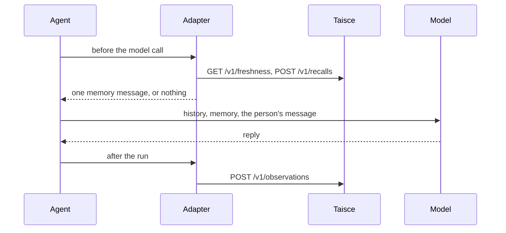

<!-- Copyright 2026 The Taisce Authors -->
<!-- SPDX-License-Identifier: Apache-2.0 -->

# Python

The Python adapter adds memory to agents built with **Microsoft Agent Framework** or **LangGraph**.
Before the model answers, it adds what Taisce knows about the person as one message. After the model
answers, it saves the turn. [Adapters](adapters.md) explains what every adapter does.

## Install

The packages are on PyPI. You need Python 3.10 or newer; the adapter is tested on 3.12.

```bash
python -m venv .venv
. .venv/bin/activate

pip install taisce-agent-framework   # for Microsoft Agent Framework
pip install taisce-langgraph         # for LangGraph
```

Either adapter brings in `taisce`, the client.

| Package | Import | What it is |
|---|---|---|
| `taisce` | `taisce` | The client. Every call is `async`, and its only dependency is `httpx`. |
| `taisce-agent-framework` | `taisce_agent_framework` | The Microsoft Agent Framework adapter. Needs `agent-framework-core` 1.18.0 or newer. |
| `taisce-langgraph` | `taisce_langgraph` | The LangGraph adapter. Needs `langchain`, `langgraph` and `langchain-core` 1.0 or newer. |

Add your model's chat client the way you normally would. The adapter never talks to the model.

## Start Taisce

In an empty directory, from the published images (the [quickstart](quickstart.md) walks through it,
including the model Taisce needs to form facts):

```bash
curl -fsSLO https://raw.githubusercontent.com/ensera-ai/taisce/v0.5.0/compose.yaml
docker compose up -d
export TAISCE_API=http://localhost:8080
export TAISCE_TOKEN=$(docker compose logs --no-log-prefix bootstrap | awk '/^token:/ {print $2}')
```

Setup prints two tokens. Take the one on the line starting `token:`; the operator token is refused
on memory calls. The adapter itself reads no environment variables: the examples read these two
and pass them in.

## Microsoft Agent Framework

This runs as it is. `EchoModel` stands in for a real model: it prints what it was given and replies
"Noted.". Swap in your own chat client and nothing else changes.

```python
import asyncio
import os
from typing import Any, Mapping, Sequence

from agent_framework import Agent, BaseChatClient, ChatResponse, InMemoryHistoryProvider, Message

from taisce import Client
from taisce_agent_framework import TaisceCompaction, TaisceContextProvider


class EchoModel(BaseChatClient):
    """A stand-in model: prints what it receives and gives a fixed reply."""

    async def _inner_get_response(self, *, messages: Sequence[Message], stream: bool,
                                  options: Mapping[str, Any], **kwargs: Any) -> ChatResponse:
        for m in messages:
            print(f"  model sees [{m.role}] {(m.text or '')[:80]!r}")
        return ChatResponse(messages=[Message("assistant", ["Noted."])])


def report(stage: str, exc: Exception) -> None:
    print(f"  taisce {stage} failed: {exc!r}")


async def main() -> None:
    async with Client(os.environ["TAISCE_API"], os.environ["TAISCE_TOKEN"]) as client:
        agent = Agent(EchoModel(), context_providers=[
            InMemoryHistoryProvider(),
            TaisceCompaction(client, data_subject_id="alice", after_messages=40, on_error=report),
            TaisceContextProvider(client, data_subject_id="alice", run_id="conversation-1", on_error=report),
        ])
        session = agent.create_session()
        for text in ("I work at Ensera and I live in Dublin.", "Where do I work?"):
            response = await agent.run(text, session=session)
            print("reply:", response.text)


asyncio.run(main())
```

The order of `context_providers` matters. The history provider comes first, so `TaisceCompaction`
has a history to look at. Compaction is optional: remove that line and the agent still has memory.

## LangGraph

The same agent with LangGraph's `create_agent`. The checkpointer keeps the conversation between
calls.

```python
import asyncio
import os
from typing import Any, List, Optional

from langchain.agents import create_agent
from langchain_core.language_models import BaseChatModel
from langchain_core.messages import AIMessage, BaseMessage, HumanMessage
from langchain_core.outputs import ChatGeneration, ChatResult
from langgraph.checkpoint.memory import InMemorySaver

from taisce import Client
from taisce_langgraph import TaisceMemory


class EchoModel(BaseChatModel):
    """A stand-in model: prints what it receives and gives a fixed reply."""

    @property
    def _llm_type(self) -> str:
        return "echo"

    def _generate(self, messages: List[BaseMessage], stop: Optional[List[str]] = None,
                  run_manager: Any = None, **kwargs: Any) -> ChatResult:
        for m in messages:
            print(f"  model sees [{m.type}] {str(m.content)[:80]!r}")
        return ChatResult(generations=[ChatGeneration(message=AIMessage(content="Noted."))])

    def bind_tools(self, tools: Any, **kwargs: Any) -> "EchoModel":
        return self


def report(stage: str, exc: Exception) -> None:
    print(f"  taisce {stage} failed: {exc!r}")


async def main() -> None:
    async with Client(os.environ["TAISCE_API"], os.environ["TAISCE_TOKEN"]) as client:
        memory = TaisceMemory(client, data_subject_id="alice", run_id="conversation-1",
                              compact_after_messages=40, on_error=report)
        agent = create_agent(EchoModel(), tools=[], middleware=[memory], checkpointer=InMemorySaver())
        config = {"configurable": {"thread_id": "conversation-1"}}
        for text in ("I work at Ensera and I live in Dublin.", "Where do I work?"):
            state = await agent.ainvoke({"messages": [HumanMessage(content=text)]}, config)
            print("reply:", state["messages"][-1].content)


asyncio.run(main())
```

The middleware is async only. Run the agent with `ainvoke()` or `astream()`; `invoke()` and
`stream()` raise an error.

## What you should see

On a fresh deployment, the first turn gets no memory message, because nothing is known yet. The
turn is saved. Once Taisce has turned it into facts, a later question gets one memory message just
before the person's message:

```text
  model sees [user] 'taisce-memory/v1 untrusted\n{"watermark":{"stored":...
  model sees [user] 'Where do I work?'
```

With Taisce down, the Agent Framework example prints this (LangGraph shows `human` instead of
`user`):

```text
  taisce recall failed: ConnectError('All connection attempts failed')
  model sees [user] 'I work at Ensera and I live in Dublin.'
  taisce observe failed: ConnectError('All connection attempts failed')
Traceback (most recent call last):
  ...
httpx.ConnectError: All connection attempts failed
```

Recall failed, was reported, and the model ran anyway. Saving failed, was reported, and raised. The
model did answer, but the call that raised doesn't return the answer, so catch the error.

## What happens on a turn



- **Recall.** The question is the person's last message. Agent Framework recalls once per
  `agent.run`. LangGraph recalls before every model call, so an agent that uses tools recalls more
  than once per run.
- **The memory message** is one `user` message named `taisce`, with `taisce.untrusted` set to
  `True`: in `additional_properties` for Agent Framework and in `additional_kwargs` for LangGraph.
  In LangGraph it goes into the model request only and is never written to the graph state.
- **Saving.** After the run, the adapter saves the person's message and the assistant's text
  replies that carry no tool calls, stamped with the current time.
- **Errors.** Your `on_error(stage, exc)` callback hears about every failure:

| Stage | What failed | What happens |
|---|---|---|
| `"recall"` | Reading memory | Nothing is added, and the turn runs. |
| `"context"` | Fetching the context for compaction | The history stays as it was, and the turn runs. |
| `"observe"` | Saving the turn | The error is raised, after the model has answered. |

`exc` is a `taisce.TaisceError` when Taisce refused the request: it has `status`, `code` and
`message`, and you should branch on `code`. It's an `httpx` exception when Taisce couldn't be
reached. Without `on_error`, a failing recall leaves no trace at all.

## Options

**`Client(base_url, token, *, http=None, timeout=30.0)`**

| Option | Default | What it does |
|---|---|---|
| `base_url` | required | The deployment's address, such as `http://localhost:8080`. |
| `token` | required | A project token that can read and write. It's sent only to `base_url` and never logged. |
| `http` | `None` | Your own `httpx.AsyncClient`, for proxies or TLS. You close it, and `timeout` is ignored. |
| `timeout` | `30.0` | Seconds allowed for each HTTP call. |

Use `async with Client(...) as client:`, or call `await client.aclose()` when you're done. Share
one client across all your agents.

**`TaisceContextProvider(client, ...)`** (Agent Framework) and **`TaisceMemory(client, ...)`**
(LangGraph). All options are keyword-only.

| Option | Default | What it does |
|---|---|---|
| `data_subject_id` | `None` | The person the memory belongs to. `None` shares memory across the whole project. |
| `run_id` | `None` | The conversation. It goes into every turn's idempotency key. |
| `max_characters` | the server's limit | How much memory text to fetch. A value above the server's limit makes every recall fail. |
| `source_roles` | the server's default, `["user"]` | Whose words may answer: any of `user`, `assistant`, `system`, `tool`. |
| `on_error` | `None` | Called as `on_error(stage, exc)`. |
| `compact_after_messages` | `None`, off | LangGraph only. Compact when the state holds more non-system messages than this. Needs `data_subject_id`. |

**`TaisceCompaction(client, ...)`** (Agent Framework)

| Option | Default | What it does |
|---|---|---|
| `data_subject_id` | required | Whose history to fetch. |
| `after_messages` | required | Compact when the loaded history holds more messages than this, not counting system or memory messages. |
| `max_characters` | the server's limit | How much context text to fetch. |
| `on_error` | `None` | Called with `"context"` when the context can't be fetched. |

## Sessions and long conversations

### One provider per person and conversation

`data_subject_id` is the person the memory is about, and `run_id` is the conversation. Both are
fixed when you build the provider or middleware, so an app that serves many people builds one per
person and conversation, and shares the `Client`.

Taisce doesn't check who `data_subject_id` is: your token opens the whole project. Take it from
your own signed-in user, never from something the person or the model typed.

### Compaction

When a conversation gets long, the adapter swaps the old history for Taisce's context: summaries of
older turns plus the newest turns word for word, in one untrusted `user` message. System messages
stay, and so does the person's current message.

- **Agent Framework:** add `TaisceCompaction` after your history provider. It doesn't change your
  stored history, so once a conversation is over the limit, every run fetches the context again.
- **LangGraph:** set `compact_after_messages`. The adapter rewrites the graph state, so with a
  checkpointer the count drops and the next fetch waits until the history grows again.

The context covers everything this person said, in every conversation, not only this one. Taisce
writes the summaries in the background with its model; until it has, older turns come back word for
word, trimmed from the oldest end.

### Saving sessions (Agent Framework)

The framework can turn a session into a dictionary, but it doesn't store it. `SessionStore` keeps it
in Taisce under the person it belongs to, so it goes when that person's data is erased.

```python
import uuid

from agent_framework import AgentSession
from taisce_agent_framework import SessionStore

store = SessionStore(client)
session_id = str(uuid.uuid4())   # keep this with the conversation; it must be a UUID

loaded = await store.load(session_id, "alice")   # None the first time
session = AgentSession.from_dict(dict(loaded.state)) if loaded else agent.create_session(session_id=session_id)

response = await agent.run("Where do I work?", session=session)

saved = await store.save(session_id, "alice", session.to_dict(),
                         expected_version=loaded.version if loaded else None)
# pass saved.version to the next save of this session
```

- **Every call needs the person.** Another person's session looks exactly like one that doesn't
  exist.
- **Pass the version you loaded.** If something else saved in between, the save is refused with
  `409 artifact_conflict`. Saving over an existing session without a version is refused the same
  way.
- **A missing session isn't an error.** `load` returns `None`, and `delete` treats it as already
  gone.

LangGraph has no session store: your checkpointer keeps the conversation, outside Taisce.

## Testing

The adapter's own tests need no deployment. Run them from a checkout of
[taisce-python](https://github.com/ensera-ai/taisce-python):

```bash
pip install -e ./client -e ./agent-framework -e ./langgraph pytest pytest-asyncio
pytest client/tests agent-framework/tests langgraph/tests -q
```

To test against a real deployment, run the [conformance suite](adapters.md#the-conformance-suite)
with each driver. Give the full path to the virtual environment's Python, because the command isn't
run through a shell:

```bash
./taisce conformance --driver "/path/to/taisce-python/.venv/bin/python -m taisce_agent_framework.conformance"
./taisce conformance --driver "/path/to/taisce-python/.venv/bin/python -m taisce_langgraph.conformance"
```

## Known limits

- **Async only.** There's no sync API, and a LangGraph agent must run with `ainvoke()` or
  `astream()`.
- **The same words in the same conversation are one turn.** Two identical exchanges with the same
  `run_id` are saved once. Use a different `run_id` for each conversation.
- **A late retry is refused.** The adapter stamps each save with the current second, and Taisce
  compares the whole request when it sees a key again. A retry a second or more later gets
  `409 idempotency_conflict`, though the turn is still stored once. This comes from reading the
  code and hasn't been run.
- **No retries.** The adapter retries nothing, including `429 rate_limited`.
- **A slow server delays the turn.** Recall makes two calls before the model runs, each allowed up
  to `timeout` (30 seconds by default). Pass a shorter `timeout` to give up on memory sooner.
- **Agent Framework compaction fetches the context on every run** once the conversation is over the
  limit.
- **No session store for LangGraph.**
- **Passage search is yours to wire up.** `taisce_agent_framework.search(client, ...)` returns a
  plain async search function; it isn't attached to any framework type.

## Where to go next

- [Adapters](adapters.md): what every adapter does, and the conformance suite.
- [Java](java.md) and [.NET](dotnet.md): the other adapters.
- [HTTP API](http-api.md): the calls underneath.
- [Troubleshooting](troubleshooting.md): when a turn doesn't remember what it should.
