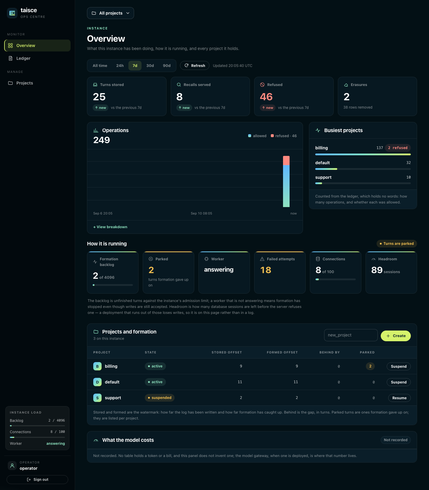
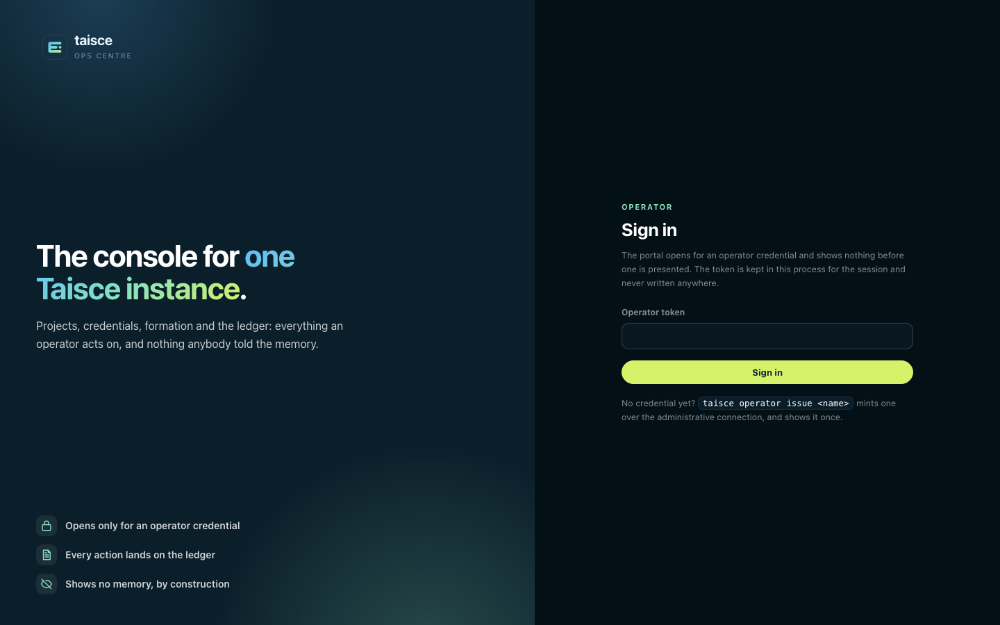
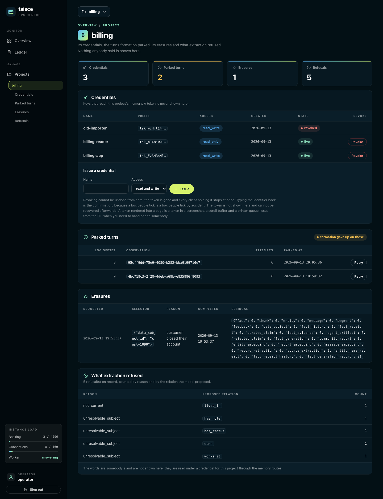
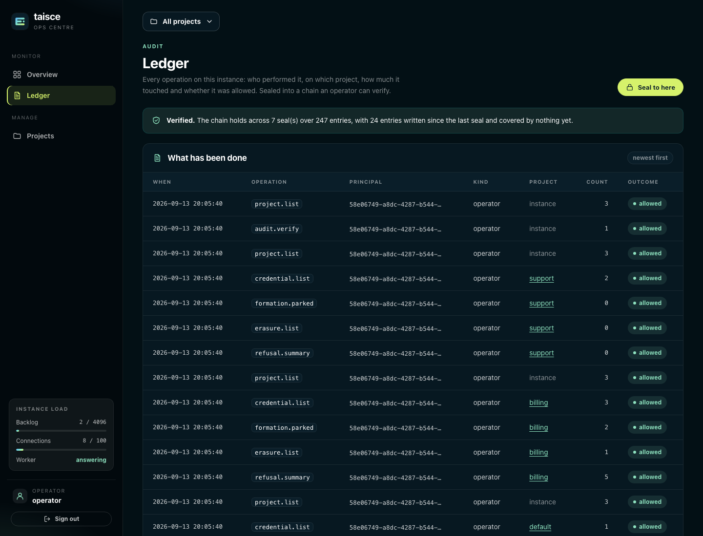

<!-- Copyright 2026 The Taisce Authors -->
<!-- SPDX-License-Identifier: Apache-2.0 -->

# Operate an instance

This guide is for whoever runs a Taisce instance. It covers the whole job, in the order you meet it:
getting an operator token, creating projects, handing out API keys, watching the instance, dealing
with turns that failed, reading what extraction refused and what was erased, and keeping the ledger
honest.



## Three ways in, one set of powers

Everything an operator does can be done three ways. They reach the same operations, need the same
credential, and write the same rows to the ledger. Pick whichever suits the moment.

| Surface | Where | Good for |
|---|---|---|
| **The ops centre** | `/portal/` on the manage process, when switched on | Seeing the whole instance at a glance, and the everyday actions |
| **The `taisce` CLI** | Any machine with the binary, or `docker compose exec manage /taisce` | Minting tokens, scripts, and the commands the ops centre does not offer |
| **The management API** | `POST /manage/v1/…` on the manage process | Automation from your own tooling |

All three take an **operator token**. An operator token manages the instance and **cannot read or
write memory**: no message, fact, quote or subject is reachable with it, from any of the three. That
is deliberate. It lets somebody run Taisce without being able to read what people told it. Reading
memory needs a project token, through the memory API.

The manage process listens on `127.0.0.1:8081` by default: loopback only, on the host that runs it.

## Get an operator token

`bootstrap`, which Compose runs on the first start, mints the first operator token and prints it once:

```bash
docker compose logs --no-log-prefix bootstrap | grep 'operator token:'
```

```text
operator token: tsk_…
```

Only a digest of each token is stored, so a lost token cannot be recovered. Mint another one. This
command goes straight to the database, because you need an operator token before you can use either
of the other surfaces:

```bash
docker compose exec manage /taisce operator issue alice
```

```text
operator credential alice (…) reaches the management surface and no project
token: tsk_…
```

Give each person or system its own operator token, so the ledger says who did what. Keep tokens in
an environment variable or a secret store, never in a file you commit. To list operator tokens, run
`taisce credential list` without `--project`; to stop one working, `taisce credential revoke <id>`.

To point the CLI at the management API instead of the database, set both variables. The command
refuses to run with one and not the other:

```bash
export TAISCE_MANAGE_API=http://127.0.0.1:8081
export TAISCE_OPERATOR_TOKEN=tsk_…
```

[Credentials](../10-project-credentials.md#operator-credentials) has the details.

## Switch on the ops centre

The ops centre is **off by default**. Off, its routes do not exist: every `/portal/` path answers
404, so a browser surface is never exposed by accident.

**With Compose**, set `TAISCE_PORTAL=on` and restart the manage service:

```bash
TAISCE_PORTAL=on docker compose up -d
```

Then open `http://127.0.0.1:8081/portal/` on the same machine. From your laptop to a server, forward
the port rather than publishing it:

```bash
ssh -L 8081:127.0.0.1:8081 your-server
```

**With Helm**, set `manage.portal: "on"`. Reach it with
`kubectl port-forward svc/<release>-manage 8081:8081`, or expose it with `ingress.portal.enabled`,
`ingress.portal.host` and TLS. The chart refuses to render a portal ingress while `manage.portal` is
off, because that ingress would expose the management surface's door instead. Write `"on"` in lower
case: the chart compares it exactly ([#55](https://github.com/ensera-ai/taisce/issues/55)).

### Sign in



Paste an operator token. Only an operator token opens it: a project token, a revoked token or anything
else gets the same **Refused.** and no session.

- **The session lasts 12 hours** and lives in the manage process's memory. Nothing about it is written
  down, so restarting the manage process signs everyone out.
- **The token is checked again on every request.** Revoke an operator token and that browser is sent
  back to sign in on its next click.
- **Every form carries a per-session guard**, and a form without it is refused. The pages load no
  script, no image and nothing from another origin.
- **The session cookie is marked `Secure` only when the manage process itself terminates TLS.** Behind
  an ingress that terminates TLS for it, keep the portal on a private network.

## Projects

A project is one memory: its own log, its own facts, its own keys. Nothing crosses between projects,
and a project token reaches exactly one. [Keeping content apart with projects](../16-content-access.md)
explains what stays separate.



### Create one

Names start with a lower-case letter and use lower-case letters, digits and `_`, up to 63 characters.
Creating a project that exists already is safe.

- **Ops centre:** on the overview, type the name into the *Projects and formation* card and press
  **Create**.
- **CLI:** `taisce project create billing`
- **API:**

  ```bash
  curl -sS -X POST http://127.0.0.1:8081/manage/v1/projects/create \
    -H "Authorization: Bearer $TAISCE_OPERATOR_TOKEN" -H "Content-Type: application/json" \
    -d '{"name": "billing"}'
  ```

### See every project and how far it has got

The overview's *Projects and formation* table lists each project with its **state** (`active` or
`suspended`) and its **watermark**:

| Column | What it means |
|---|---|
| Stored offset | The newest turn written to the project's log |
| Formed offset | The newest turn formation has turned into facts, or `–` if none has formed yet |
| Behind by | The gap between the two, in turns. A steady non-zero number means formation is falling behind |
| Parked | Turns formation gave up on (see [parked turns](#turns-that-failed-parked-turns)) |

From the CLI, `taisce project list` prints each project with its surfaces, retention and
`[suspended]`. The API's `POST /manage/v1/projects/list` returns each project's name, label, surfaces
and whether it is suspended, and `POST /manage/v1/formation/status` returns every project's stored,
formed and parked counts. An application reads its own project's watermark with `GET /v1/freshness`.

### Suspend and resume

Suspending takes a project offline without losing anything: its keys are refused until it is resumed.
Use it when a key has leaked and you have not yet found every copy, or while you investigate a
project.

- **Ops centre:** **Suspend** or **Resume** on the project's row.
- **CLI:** `taisce project suspend billing`, `taisce project resume billing`
- **API:** `POST /manage/v1/projects/suspend` or `/resume` with `{"name": "billing"}`

There is no project deletion. Removing what people said is an erasure, which proves what it removed
(see [erasures](#erasures)).

### Retention

Retention is how many days new turns are kept in a project. It is set from the CLI or the API; the
ops centre shows nothing about it.

```bash
taisce project retention billing 365
taisce project retention billing indefinite
```

Whole days, 1 to 36,500. A new setting applies to turns written after it: deadlines already stamped
on stored turns are not rewritten. [Governance](../architecture/governance.md#retention) explains how
expiry works.

## API keys

A **project token** is what an application or an adapter uses to reach one project's memory. Every
token starts with `tsk_`.

| Kind | Reaches | Can |
|---|---|---|
| Read and write (`read_write`) | One project | Every memory operation: save turns, recall, inspect, correct, erase |
| Read only (`read_only`) | One project | Recall, inspect and export, but change nothing |
| Operator | The management surface, no project | Everything in this guide, and no memory |

### Issue a key to hand to an application

Use the CLI or the API: they show the token, **once**.

```bash
taisce credential issue billing-app --project billing
taisce credential issue billing-reader --project billing --read-only
```

```text
credential billing-app (…) reaches project billing with read_write access
token: tsk_…

This token is shown once and cannot be recovered.
```

```bash
curl -sS -X POST http://127.0.0.1:8081/manage/v1/credentials/issue \
  -H "Authorization: Bearer $TAISCE_OPERATOR_TOKEN" -H "Content-Type: application/json" \
  -d '{"name": "billing-app", "project": "billing", "access": "read_write"}'
```

Put the token where the application reads its secrets, and pass it to the client or adapter in code.
No adapter reads an environment variable of its own. Issuing for a suspended project is refused.

The ops centre has an **Issue** form on each project's page, but it **never shows the token**: a
token rendered into a page ends up in screenshots, scroll buffers and printer queues. A key issued
there cannot be handed to anybody, so issue from the CLI or the API when an application needs one.
Like the CLI and the API, the form refuses a project that does not exist or is suspended, and
nothing is issued.

### See who holds what

Each project's page in the ops centre lists its keys, newest first, revoked ones included:

| Column | What it means |
|---|---|
| Name | The name given when it was issued |
| Prefix | The first 12 characters of the token (`tsk_` and 8 more). Match it against what a client holds without seeing the rest |
| Access | `read_write` or `read_only` |
| Created | The day it was issued |
| State | `live` or `revoked` |

`taisce credential list --project billing` and `POST /manage/v1/credentials/list` with
`{"project": "billing"}` return the same list.

### Rotate and revoke

To rotate a key without downtime, issue a new one, deploy it, then revoke the old one. Revoking takes
effect at once: every client holding the token is refused on its next request.

- **Ops centre:** **Revoke** on the key's row, then type the key's identifier exactly as the page shows
  it and press **Revoke for good**. Typing it back is the confirmation; nothing else revokes.
- **CLI:** `taisce credential revoke <credential id>`
- **API:** `POST /manage/v1/credentials/revoke` with `{"id": "<credential id>"}`

The ops centre's form revokes only keys of the project whose page it is on. A key of another project,
an operator key or an identifier that names nothing is refused, and nothing is revoked. To revoke an
operator key, or any key by identifier alone, use the CLI or the API.

[Credentials](../10-project-credentials.md) covers what each kind allows in detail.

## Watch the instance

The ops centre's **Overview** is the instance at a glance. Everything on it is counted from the
ledger and from PostgreSQL's own statistics, never from anything anybody said.

### Activity

- **Window.** *All time*, *24h*, *7d* (the default), *30d* or *90d*. **Refresh** reloads the same
  view. The **All projects** switcher at the top narrows the page to one project.
- **Cards.** *Turns stored*, *Recalls served*, *Refused* and *Erasures* in the window, each compared
  with the previous window of the same length. Only *Refused* is coloured, because more refusals is
  the one movement that is always worth a look. *Turns stored* currently adds up messages rather than
  turns, so a turn of three messages counts three
  ([#54](https://github.com/ensera-ai/taisce/issues/54)).
- **Operations.** Allowed and refused operations over time. **View breakdown** lists each operation
  with how often it was allowed, how often refused, and how many rows it touched.
- **Busiest projects.** The six projects doing the most. Narrowed to one project, it becomes the six
  busiest operations in that project.

### How it is running

Six tiles, and a status that says which of them needs you first:

| Tile | What it tells you | When to act |
|---|---|---|
| Formation backlog | Unfinished turns against the instance's admission limit (4,096 by default) | Near the limit, new turns are refused with `429 rate_limited`. See [the ingestion backlog](../06-ingestion-budget.md) |
| Parked | Turns formation gave up on, across every project | Any at all: see [parked turns](#turns-that-failed-parked-turns) |
| Worker | `answering` if a worker has reported in the last 330 seconds | `not answering` means formation has stopped, even though writes are still accepted |
| Failed attempts | Formation attempts that have failed over the life of the instance: a running total kept in the database, so a restart does not reset it | Not the number, but whether it is still rising. A climbing count usually means the model is unreachable or refusing |
| Connections | Database sessions in use across the whole PostgreSQL server | Watch it as you add workers and API replicas |
| Headroom | Sessions left before PostgreSQL refuses a new one | Marked low at 10 sessions or a tenth of `max_connections`, whichever is larger. The next process to start may be refused |

The status reads **Formation has stopped**, **Connections are low**, **Turns are parked**, or
**Nothing needs attention**, in that order of urgency. The same numbers appear in the rail on every
page as *Instance load*.

*What the model costs* says **Not recorded**, because no table holds a token count or a bill. The
model gateway, when you run one, is where that number lives.

From the CLI, `taisce health` prints the same aggregates, as a panel in a terminal or as JSON
otherwise. For a load balancer or an orchestrator, use the readiness endpoints in
[readiness and health](../07-operational-health.md).

## Turns that failed: parked turns

When forming a turn fails, formation tries again: six attempts in all, waiting 10 seconds before the
second and doubling each time. After the sixth failure the turn is **parked**. Its words are kept, the
watermark moves past it so the turns after it can form, and it waits for an operator.

A parked turn usually means the model was unreachable, timed out, or answered with something that was
not the contract. Fix that first, or the turn parks again.

- **Ops centre:** the project's page lists its parked turns with the log offset, the observation
  identifier, the number of attempts and when it parked. **Retry** queues one for formation again.
- **CLI:**

  ```bash
  taisce formation parked --project billing
  taisce formation unpark --project billing <observation id>
  ```

- **API:** `POST /manage/v1/formation/parked` with `{"project": "billing"}`, then
  `POST /manage/v1/formation/unpark` with `{"project": "billing", "observation_id": "…"}`.

No surface shows why a turn failed, because the record that marks it parked is built so that it cannot
carry a provider's error text or anybody's words. The worker's log has the error.
[Managing the ingestion backlog](../06-ingestion-budget.md#recover-parked-turns) goes further.

## What extraction refused

Extraction proposes facts, and Taisce refuses any it cannot stand behind. Each project's page counts
those refusals **by reason and by the relation the model proposed**, never with the words:

| Reason | What it means |
|---|---|
| `unmapped_relation` | The relation is not in the vocabulary, so there is nowhere to put it |
| `unlocatable_quote` | The quote is not in the message: usually a paraphrase, occasionally an invention |
| `duplicate_claim` | The same claim was already produced from this message |
| `not_asserted` | The words are there but do not assert it: a denial, a hedge, a hypothetical, or someone else's statement reported |
| `unresolvable_subject` | The subject is a pronoun or a "that" whose referent is outside the message |
| `not_current` | It is stated in the past ("I used to live in Amman"), and storing it would invent when it was true |
| `conflicting_value` | The same message gives two current values for something that can only have one |
| `not_spoken_by_principal` | A first-person claim from someone other than the person, such as the assistant's "so you work at Ensera" |
| `entity_name_limit` | A name is too long, or one spelling too many for a single entity |

Refusals are normal; a conversation full of thanks and small talk refuses a lot. Watch for a change:
a jump in `unlocatable_quote` or `unmapped_relation` after changing models usually means the new model
keeps to the contract less well. The words behind a refusal are somebody's, and are read under that
project's token through [the memory API](../11-record-inspection.md).

From the API: `POST /manage/v1/refusals/summary` with `{"project": "billing"}`.

## Erasures

Erasing a person is a memory operation: the application does it with a project token
(`POST /v1/erasures`). What the operator sees is the **receipt** each erasure leaves on the project's
page:

| Column | What it means |
|---|---|
| Requested | When the erasure was asked for |
| Selector | Whom or what it named: a subject or source observations, as identifiers |
| Reason | The reason the caller gave |
| Completed | When it finished, or `open` if it has not |
| Residual | A count, by kind, of what still matched after the deletion. All zeros is a clean erasure |

A receipt with a non-zero residual is the one to follow up. [Forget a person](../examples/forget-a-person.md)
explains how to read one. From the API: `POST /manage/v1/erasures/list` with `{"project": "billing"}`.

## The ledger

Every operation on the instance, from every surface, is written to the ledger: who performed it,
on which project, how much it touched and whether it was allowed. It holds no words.



The ops centre's **Ledger** page shows the 100 most recent entries, newest first, and can be narrowed
to one project:

| Column | What it means |
|---|---|
| When | When it happened, in UTC |
| Operation | The operation, such as `observe`, `recall`, `credential.issue` or `authenticate` |
| Principal | The credential that acted, or `unresolved` for a request that never authenticated |
| Kind | `credential`, `operator` or `system` |
| Project | The project it acted on, or `instance` |
| Count | How many rows or items it touched |
| Outcome | `allowed` or `refused` |

Refused sign-ins and requests with unknown tokens are recorded too, sampled at up to 16 a minute, so
somebody guessing tokens shows up without flooding the ledger. The token they presented is never
written.

### Seal and verify

**Sealing** chains every entry written since the last seal into a digest, and the head of that chain
is a fingerprint of the whole ledger so far. The worker seals every five minutes; you can also seal on
demand. **Verifying** recomputes the chain.

- **Ops centre:** the Ledger page verifies every time it loads. **Verified.** says how many seals and
  entries the chain covers, and how many entries were written since the last seal. **Not verified.**
  says which seal broke and how. **Seal to here** seals on demand.
- **CLI:** `taisce audit seal`, then `taisce audit verify`, which exits 1 when the chain does not
  verify, but only when it talks to the database directly.
- **API:** `POST /manage/v1/audit/seal` and `POST /manage/v1/audit/verify`. Read `Valid` in the answer:
  the call succeeds even when verification fails.

Write the head down somewhere the database cannot reach. A rewritten ledger cannot produce a head that
matches one recorded earlier.

## Recovery, rebuilds and storage

These are CLI commands, run with the administrative database connection, and the ops centre does not
offer them:

| Task | Commands | Read |
|---|---|---|
| Restore derived rows from what is stored, without a model | `taisce recover facts`, `taisce recover chunks` | [Recovering facts](../15-fact-recovery.md) |
| Re-read turns with the model you have now | `taisce rebuild project`, `status`, `cancel`, `facts`, `reports` | [Rebuilding facts](../20-generation-rebuild.md) |
| Limit what agents may store as state and files | `taisce artifact limits` | [Agent state and files](../18-agent-artifacts.md) |
| Build and switch embedding generations | `taisce embeddings`, `entity-embeddings`, `report-embeddings` | [Message embeddings](../22-message-embeddings.md) |

[The command line](../developers/cli.md) lists every command and flag.

## What an operator cannot do

These are deliberate, and each holds on all three surfaces:

- **Read memory.** No message, fact, quote, subject or refused claim is reachable with an operator token.
- **Purge an entity or erase a person.** Both are memory operations and need a project token.
- **See a token after it was issued.** Only its digest is stored.
- **Delete a project.** An erasure removes what was said, with a receipt; a deletion would not.
- **See why a turn failed**, beyond the fact that it did. The worker's log has the error.
- **See what the model cost.** Nothing records it.

