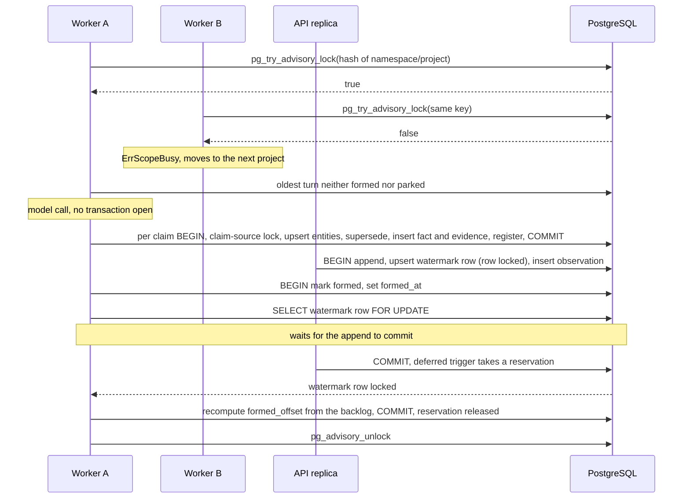

<!-- Copyright 2026 The Taisce Authors -->
<!-- SPDX-License-Identifier: Apache-2.0 -->

# Concurrency and correctness

Several processes write to the same database at once, and none of them coordinates with another in
memory. This page shows which lock, row or constraint keeps each invariant true when they do.

**You'll learn:**

- the isolation levels in use, and why correctness does not depend on them;
- every lock the system takes, and what it protects;
- how appends, retries, formation, supersession, erasure, rebuilds and sealing stay correct under
  concurrency;
- how connection exhaustion is handled;
- what happens when a message arrives twice, a process dies, two replicas form one project, or an
  erasure races formation.

Read [the data model](data-model.md) first; this page assumes its tables.

## Who writes

Every process is the same binary in a different role. Anything that has to hold across processes is
held by PostgreSQL.

| Writer | What it writes | Runs as |
|---|---|---|
| API replicas | observations, corrections, assertions, retractions, feedback, erasures, artifacts, subjects, audit entries | the memory role, several replicas |
| Formation workers | facts, entities, evidence, refusals, the formed watermark | the memory role, several replicas |
| Background passes | reports, segments, embeddings, notification deliveries, retention sweeps | the memory role |
| Operator commands | rebuilds, recovery, provisioning, embedding generations, seals | the operator connection |

## Isolation: statement snapshots, row locks and constraints

Every read-write transaction runs at PostgreSQL's default, `READ COMMITTED`. No code sets another
level for a write, and none uses `SERIALIZABLE`.

A few reads need one consistent state across several statements:

- export ([exportstore.go](../../internal/infra/pg/exportstore.go)), citation resolution
  ([citationstore.go](../../internal/infra/pg/citationstore.go)) and record pages
  ([recordstore.go](../../internal/infra/pg/recordstore.go)) run at `REPEATABLE READ READ ONLY`;
- a rebuild reads its source at `REPEATABLE READ`
  ([generationsnapshot.go](../../internal/infra/pg/generationsnapshot.go)).

A recall is not a transaction at all. The anchor lookup and the traversal are separate statements,
each with its own snapshot ([recallstore.go](../../internal/infra/pg/recallstore.go)).

So correctness does not come from the isolation level. Each invariant below names the row lock,
advisory lock or constraint that holds it.

The recurring pattern is **lock, then read**. Under `READ COMMITTED` every statement takes a fresh
snapshot. A transaction that first locks the row it depends on, and then reads, sees everything
committed by whoever held that lock before it.

## The locks

| Lock | Kind | Key | Held for | Taken by | Protects |
|---|---|---|---|---|---|
| Formation, per project | session advisory, try | hash of namespace and project | the whole drain of one project | `Worker.Drain`, [formation.go](../../internal/formation/formation.go) | one extraction per turn |
| Watermark row | row lock by upsert, or `FOR UPDATE` | `watermark (scope)` | the append or the mark-formed transaction | [observationstore.go](../../internal/infra/pg/observationstore.go) | contiguous offsets; a formed watermark that cannot run ahead |
| Retry key | transaction advisory | `taisce:observe-retry:<namespace>:<project>:<key digest>` | the append | [observationretry.go](../../internal/infra/pg/observationretry.go) | one receipt per key |
| Ingestion budget | row lock by update | the single `ingestion_budget` row | commit of any append or release | the deferred triggers in [0025](../../internal/migrate/sql/0025_unfinished_observations_reserve_ingestion_capacity.sql) | the backlog ceiling |
| Claim source | transaction advisory | `taisce:claim-source:<namespace>:<project>:<observation>` | one claim, retraction or publication | `lockClaimSource`, [recordretraction.go](../../internal/infra/pg/recordretraction.go) | one source's claims are written one at a time |
| Entity row | row lock by `ON CONFLICT DO UPDATE`, or `FOR UPDATE` | `entity (scope, normalized_name)` | the claim transaction | [factstore.go](../../internal/infra/pg/factstore.go), [entitynames.go](../../internal/infra/pg/entitynames.go) | orders assertions about one subject |
| Current facts | `FOR UPDATE` | the open facts for `(scope, subject, predicate)` | the claim transaction | `supersedeSQL` in [factstore.go](../../internal/infra/pg/factstore.go) | the supersession read |
| Erasure | `FOR UPDATE`, sorted by id | the subject row and the selected observations | the erasure | [erasurestore.go](../../internal/infra/pg/erasurestore.go) | an erasure's view of what it deletes |
| Rebuild, per project | session advisory, try | `<namespace>/project-rebuild/<project>` | the runner's session | [rebuildjob.go](../../internal/infra/pg/rebuildjob.go) | one runner per project |
| Rebuild job | `FOR UPDATE` plus a lease column | `fact_rebuild_job (scope, job_id)` | each checkpoint and publication | [rebuildjob.go](../../internal/infra/pg/rebuildjob.go) | a replaced runner cannot publish |
| Embedding policy | transaction advisory | `<namespace>:embedding-policy:<project>` | start, activate, cancel, prune | [embeddinggeneration.go](../../internal/infra/pg/embeddinggeneration.go) | one change to a project's generations at a time |
| Seal | transaction advisory | `taisce:audit-seal:<namespace>` | one seal | [auditstore.go](../../internal/infra/pg/auditstore.go) | seals never overlap |
| Provisioning | transaction advisory | `<namespace>:project:<project>` | one provisioning | [provision.go](../../internal/migrate/provision.go) | one partition and row per project |
| Bootstrap | session advisory | `taisce:establish-planes` | role and grant reconciliation | [planes.go](../../internal/migrate/planes.go) | replicas starting together |
| Work queues | `FOR UPDATE SKIP LOCKED` | due observations, subjects, deliveries | one page | [retentionstore.go](../../internal/infra/pg/retentionstore.go), [notificationstore.go](../../internal/infra/pg/notificationstore.go) | two workers split the work instead of waiting |

Advisory keys are hashes of these strings, so two unrelated keys can collide. Formation, the seal,
provisioning, bootstrap and embedding policy use the 32-bit `hashtext`. The retry-key, claim-source and
rebuild locks use the 64-bit `hashtextextended`, where collisions are much rarer.

A collision only makes two unrelated pieces of work wait for each other. It never merges their
identities, and every correctness check still runs inside the lock. The cost is throughput, not
correctness.

## Appending and the contiguous log offset

A project's log offset has no gaps. The formed watermark is defined as "the highest offset with
nothing unformed below it", and that only works if offsets have no holes.

A global sequence would not do. It has holes in every project by construction, and a sequence value
taken outside the transaction leaves a permanent hole whenever a transaction rolls back.

So the offset is claimed inside the append transaction, by upserting the project's watermark row
(`claimOffsetSQL` in [observationstore.go](../../internal/infra/pg/observationstore.go)):

```sql
INSERT INTO {schema}.watermark (scope, log_offset, watermark_at)
VALUES ($1, 0, $2)
ON CONFLICT (scope) DO UPDATE
   SET log_offset   = {schema}.watermark.log_offset + 1,
       watermark_at = greatest({schema}.watermark.watermark_at, excluded.watermark_at),
       updated_at   = now()
RETURNING log_offset
```

What this gives:

- The update locks the row until commit. Appends to one project serialize; appends to different
  projects never touch each other's row.
- If the transaction rolls back, the increment rolls back with it, and the next append takes the same
  number.
- `observation_scope_offset_uniq` backs the invariant in the database.

The row doubles as the lock, rather than a separate advisory lock, because a second lock would need
its own key and could disagree with the row it protects.

**The cost:** each project accepts one append at a time, for as long as an append transaction lasts.
That includes writing the messages, chunks and registrations, and the reservation trigger at commit.
This has not been measured.

## Idempotent writes: one receipt per retry

A caller retries a write with the same UUID `idempotency_key`
([0021](../../internal/migrate/sql/0021_observation_retries_have_one_receipt.sql)). Inside one
transaction, `AppendIdempotent` in [observationretry.go](../../internal/infra/pg/observationretry.go):

1. Takes a transaction advisory lock on the key's digest. Only attempts that share a key wait for each
   other.
2. Reads `observation_retry` for that key `FOR UPDATE`.
3. If a receipt exists with the same request fingerprint, returns the original observation, with no
   new offset and no second formation. A different fingerprint, or a tombstone left by an erasure, is
   refused as a conflict (HTTP 409).
4. Otherwise appends the turn and writes the receipt, in the same transaction.

The advisory lock is what turns a race into a replay. Without it, two first attempts would both miss
the receipt and both append. The loser would then fail on the receipt's primary key, roll back a whole
append, and answer with an error instead of the receipt. With the lock, the second attempt waits and
then finds the receipt.

`TestConcurrentObservationRetriesShareOneReceiptAndOneFormation` in
[idempotency_test.go](../../internal/api/idempotency_test.go) sends concurrent attempts through HTTP and
asserts one observation and one extraction call.

## Durable ingestion reservations

Each unformed turn holds one reservation, against a ceiling for the instance and a ceiling per project
([0025](../../internal/migrate/sql/0025_unfinished_observations_reserve_ingestion_capacity.sql)). Two
deferred constraint triggers keep the counters exact.

**`observation_ingestion_reservation`** fires at the commit of any transaction that inserts an
observation or changes its `formed_at`, `scope` or `kind`:

- For an unformed turn with no reservation yet, it increments the single `ingestion_budget` row
  (conditional on room), then the project's row in `ingestion_project_usage` (also conditional), and
  inserts the reservation.
- If either ceiling is full, it raises an error naming `ingestion_backlog_capacity`. The whole append
  rolls back: observation, messages, chunks, receipt and offset. The API answers `429` with
  `Retry-After: 1`.
- For a turn that has now formed, it deletes the reservation.

**`ingestion_reservation_release`** fires at the commit of any delete from `ingestion_reservation`,
whether from formation or cascaded from an erasure or retention sweep. It decrements both counters.

Why they are built this way:

- **Deferred to commit**, so they run after the append has taken its watermark lock. That keeps the
  global row locked for as little of the transaction as possible.
- **The global row is a deliberate serialization point.** Every append in the instance updates it at
  commit, and a stale `REPEATABLE READ` snapshot fails with a serialization error rather than
  oversubscribing. It is a known write bottleneck, and its throughput has not been measured.
- **`SECURITY DEFINER` with a fixed `search_path`**, and they refuse any table other than their own.
  The runtime role can fire them but cannot write the counters or forge a reservation
  ([roles and grants](roles-and-grants.md)).

`TestConcurrentWritersCannotOversubscribeDurableCapacity` in
[ingestionbudget_test.go](../../internal/infra/pg/ingestionbudget_test.go) holds the ceiling under
concurrent writers.

## Formation: one worker per project

Formation runs behind the append and calls a model once per message, which takes seconds. Three things
make it safe to run on several replicas at once.

**A session advisory lock per project, held across the whole drain.** `Worker.Drain` in
[formation.go](../../internal/formation/formation.go) takes a pool connection of its own and calls
`pg_try_advisory_lock`.

- If another worker holds the project, it returns `ErrScopeBusy`, and the driver moves on to the next
  project. It never waits.
- The lock is session-level, not transaction-level, because no transaction may stay open across a
  model call. A transaction-scoped lock would be released before the call it was meant to protect.
- It is per project rather than per instance, so a busy project cannot starve a quiet one.
- It is released explicitly before the connection goes back to the pool. If the process dies,
  PostgreSQL releases it when the session ends.

**Short transactions for everything that writes.** Each claim is its own transaction (`AssertVersioned`
in [factstore.go](../../internal/infra/pg/factstore.go)), and so is each refusal (`RejectVersioned`).
No transaction is open while the model runs.

**A formed watermark that is derived, not incremented.** `MarkFormed` in
[observationstore.go](../../internal/infra/pg/observationstore.go):

1. sets `formed_at`;
2. locks the watermark row `FOR UPDATE`, the same row an append locks;
3. recomputes `formed_offset` from the backlog: the offset just below the lowest turn that is neither
   formed nor parked.

Two completions arriving out of order therefore cannot move the number past a turn that is still
unformed.



Worker B never forms Worker A's turn, and never waits for it either. The append and the mark-formed
transaction meet on the watermark row. Whichever commits second reads the first one's result, so the
formed offset is always recomputed from the backlog as it stands after both.

The tests are `TestASecondWorkerOnTheSameScopeIsTurnedAway` and
`TestASecondDriverDoesNotFormTheSameTurnTwice` in
[formation_test.go](../../internal/formation/formation_test.go).

**Failures.** A turn that fails is retried with a doubling backoff, chosen when the backlog is read
(`selectNextUnformedSQL`). After its attempt budget it is parked
([0009](../../internal/migrate/sql/0009_a_turn_that_will_not_form_is_parked_not_lost.sql)). A parked
turn:

- no longer holds the watermark back;
- still counts against the backlog ceiling;
- is reported as a count beside freshness.

Notifications are written as rows and delivered afterwards, so formation never waits for a customer's
endpoint ([0058](../../internal/migrate/sql/0058_a_scope_can_tell_somebody_it_formed.sql)).

## Supersession is a constraint, not a lock

A single-cardinality relation, such as where somebody lives, may hold one current value per subject.
`fact_single_cardinality_excl`, an `EXCLUDE USING gist` over the project, subject, predicate, `valid`
and `known`, makes that a database invariant
([0010](../../internal/migrate/sql/0010_supersession_is_a_constraint_rather_than_a_lock.sql),
[0032](../../internal/migrate/sql/0032_retractions_preserve_source_instructions.sql)).

The alternative was an application lock per subject and relation, taken on every write path. That is
correct only while every path remembers to take it, including one written next year by someone who
never read the reasoning. The constraint is correct because the database will not store the violation,
whichever path the write took.

The constraint decides what may be stored. Two other mechanisms decide the order in which concurrent
writers reach it:

1. **The entity row.** Resolving a claim's subject upserts the entity with `ON CONFLICT ... DO UPDATE`
   (`upsertEntitySQL` in [factstore.go](../../internal/infra/pg/factstore.go)). That locks the subject's
   row for the rest of the claim transaction, so a second assertion about the same subject waits for
   the first to commit.
2. **The current facts.** `supersedeSQL` then locks the subject's current facts for that relation
   `FOR UPDATE`. Because it runs after the entity lock, it sees the first writer's fact. It archives
   the prior interval in `fact_history`, closes its `valid` range at the new fact's start, and restarts
   its `known` range at the new knowledge time. The new fact is inserted in the same transaction.

When supersession cannot apply, the insert overlaps and the constraint refuses it with SQLSTATE `23P01`.
That happens when two claims start at the same instant, or when a claim starts before the current
value did.

- The store names that refusal `ErrConflictingValue`.
- Formation records it as a `conflicting_value` refusal, and the turn still completes.
- The rebuild path wraps each claim in a savepoint, so one refusal cannot abort a whole generation.

Tests:

- `TestConcurrentWritersCannotProduceTwoCurrentFacts` in
  [writepath_test.go](../../internal/infra/pg/writepath_test.go) starts eight writers at one instant and
  asserts that one current fact remains, with the rest refused by the constraint.
- `TestConcurrentSupersessionCommitsOneCoherentKnowledgeTransition` in
  [facthistory_test.go](../../internal/infra/pg/facthistory_test.go) covers the archive.

**What the entity lock costs** is an inference from the code; it has not been measured. Every assertion
that names an entity holds that entity's row lock until its claim transaction commits, and writes a new
version of the row. That update also fires the trigger that invalidates the entity's embedding.

Formation is one worker per project, so inside a project this lock contends mainly with corrections,
assertions and rebuild publication. The extra row versions on frequently mentioned entities are vacuum
work.

## A claim already recorded is refused rather than repeated

Two mechanisms cover two kinds of repetition.

**Within one message.** The extractor collapses a relation the message states twice, and records the
repeat as `duplicate_claim` ([extract.go](../../internal/extract/extract.go),
[0008](../../internal/migrate/sql/0008_a_claim_already_recorded_is_refused_not_repeated.sql)). This
cannot be a unique constraint: a superseded fact and the fact that replaced it share a subject, a
predicate and often an object, so uniqueness over the triple would forbid supersession.

**Across attempts.** A fact's id is derived from the project, the source observation, the message
ordinal and the claim's signature (`sourceClaimID` in
[recordretraction.go](../../internal/infra/pg/recordretraction.go)). Before inserting, the claim
transaction checks whether that id already exists, and reuses the fact if it does. A retried formation,
a replay after a lost acknowledgement, or a second writer of the same source finds the fact it would
have written, instead of writing another. Refused claims also have derived ids, and are inserted
`ON CONFLICT DO NOTHING`.

Two more guarantees hold per source:

- The extraction pin in `source_extraction` is immutable, so a retry cannot mix claims from two
  extractor configurations in one source
  ([0040](../../internal/migrate/sql/0040_source_extraction_pins_prevent_mixed_retries.sql)).
- The claim-source advisory lock serializes every writer of one source's claims: formation,
  retraction and rebuild publication.

## Erasure

An erasure is one transaction at `READ COMMITTED` (`Eraser.erase` in
[erasurestore.go](../../internal/infra/pg/erasurestore.go)). Its order is deliberate:

1. For an erasure by data subject, lock the subject's registry row `FOR UPDATE`. A new observation
   naming that subject takes a `FOR KEY SHARE` lock on the same row
   ([0039](../../internal/migrate/sql/0039_subject_registry_keeps_external_references_at_the_boundary.sql)),
   so accepting a source and erasing its subject serialize.
2. Lock the selected observations `FOR UPDATE`, in id order. Sorting means two overlapping erasures
   lock in the same order instead of deadlocking.
3. Refuse if no projection kinds are declared. A receipt that could delete nothing would prove nothing
   while looking clean.
4. Open the `erasure_request` row.
5. For each declared kind, delete the rows registered to the departing subject or sources, then count
   the residual with the same predicate. A kind whose `survives_sharing` is true keeps a row that
   another subject also registered.
6. Remove, and count, the name receipts, the erased sources' evidence, retractions, curated claims,
   fact receipts and extraction pins.
7. Delete the observations last. The cascade takes messages, chunks, registrations and reservations;
   the retry receipt keeps only its tombstone.
8. Close the request with its residual.

Why this order:

- **The residual is counted before the observations go, in the same transaction.** Deleting the
  observations first would cascade the registrations away and make the count meaningless. Counting
  after commit would count other writers' work as this erasure's.
- **The deferred, project-consistent foreign keys** from
  [0023](../../internal/migrate/sql/0023_relationships_agree_on_the_project.sql) are checked at commit.
  Any surviving row that still points at a deleted observation aborts the whole erasure instead of
  committing half of it.

An erasure takes no advisory lock and does not pause formation or rebuild. Row locks alone order them;
[the last question below](#an-erasure-races-formation) shows how.

## Rebuild checkpoints and cancellation

`taisce rebuild project` reinterprets a project's retained turns under a new extractor identity, one
source at a time ([0042](../../internal/migrate/sql/0042_project_fact_rebuild_jobs.sql),
[rebuildjob.go](../../internal/infra/pg/rebuildjob.go)).

- **One runner per project.** The runner needs a pool of at least two connections. It takes a session
  advisory lock on one of them, and returns `ErrRebuildBusy` if another runner holds it. The partial
  unique index `one_active_fact_rebuild` separately allows only one active job per project.
- **A fixed range.** A new job records `through_offset` from the watermark's stored offset. Turns
  appended later belong to a later job.
- **A reserved position.** Before visiting a source, the job sets `pending_offset`. That reservation is
  the boundary cancellation respects.
- **A lease.** A runner that replaces a disconnected one writes a new `lease_id`, so a predecessor
  whose connection lingers fails the fence and cannot publish.

**Publication happens in one transaction per source**
([factgeneration.go](../../internal/infra/pg/factgeneration.go)). The source is first read in a
`REPEATABLE READ` snapshot, and the model runs with no transaction open. Then one transaction:

1. locks the job row and checks the fence: the job is active, the lease is this runner's, and the
   pending offset and extractor identity match;
2. takes the claim-source lock;
3. returns the earlier result if this source's operation key was already published;
4. re-reads the source `FOR UPDATE`, and refuses if its digest changed;
5. retires the prior generated facts;
6. asserts each new claim inside its own savepoint;
7. records what it admitted and retired.

**Cancellation** sets `cancel_requested`. A live runner may finish the source it has reserved, but
reserves no other. If no runner holds the project lock, which cancellation checks with
`pg_try_advisory_xact_lock`, the cancel transaction settles the job itself. It finishes the bookkeeping
of a pending source that was published before the runner died, and marks the job cancelled together
with its audit entry. No model call is needed.

**Rebuild and formation together.** They use different advisory locks, so both can run in one project
at once. They meet per source, at the claim-source lock and on the source row. The project as a whole
does not switch over atomically; freshness reports the rebuild's progress instead.

Job rows hold offsets and counts but no source ids, so an erasure never needs to touch them. A source
erased while its model call is running fails the re-read and is counted as skipped
(`TestProjectRebuildSkipsSourcesErasedDuringModelWork` in
[projectrebuild_test.go](../../internal/formation/projectrebuild_test.go)).

## The ledger's seal

Every recall, and nearly every other operation, writes an `audit_entry` row. Entries take their ids
from a sequence and never read one another, so audit writes do not serialize.

That is why the ledger is sealed in batches rather than chained row by row. A per-row chain would make
every recall in the instance wait for the previous one's digest
([0017](../../internal/migrate/sql/0017_the_ledger_seals_itself.sql)).

`AuditStore.Seal` in [auditstore.go](../../internal/infra/pg/auditstore.go) runs in one transaction:

1. Take a transaction advisory lock, so two sealers never overlap (`TestTwoSealersCannotOverlap` in
   [planes_test.go](../../internal/migrate/planes_test.go)).
2. Read where the last seal ended, and its digest.
3. Take the highest entry id, and the count of entries since the last seal.
4. Digest that range with `audit_entries_digest`, which names its fields explicitly so a later column
   cannot silently change past digests.
5. Chain the result to the previous seal's digest, and insert the new seal.

`Verify` recomputes every seal's range and chain. It reports whether an entry was altered or the chain
was relinked, and how many entries are not sealed yet. Triggers make both tables append-only.

What the seal does not cover:

- **Entries written since the last seal.** The sealing interval is the window of exposure.
- **A rebuild of the whole database with a fresh chain.** Only the head digest written to the process
  log, held outside the database, defends against that.
- **An entry that commits after the seal covering its id.** This is an inference from the code; no test
  reproduces it.
  - An audit entry's id is assigned when its row is inserted, not when its transaction commits.
  - Suppose its transaction is still open when a seal reads the highest committed id, and commits after
    the seal computes its digest. Its id then falls inside the sealed range, while its row is missing
    from the digest.
  - The next verification reports that range as altered. The entry is also neither covered by a seal
    nor counted as unsealed, because the unsealed count starts after the last sealed id.
  - The window is the time between an audit row's insert and its commit. That is milliseconds for a
    recall's single-statement audit write. For audit entries written inside operator transactions
    (embedding operations, rebuild start and cancellation), it is the whole transaction.

## Connections: reserved at startup, retryable when exhausted

Each process opens its own pools, the deployment decides how many processes run, and the server decides
`max_connections`.

At startup, `CheckConnectionBudget` in [connectionbound.go](../../internal/migrate/connectionbound.go)
compares each pool's maximum with what the server has left: `max_connections`, minus
`superuser_reserved_connections`, minus every client backend currently connected, whatever its database
or role. The process refuses to start if its pool could not be satisfied, and names all the numbers.

If a write still meets exhaustion, `NoConnectionSlots` in
[connectionslots.go](../../internal/infra/pg/connectionslots.go) recognizes SQLSTATE `53300`, or the
driver's message when the pool wraps it. The API then answers `503` with `Retry-After: 1` and its own
error code ([api.go](../../internal/api/api.go)). Because the observation carries an idempotency key,
retrying is safe.

The limits:

- **Simultaneous starts.** Two processes starting at the same moment can both see room.
- **Lazily opened pools.** This is an inference from the code and the shipped configuration. The check
  counts connections other processes already hold, not the maximum their pools may still open. The
  DSNs in [compose.yaml](../../compose.yaml) set `pool_min_conns` well below `pool_max_conns`, so a
  process that started earlier has claimed only what it has opened so far. A later process can pass
  the check even when the sum of all pools' maxima exceeds the server's slots. The retryable `503`
  catches the difference.
- **`reserved_connections`.** The check does not subtract PostgreSQL's `reserved_connections`, which
  also withholds slots from ordinary roles. It defaults to zero.

Inside a process, API memory work passes through a local admission gate sized from the pool. Formation
holds one connection for each project it is draining. A rebuild runner holds two.

## Transaction boundaries, path by path

| Path | Transactions | Isolation | Serialized by | What a crash leaves |
|---|---|---|---|---|
| Append | one | read committed | retry-key lock, watermark row, budget row at commit | nothing: all or none |
| Formation of one turn | one per claim, one per refusal, one to mark it formed; none during model calls | read committed | project advisory lock, claim-source lock, entity rows, watermark row | earlier claims committed, the turn still unformed and retried |
| Erasure | one | read committed | subject and observation rows, locked in order | nothing: all or none |
| Rebuild of one source | a snapshot read, then one publication | repeatable read, then read committed with a savepoint per claim | project advisory lock, job row and lease, claim-source lock | the prior generation intact or the new one committed; the checkpoint says which |
| Export, citation, record pages | one, read-only | repeatable read | none | nothing |
| Recall | none; one statement per step | read committed snapshot per statement | none | nothing |

## Four failure questions

### A message arrives twice

**With an idempotency key**, the second arrival returns the first one's receipt: the same observation
id and offset. It writes no second observation, takes no second offset or reservation, and triggers no
second formation.

- A second arrival with a different payload under the same key is refused.
- So is one whose original was erased, because the key's tombstone outlives the observation. That
  stops a stale queued retry from writing erased words back.

**Without a key**, the second arrival is a new observation, by design. A person can say the same thing
twice, and deduplicating by content would erase the repetition.

- Its claims get their own fact ids and their own evidence, because a fact's id includes its source
  observation.
- For a single-cardinality relation, the later claim supersedes the earlier if it starts later, and is
  refused as `conflicting_value` if it starts at the same instant.

A transport retry therefore needs a key to count as one write, and the adapters are required to send
one.

### A process dies mid-transaction

PostgreSQL rolls the open transaction back, and nothing it wrote survives:

- **An append.** No observation, messages, chunks, receipt or reservation. The offset increment rolls
  back too, so no gap appears.
- **Formation.** Claims committed before the crash stay, and the turn remains unformed. The session
  ends, so the project's advisory lock is released and the next drain picks the turn up again. The
  retry finds the facts already written, because their ids are derived, and the extraction pin keeps
  it on the same configuration. A crash does not count as a failed attempt, because
  `RecordFormationFailure` is written only when the attempt returns an error
  (`TestAWorkerThatDiesStrandsNeitherTheScopeNorTheTurn` in
  [formation_test.go](../../internal/formation/formation_test.go)).
- **An erasure.** It either happened with its receipt, or it did not happen.
- **A rebuild publication.** The prior generation stays intact. If the runner died after publishing but
  before advancing its checkpoint, the next run or a cancellation finds the published generation by
  its operation key and settles it without calling the model again.

One gap is an inference, not a measurement. A session lock lasts as long as the server believes the
session is alive. A worker cut off by a network partition, rather than killed, keeps its project's
formation lock until the server notices the dead connection.

The shipped deployment configures no TCP keepalive setting, `client_connection_check_interval` or
statement timeout. The effect is a project that stops forming, which freshness and formation health
show. No data is wrong.

### Two replicas form the same project

One takes the project's advisory lock. The other is turned away and forms other projects. Neither
waits. A hash collision on the lock key cannot let two workers into one project; it can only make two
different projects share one lock and take turns.

If the lock were bypassed altogether, by a future code path that forms without it or a process run by
hand, the database still refuses the damaging outcomes:

- derived fact ids mean the same claim from the same source is one row;
- the claim-source lock serializes the writers of one source;
- the exclusion constraint refuses a second current value;
- the watermark is recomputed under its row lock, not incremented.

The lock exists so each turn is extracted once, from one model answer. The data would stay consistent
without it.

### An erasure races formation

Formation's claim transaction takes a `FOR KEY SHARE` lock on the source observation while it resolves
entities ([factstore.go](../../internal/infra/pg/factstore.go)). Erasure locks the same row
`FOR UPDATE`, and those two lock modes conflict. So one waits for the other:

- **The erasure commits first.** The claim transaction finds its source gone and fails. Nothing it would
  have written can reference the erased observation, because the deferred foreign keys refuse it at
  commit. Recording the failure finds no row and returns quietly, `MarkFormed` finds no row and
  returns, and the cascade already released the reservation.
- **The claim commits first.** Its fact, evidence and registrations are visible to the erasure's
  statements. Each delete sees what committed before it, and the fact was registered in its own
  transaction, so the per-kind walk deletes it and the residual counts against the same registrations.

The model call that produced the claim ran outside both transactions. If an erasure lands while it is
running, the claims it returns fail to commit. But the words were still sent to the provider before the
erasure, and the database cannot recall them.

Rebuilds behave the same way: `TestRebuilderCannotRecreateSourceErasedDuringInference` in
[rebuildretry_test.go](../../internal/formation/rebuildretry_test.go). One test overlaps all three paths
at once, and checks that project relationships and surviving shared identities hold:
`TestFormationRebuildAndErasurePreserveProjectRelationships` in
[rebuildintegrity_test.go](../../internal/formation/rebuildintegrity_test.go).

## Where to go next

- [The data model](data-model.md): the tables and constraints this page relies on.
- [Indexing and query plans](indexing-and-plans.md): how the reads stay bounded, and what is measured.
- [Formation](../architecture/formation.md): what formation does with a turn, beyond its locking.
- [Governance](../architecture/governance.md): erasure, retention and export.
- [Roles and grants](roles-and-grants.md): which identity may write which table.
