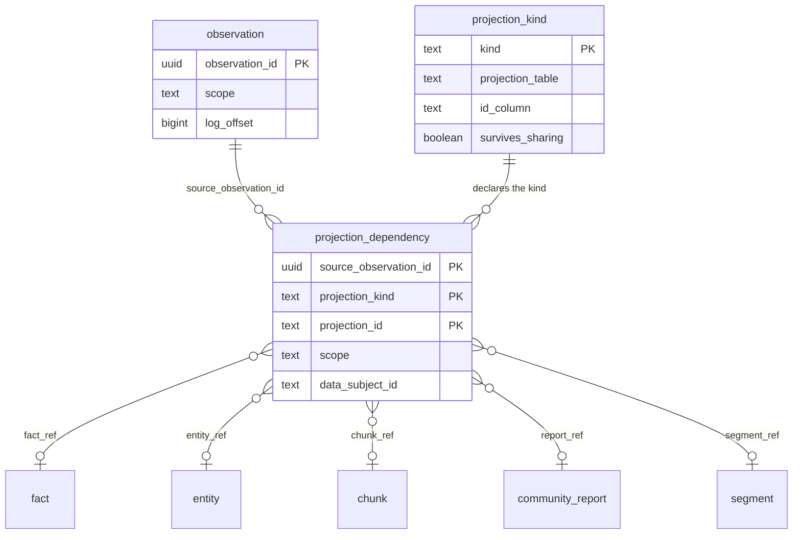
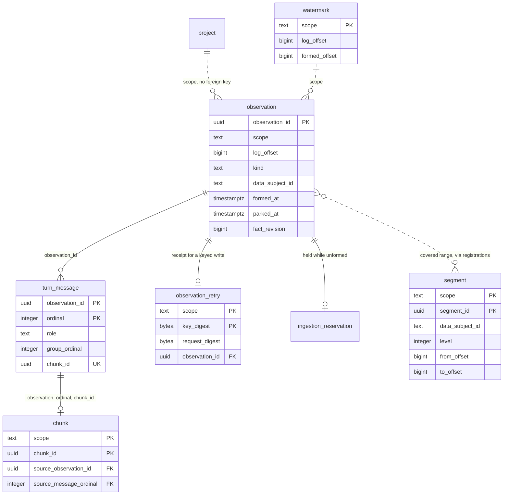
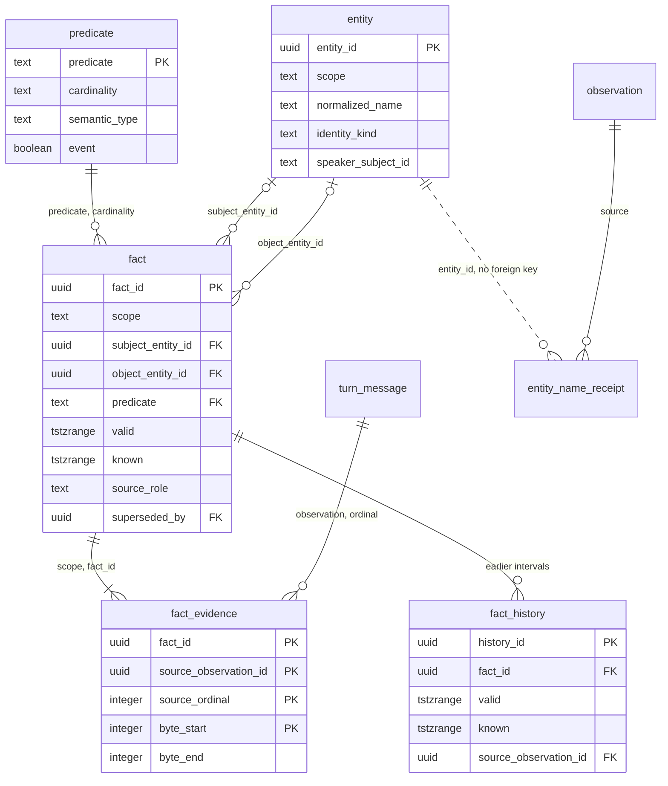
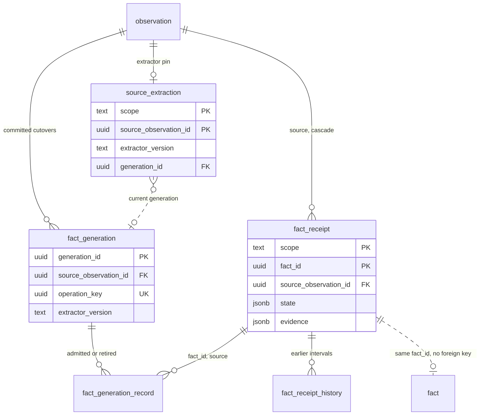
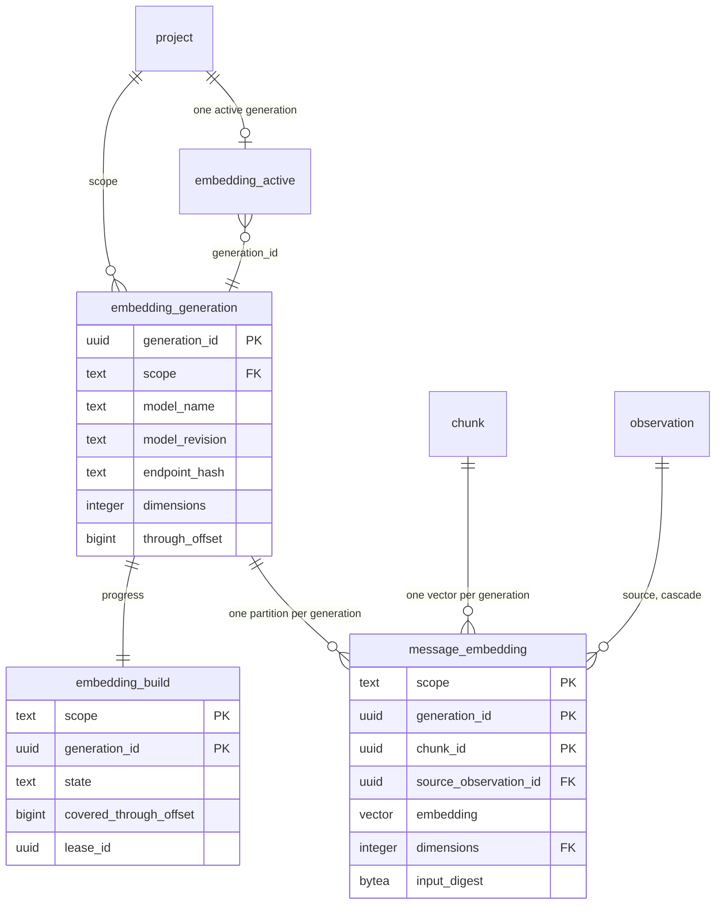
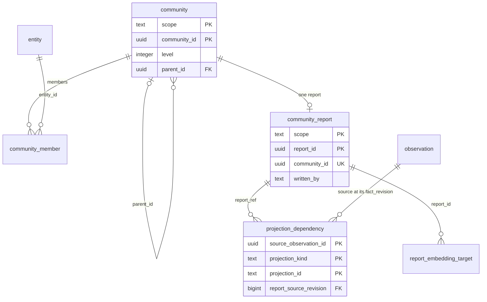
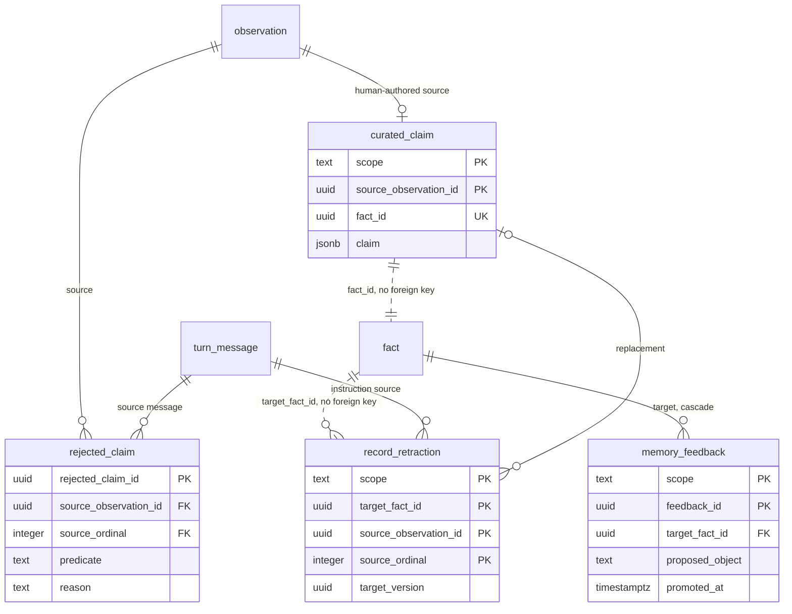
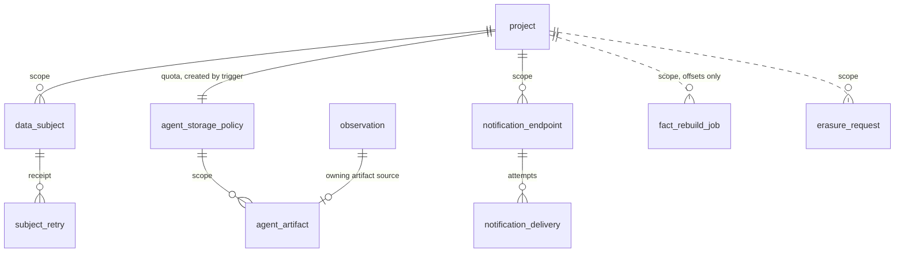
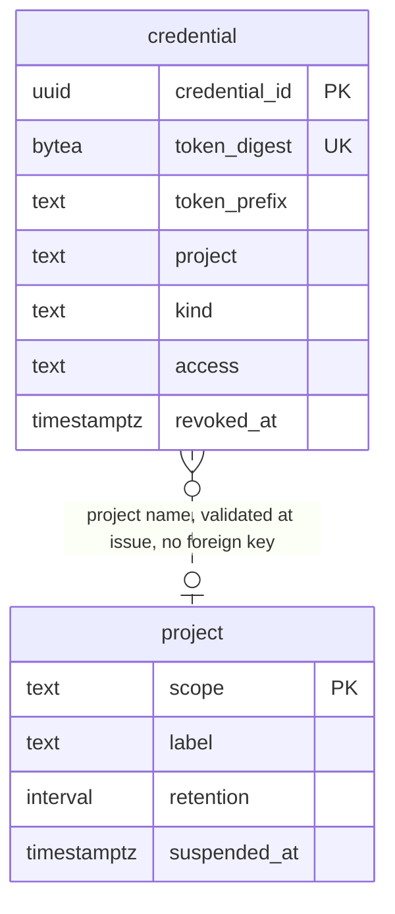

<!-- Copyright 2026 The Taisce Authors -->
<!-- SPDX-License-Identifier: Apache-2.0 -->

# The data model

Everything in Taisce's memory namespace is either source material, a receipt of an outcome, or a
projection derived from those and rebuilt from what survives. This page walks through each area of the
schema as the latest migration leaves it, and explains why each relationship is shaped the way it is.

**You'll learn:**

- the three kinds of row, and how erasure finds every derived row;
- how observations, messages and chunks are stored;
- how entities, facts and their two time ranges work;
- how receipts, generations and embeddings are laid out;
- how refusals, retractions, corrections and feedback are recorded;
- what the control namespace holds, and how Go types map to tables.

The generated schema reference in the site's Reference section lists every column, constraint and
index; this page names only the ones an explanation needs. Read [the PostgreSQL overview](overview.md)
first for how the two namespaces fit together, and [the write path](../architecture/write-path.md) for
how rows arrive.

## One authority, and three kinds of row

Everything in the memory namespace answers to one table: `observation`, with each turn's messages in
`turn_message`. It is the log of what people said, and every erasure starts there.

The principle, set out in [0001](../../internal/migrate/sql/0001_the_spine.sql): other tables are
derived from the log and can be derived again. That makes "rebuild, never repair" safe. After an
erasure, the next rebuild reads only what survived, so nothing erased can come back through it.

The schema holds three kinds of row, and it helps to tell them apart:

| Kind of row | What it is | Tables |
|---|---|---|
| Source | What somebody said or supplied. Authoritative, and never rebuilt. | `observation`, `turn_message`, `curated_claim`, `record_retraction`, `agent_artifact`, `memory_feedback` |
| Source-owned receipt | A record of an outcome that cannot be recomputed exactly from the words: what a model admitted, when it was learned, which extractor produced it. Owned by its observation through a cascading foreign key, and deliberately not tied to the derived row it describes, so it survives losing that row. | `fact_receipt`, `fact_receipt_history`, `entity_name_receipt`, `source_extraction`, `fact_generation`, `fact_generation_record` |
| Projection | Derived from the two kinds above, registered for erasure, and rebuilt from what survives. | `chunk`, `entity`, `fact`, `fact_evidence`, `fact_history`, `rejected_claim`, `community`, `community_member`, `community_report`, `segment`, and the three embedding tables |

Receipts exist because re-deriving from the words alone is not always faithful. A model does not
return the same claims twice, and the moment a fact entered memory is not in the message.
[0034](../../internal/migrate/sql/0034_formation_receipts_preserve_recorded_knowledge.sql) therefore
records admitted outcomes beside their source, and treats losing one as losing authoritative data.
Recovery reads receipts. A new interpretation under a different extractor is a rebuild, which
publishes a new generation rather than editing the old one.

Around these sit tables that are neither source nor derived. They hold state about the system: the
watermark, backlog accounting, the audit ledger, erasure receipts, embedding generation catalogs,
rebuild jobs, notification deliveries, the project row and the data subject registry. Each one's
migration says why it holds nothing an erasure needs to reach, or how an erasure reaches it.

### The projection registry



Every projection writes a registration row in `projection_dependency`, in the same transaction as the
projection itself. The row names the source observation, the projection's kind and its id. (The
diagram shows five of the twelve typed references; the other seven follow the same pattern.)

Writing the registration in the same transaction matters. A projection registered afterwards would be
invisible to erasure until the gap closed, and that gap is exactly when a process might die
([observationstore.go](../../internal/infra/pg/observationstore.go),
[factstore.go](../../internal/infra/pg/factstore.go)).

**The kind must be declared** in `projection_kind`
([0007](../../internal/migrate/sql/0007_a_projection_kind_declares_where_it_lives.sql)). That is a
foreign key, so an undeclared kind cannot be registered at all. The failure lands on whoever adds the
projection, on the day they add it, instead of on a later erasure that quietly misses it.

`projection_kind` also names the table and id column the eraser deletes from. Those names are
interpolated into a `DELETE`, so a `CHECK` restricts them to lowercase identifiers where they are
written.

**`survives_sharing`** ([0019](../../internal/migrate/sql/0019_a_kind_declares_whether_sharing_saves_it.sql))
answers one question per kind: when a row is registered by two people and one of them is erased, is
the row kept? An entity is a shared identity, so it is kept. A report is shared text, so it goes. The
default is `false`, so a kind added by someone who never read the migration deletes too much rather
than leaking.

**Typed references.** Since [0023](../../internal/migrate/sql/0023_relationships_agree_on_the_project.sql)
each kind has a generated, typed reference column (`entity_ref`, `fact_ref`, and so on through
`feedback_ref`):

- `dependency_one_target_chk` requires exactly one of them per row;
- each carries a deferred foreign key to its real target in the same project;
- so a registration cannot name a row that does not exist, and deleting a target cascades its
  registrations.

Adding a kind therefore takes a relationship migration as well as a catalog row.

| Kind | Table | Registered to | `survives_sharing` | Migration |
|---|---|---|---|---|
| `chunk` | `chunk` | the message's observation | true | [0007](../../internal/migrate/sql/0007_a_projection_kind_declares_where_it_lives.sql) |
| `fact` | `fact` | the source observation | true | [0007](../../internal/migrate/sql/0007_a_projection_kind_declares_where_it_lives.sql) |
| `entity` | `entity` | every observation that named it | true | [0007](../../internal/migrate/sql/0007_a_projection_kind_declares_where_it_lives.sql) |
| `rejected_claim` | `rejected_claim` | the source observation | true | [0007](../../internal/migrate/sql/0007_a_projection_kind_declares_where_it_lives.sql) |
| `community_report` | `community_report` | every contributing observation, at its current revision | false | [0020](../../internal/migrate/sql/0020_subjects_and_what_was_written_about_them.sql), [0031](../../internal/migrate/sql/0031_reports_follow_source_fact_revisions.sql) |
| `fact_history` | `fact_history` | the fact's sources and the observation that caused the transition | false | [0029](../../internal/migrate/sql/0029_supersession_preserves_earlier_knowledge.sql) |
| `agent_artifact` | `agent_artifact` | its owning artifact observation | false | [0037](../../internal/migrate/sql/0037_agent_artifacts_are_bounded_owned_storage.sql) |
| `message_embedding` | `message_embedding` | the message's observation | false | [0046](../../internal/migrate/sql/0046_message_embeddings_belong_to_model_generations.sql) |
| `entity_embedding` | `entity_embedding` | every contributing observation | false | [0049](../../internal/migrate/sql/0049_entity_embeddings_are_source_owned_candidates.sql) |
| `report_embedding` | `report_embedding` | every observation under the report | false | [0050](../../internal/migrate/sql/0050_report_embeddings_are_source_owned_themes.sql) |
| `segment` | `segment` | every covered observation | false | [0055](../../internal/migrate/sql/0055_a_segment_stands_in_for_the_turns_it_covers.sql) |
| `feedback` | `memory_feedback` | each observation supporting the record it is about | false | [0061](../../internal/migrate/sql/0061_a_doubt_is_not_yet_a_belief.sql) |

Notes on the table:

- `chunk`, `fact` and `rejected_claim` are each registered to exactly one observation, so their
  `survives_sharing` setting never comes into play.
- Two source tables, `agent_artifact` and `memory_feedback`, are registered too. They cannot be
  re-derived; they are registered because the registry is how an erasure finds rows.
- `fact_evidence` and `community_member` are not kinds of their own. Evidence goes with its fact by
  cascade, and membership goes with its community.
- Erasure also deletes an erased source's evidence rows directly, even when the fact they support is
  kept because another registration still supports it
  ([erasurestore.go](../../internal/infra/pg/erasurestore.go)).

## Source



### The observation and its messages

An `observation` is one source:

- a conversation turn (`kind = 'turn'`);
- a human-authored correction or assertion (`kind = 'curated'`, set by
  [recordassertion.go](../../internal/infra/pg/recordassertion.go));
- an agent artifact (`kind = 'artifact'`, see [Governance](#governance)).

It carries:

- the project (`scope`);
- a `log_offset` that is contiguous within the project (`observation_scope_offset_uniq`);
- when the turn happened (`occurred_at`), separate from when it was stored (`ingested_at`);
- who spoke first (`source_role`) and the data subject it is about (`data_subject_id`);
- a `retention_until` deadline, stamped at append time from the project's policy. A fact carries
  one too, taken from the latest deadline among the observations supporting it, and null when one of
  them is kept indefinitely: that is what lets a read refuse expired memory with a column test
  ([0068](../../internal/migrate/sql/0068_an_expired_turn_is_unreachable_before_it_is_swept.sql)).

Governance travels on the row rather than in a side table, because every read filters on it and a
join is one more thing to forget.

**Formation bookkeeping** lives on the same row
([0005](../../internal/migrate/sql/0005_stored_is_not_the_same_as_formed.sql),
[0009](../../internal/migrate/sql/0009_a_turn_that_will_not_form_is_parked_not_lost.sql)):

- `formed_at` is set once, when extraction has run;
- `formation_attempts`, `formation_failed_at` and `formation_error` (at most 2,000 characters) record
  failures;
- `parked_at` marks a turn formation gave up on.

The error is kept on the row, not in a log, because a provider's error can quote the message that was
sent to it. On the row it is personal data that erasure takes with the observation. In a log it would
be personal data no erasure can reach.

`fact_revision` ([0031](../../internal/migrate/sql/0031_reports_follow_source_fact_revisions.sql)) is a
counter that a trigger advances whenever a fact or evidence row derived from this observation changes.
Reports use it to prove they were written from the current state of their sources (see
[Communities and their reports](#communities-and-their-reports)).

**`turn_message`** holds a turn's messages as rows rather than as a JSON document
([0002](../../internal/migrate/sql/0002_a_turn_is_messages_with_roles.sql)). The role policy is
enforced per message. A role inside a JSON array is a convention every reader has to parse the same
way; as a column it is `NOT NULL` with a `CHECK`.

- `ordinal` preserves the caller's order.
- `group_ordinal` marks the members of an atomic unit, such as an assistant tool call and its results,
  so compaction never splits one.
- Since [0044](../../internal/migrate/sql/0044_messages_retain_their_chunk_identity.sql) the message
  owns its `chunk_id`, and [0048](../../internal/migrate/sql/0048_message_reference_reads_are_audited.sql)
  makes that id unique, so a saved message reference resolves by UUID alone.

### Chunks: one per message, partitioned by project

A `chunk` is a message stored as retrievable text, exactly one per message. It is the only table
partitioned by project: `PARTITION BY LIST (scope)`, with one partition per project, created by
`ProvisionScope` ([provision.go](../../internal/migrate/provision.go)).

- The default partition `chunk_unpartitioned` catches writes for a project whose partition was never
  created. Losing memory to a missed provisioning step would be worse than a slow query, and a row in
  the default partition is still visible to erasure.
- A composite foreign key to `turn_message (observation_id, ordinal, chunk_id)` keeps a chunk's
  identity bound to its message.
- A chunk has no vector column. Vectors live in model generations (see [Derived](#derived)).

[Indexing and query plans](indexing-and-plans.md#partitioning) covers what the partitioning buys.

### Retries: one receipt per key

`observation_retry` ([0021](../../internal/migrate/sql/0021_observation_retries_have_one_receipt.sql))
lets a caller retry a write without creating a second observation.

- The key is a UUID. Only its SHA-256 digest is stored, scoped to the project.
- `request_digest` fingerprints the normalized request, so a retry with a different payload under the
  same key is refused.
- When the observation is deleted, the trigger `observation_retry_forgets_payload` clears the
  fingerprint and the observation reference, and leaves the key digest as a tombstone. An old queued
  retry therefore cannot write erased words back.

[Concurrency](concurrency.md#idempotent-writes-one-receipt-per-retry) covers how two racing retries
still produce one receipt.

### Backlog reservations

`ingestion_budget` (a single row), `ingestion_project_usage` and `ingestion_reservation`
([0025](../../internal/migrate/sql/0025_unfinished_observations_reserve_ingestion_capacity.sql)) count
unformed turns.

- The default ceilings are 4,096 for the instance and 512 per project.
- Each unformed turn holds one reservation, parked turns included.
- Deferred constraint triggers take a reservation when a turn is stored, and release it when the turn
  is formed or deleted, in the same transaction.
- The runtime role can read these tables but not change them
  ([planes.go](../../internal/migrate/planes.go), [roles and grants](roles-and-grants.md)).

### The watermark: two numbers per project

`watermark` holds one row per project
([0005](../../internal/migrate/sql/0005_stored_is_not_the_same_as_formed.sql)):

- `log_offset` is the highest offset stored.
- `formed_offset` is the highest offset whose turn has formed with nothing unformed below it. It is
  `NULL` until the first turn forms.
- `watermark_at` is the turn's own time, not the time it was stored, so a backfill of last year's
  conversations does not look current.

The row also serves as the lock that serializes appends to one project;
[Concurrency](concurrency.md#appending-and-the-contiguous-log-offset) explains why.
`formation_health` is a single aggregate row for the whole instance
([0027](../../internal/migrate/sql/0027_operational_formation_health.sql)).

### Segments

A `segment` ([0055](../../internal/migrate/sql/0055_a_segment_stands_in_for_the_turns_it_covers.sql)) is
a model-written summary standing in for a contiguous range of one subject's formed turns. Segments roll
up in levels: level 1 summarizes turns, level 2 summarizes level-1 segments, and so on up to level 6.

A segment is a projection, not an observation. It is registered to every observation it covers, so
erasing any one of them removes it, and the compaction pass writes a new one from what survived.
`UNIQUE (scope, data_subject_id, level, from_offset)` allows one account of each stretch per level.

## Knowledge



### Entities: two kinds of identity

An `entity` is a node. There are two ways to identify one:

- **Named entities** are identified by `(scope, normalized_name)`, where normalization lowercases,
  trims and collapses whitespace. `entity_type` is an attribute, not part of the identity. If it were
  part of the key, one thing extracted once as a `place` and once as a `thing` would become two
  nodes, each holding half its facts.
- **Speaker entities** ([0022](../../internal/migrate/sql/0022_speakers_have_project_scoped_identity.sql)).
  A first-person reference ("I", "me", "أنا") resolves to a speaker entity identified by
  `(scope, speaker_subject_id)`, bound to the stored observation's data subject rather than to a name.

The partial unique indexes `entity_named_identity_uniq` and `entity_speaker_identity_uniq` enforce the
two kinds. `entity_identity_kind_chk` pins a speaker entity's name to `speaker`.

Two closed lists support this. `speaker_term` lists the first-person terms. `unresolvable_term`
([0016](../../internal/migrate/sql/0016_a_subject_that_names_nothing.sql)) lists pronouns and
demonstratives that can never be a fact's subject.

**Spellings.** `canonical_name` is the spelling first seen. Every spelling a source used is kept in
`entity_name_receipt` ([0043](../../internal/migrate/sql/0043_entity_name_variants_have_source_owners.sql)),
owned by the observation that used it.

- The receipt deliberately has no foreign key to the entity. If the entity row is lost, the receipts
  are the only faithful input for rebuilding it.
- Instead, a trigger checks under `FOR KEY SHARE` that every receipt's `normalized_name` equals a live
  named entity's `normalized_name`.
- Because every recorded spelling normalizes to the entity's one key, the canonical key alone serves
  exact anchoring. There is no alias index
  ([0051](../../internal/migrate/sql/0051_canonical_names_are_the_exact_anchor_key.sql)).
- `aliases` is a bounded display cache of at most 64 variants, rebuilt from receipts during recovery
  ([entitynames.go](../../internal/infra/pg/entitynames.go)).

### The closed vocabulary

`predicate` ([0003](../../internal/migrate/sql/0003_a_closed_predicate_vocabulary.sql)) holds 39
relations. Each has:

- a `semantic_type`;
- a `cardinality`: `one` for 11 of them, `many` for the rest;
- an `object_kind`;
- an `event` flag ([0054](../../internal/migrate/sql/0054_an_event_is_reported_in_the_past_and_stays_true.sql)).

`fact.predicate` references this table, so no path, not even a hand-written `INSERT`, can store a
relation outside the set. The runtime role cannot modify the table
([planes.go](../../internal/migrate/planes.go)).

`fact.cardinality` is a copy of the predicate's cardinality. It exists only because an exclusion
constraint cannot read another table. The composite foreign key `(predicate, cardinality)`
([0010](../../internal/migrate/sql/0010_supersession_is_a_constraint_rather_than_a_lock.sql)) makes it
impossible for the copy to disagree with the vocabulary.

### Facts are the edges

A `fact` is one typed, directed edge: a subject entity, a predicate, an object entity, a `statement`,
and two time ranges. Either end may be `NULL` when it did not resolve to an entity; traversal simply
does not follow it.

Both ends carry deferred, project-consistent foreign keys to `entity (scope, entity_id)`
([0023](../../internal/migrate/sql/0023_relationships_agree_on_the_project.sql)). So a fact cannot
point into another project, and an erasure may delete entities and facts in any order within one
transaction.

Other columns:

- `source_role`: the role of the message that asserted it
  ([0014](../../internal/migrate/sql/0014_a_fact_carries_the_role_that_said_it.sql));
- `confidence`: as the extractor reported it;
- `superseded_by` and `supersession_source`: what replaced it, and which observation caused that
  ([0029](../../internal/migrate/sql/0029_supersession_preserves_earlier_knowledge.sql));
- `version`: a compare-and-swap token that a trigger changes on every update, so a correction or
  retraction cannot act on a record that changed after it was inspected
  ([0032](../../internal/migrate/sql/0032_retractions_preserve_source_instructions.sql)).

**A fact's id is derived, not random.** `sourceClaimID` in
[recordretraction.go](../../internal/infra/pg/recordretraction.go) hashes the project, the source
observation, the message ordinal, and a signature of the predicate and resolved ends. A rebuild hashes
the result again with its generation id. So a retried assertion finds the fact it already wrote
instead of writing a second one. It also means the same claim in two different observations is two
facts, each with its own evidence.

**`fact_single_cardinality_excl`** is the invariant the model rests on:

```sql
EXCLUDE USING gist (scope WITH =, subject_entity_id WITH =, predicate WITH =,
                    valid WITH &&, known WITH &&)
  WHERE (cardinality = 'one' AND subject_entity_id IS NOT NULL)
```

A single-cardinality relation cannot hold two values for one subject when both their validity and
knowledge intervals overlap. The object is deliberately not in the key: "lives in Dublin" and "lives
in Amman" overlapping is exactly the state being refused.

`known` is in the key so that a withdrawn claim, whose knowledge interval is closed, does not conflict
with a later assertion that overlaps it in valid time.
[Concurrency](concurrency.md#supersession-is-a-constraint-not-a-lock) covers how concurrent writers meet
the constraint.

### Valid time and transaction time

- `valid` is when the world was that way.
- `known` is when this system believed it.

Both are `tstzrange` columns that are never empty (`fact_valid_not_empty_chk`,
`fact_known_not_empty_chk`), and an open upper bound means "still". A range with an open end needs no
sentinel value and no `OR` in every predicate, and it can lead an index.

The current read and the as-of read differ in one predicate:

```sql
-- what is true now, as best we know now
upper_inf(f.valid) AND upper_inf(f.known)

-- what was true at T1, as this system knew it at T2: the current row where its known range
-- contains T2, otherwise the archived interval in fact_history that does
state.valid @> $t1   -- with state drawn from f.known @> $t2 or fact_history.known @> $t2
```

**Supersession** closes the old fact's `valid` range at the new fact's start, so the two intervals
meet exactly and any instant has one answer. It does not rewrite what was believed earlier:

- The previous `(valid, known)` pair is archived in `fact_history`, with its knowledge interval closed
  at the moment of the transition. The retained row's knowledge starts again at that moment.
- The exclusion constraint `EXCLUDE (fact_id WITH =, known WITH &&)` on `fact_history` keeps one fact's
  archived beliefs from overlapping.
- The knowledge timestamp comes from the database clock, advanced at least one microsecond past the
  knowledge start it supersedes. A clock that steps backwards therefore cannot produce an empty or
  reversed range.

**A retraction** closes `known` and leaves `valid` alone. It records that the system stopped believing
the claim, without inventing when the claim stopped being true.

**Events.** Predicates flagged `event`
([0054](../../internal/migrate/sql/0054_an_event_is_reported_in_the_past_and_stays_true.sql)) are
accepted in the past tense, because an event is only ever reported after it happened and stays true
afterwards.

### Evidence

`fact_evidence` is a fact's receipt: the verbatim `quote`, plus the byte span (`byte_start`,
`byte_end`) in the exact message it came from.

`source_ordinal` is part of the key
([0006](../../internal/migrate/sql/0006_evidence_names_the_message_it_indexes.sql)). A byte offset
taken against a different message of the same turn would not fail; it would resolve to a plausible
fragment of the wrong sentence. A foreign key to `turn_message (observation_id, ordinal)` makes the
message mandatory.

Recall joins evidence with an inner join, so a fact without evidence is never returned
([recallstore.go](../../internal/infra/pg/recallstore.go)).

### Receipts, pins and generations



- **`source_extraction`** ([0040](../../internal/migrate/sql/0040_source_extraction_pins_prevent_mixed_retries.sql))
  pins the extractor identity for a source before the model is called, and a trigger makes the pin
  immutable. A retry after a crash therefore cannot mix claims from two extractor configurations in
  one source.
- **`fact_receipt` and `fact_receipt_history`**
  ([0034](../../internal/migrate/sql/0034_formation_receipts_preserve_recorded_knowledge.sql)) keep the
  admitted state of each fact and its earlier intervals. Triggers keep them in step with `fact` and
  `fact_history`. They have no foreign key to `fact`, because they exist to outlive a lost fact row.
- **`fact_generation` and `fact_generation_record`**
  ([0041](../../internal/migrate/sql/0041_fact_generations_keep_old_citations.sql)) record each
  committed rebuild of a source: which facts it admitted, which it retired, and the operation key that
  makes a replay idempotent. Rows exist only for committed cutovers.

## Derived

### Embeddings live in model generations



A vector only means something within one model's space, so vectors are stored per *generation*
([0046](../../internal/migrate/sql/0046_message_embeddings_belong_to_model_generations.sql)).

**The generation catalog:**

- An `embedding_generation` row binds a model name, an immutable revision, a digest of the endpoint,
  an input contract (`input_version`), a dimension between 1 and 4,000, and the cosine metric to a
  finite target: the log up to `through_offset`. A trigger refuses any update to that identity.
- `embedding_build` tracks the worker's progress, and keeps the target separate from the coverage
  actually completed ([0047](../../internal/migrate/sql/0047_embedding_progress_separates_targets_from_coverage.sql)).
- `embedding_active` names the one generation a project searches.
- The runtime role cannot write the generation or activation catalogs. Starting and activating a
  generation are operator operations.

**The vectors.** `message_embedding` is partitioned by `generation_id`. Each generation gets its own
child table and its own HNSW index, created in the same transaction that creates the generation
([embeddinggeneration.go](../../internal/infra/pg/embeddinggeneration.go)).

- The column type is plain `vector`. A generated `dimensions` column carries a foreign key to the
  generation's declared dimension, so the database refuses a vector of the wrong size.
- `CHECK (vector_norm(embedding) > 0)` refuses the zero vector, for which cosine is undefined.
- `input_digest` is the SHA-256 of the message text the vector was computed from. Search compares it
  with the current message and drops the vector if they differ.

A project keeps at most two generations (`MaxRetainedEmbeddingGenerations` in
[embeddingtypes.go](../../internal/infra/pg/embeddingtypes.go)). A model change builds a new generation
beside the old one, activates it with a one-row update, and retires the old child by detaching and
dropping it.

**Entity and report vectors** ([0049](../../internal/migrate/sql/0049_entity_embeddings_are_source_owned_candidates.sql),
[0050](../../internal/migrate/sql/0050_report_embeddings_are_source_owned_themes.sql)) repeat the same
shape, with separate generation, build and active tables. Equal dimensions and model names do not make
two input contracts one space. Each adds two tables:

- A `*_target` table fixes, when the generation starts, the finite set of entities or reports it
  covers.
- A `*_source` table holds one row per contributing observation, because an entity or report vector
  combines many sources and every one of them owns it.

Triggers delete a vector when any of its inputs changes. They also mark a completed generation `stale`
when a new named entity or report appears after its snapshot, so search cannot silently leave the
newcomer out.

### Communities and their reports



**A `community`** is a group of entities densely connected to each other and sparsely connected to
everything else ([0020](../../internal/migrate/sql/0020_subjects_and_what_was_written_about_them.sql)).

- Level 0 partitions the whole graph. A deeper level exists where a group was too large to be one
  subject and was split again.
- `community_parent_chk` requires a parent exactly when the level is above 0.
- A grouping depends on the whole graph, and one new fact can move, merge or split groups. So a pass
  replaces every community in a project rather than editing them in place.
- Communities hold no words and are not registered.

**A `community_report`** is prose a model wrote about one community, one per community. It holds
several people's material, so it is registered to every contributing observation with
`survives_sharing = false`: erasing any contributor deletes it.

Reports also cannot outlive a change to their sources
([0031](../../internal/migrate/sql/0031_reports_follow_source_fact_revisions.sql)):

- Each registration records `report_source_revision`, with a foreign key to
  `observation (scope, observation_id, fact_revision)`.
- A trigger on `fact` and `fact_evidence` advances the source's revision and deletes the reports
  registered to it.
- A report describing facts that have since changed therefore cannot stay stored. It is written again
  when next needed.

`written_by` ([0060](../../internal/migrate/sql/0060_a_report_says_what_wrote_it.sql)) is a digest of
the model, the code and the prompt that wrote the report, so a changed writer is a reason to write it
again.

## Governance

### Claims about claims: refusals, retractions, corrections and feedback



**`rejected_claim`** ([0004](../../internal/migrate/sql/0004_what_extraction_refused.sql)) keeps every
proposal that did not become a fact, in the model's own words, with a reason from a closed set. There
are eight reasons today:

| Reason | Meaning | Added by |
|---|---|---|
| `unmapped_relation` | The vocabulary cannot represent it | [0004](../../internal/migrate/sql/0004_what_extraction_refused.sql) |
| `unlocatable_quote` | The message cannot cite it | [0004](../../internal/migrate/sql/0004_what_extraction_refused.sql) |
| `duplicate_claim` | This message already said it | [0008](../../internal/migrate/sql/0008_a_claim_already_recorded_is_refused_not_repeated.sql) |
| `not_asserted` | The message did not assert it (a denial or a hedge) | [0011](../../internal/migrate/sql/0011_a_claim_the_message_did_not_assert.sql) |
| `unresolvable_subject` | The subject names nothing the message establishes | [0016](../../internal/migrate/sql/0016_a_subject_that_names_nothing.sql) |
| `not_current` | The message puts a state in the past | [0018](../../internal/migrate/sql/0018_a_relation_the_message_puts_in_the_past.sql) |
| `conflicting_value` | The message already gave the relation a different current value | [0052](../../internal/migrate/sql/0052_a_second_current_value_is_refused_not_failed.sql) |
| `not_spoken_by_principal` | It speaks for the principal from a message the principal did not speak | [0053](../../internal/migrate/sql/0053_a_non_user_message_may_assert_about_others.sql) |
| `entity_name_limit` | One of its ends carries a name this store cannot keep: longer than the bound, or one spelling too many for one entity | [0066](../../internal/migrate/sql/0066_a_name_that_cannot_be_kept_is_a_refusal.sql) |

`predicate` has no foreign key here, because this column holds exactly the relations the vocabulary
refused. A refused claim still quotes somebody, so it is a registered projection like any other.

**`record_retraction`** ([0032](../../internal/migrate/sql/0032_retractions_preserve_source_instructions.sql))
is a human instruction to withdraw a fact, stored as source input rather than as an edit.

- `target_fact_id` has no foreign key, so the instruction survives losing the fact and keeps blocking
  the same claim when it is re-derived.
- `target_version` is the version the editor saw.

**`curated_claim`** ([0033](../../internal/migrate/sql/0033_curated_claims_are_authoritative_source_input.sql))
is a human correction or an authored assertion
([0036](../../internal/migrate/sql/0036_authored_assertions_are_audited.sql)). The extractor never
reinterprets it, and its `fact_id` is a receipt for recovery.

**`memory_feedback`** ([0061](../../internal/migrate/sql/0061_a_doubt_is_not_yet_a_belief.sql)) is a
report that a record looks wrong. It asserts nothing. It is its own table rather than a kind of fact,
so no read path can return it by accident. Promoting it produces an ordinary correction or retraction.

### Subjects: three meanings of one word

The migrations use "subject" in three senses:

| Sense | Where | Tables |
|---|---|---|
| The grammatical subject of a claim | [0016](../../internal/migrate/sql/0016_a_subject_that_names_nothing.sql) | `unresolvable_term`, `fact.subject_entity_id` |
| A theme the graph holds | [0020](../../internal/migrate/sql/0020_subjects_and_what_was_written_about_them.sql) | `community`, `community_report` |
| The person a record is about | [0039](../../internal/migrate/sql/0039_subject_registry_keeps_external_references_at_the_boundary.sql) | `data_subject`, and `data_subject_id` on every governed row |

`data_subject` is an optional registry. It maps a random subject id to an external reference and a
label, with one current mapping per project. Only the random id is ever copied onto observations.

- Triggers make the identity and its lifetime immutable.
- When a new observation names a registered subject, a trigger takes a `FOR KEY SHARE` lock on that
  subject's row, so an expiry cannot remove the mapping while a source is being accepted.
- `subject_retry` does for registrations what `observation_retry` does for writes.

### Artifacts, retention, rebuild jobs and notifications



- **Agent artifacts** ([0037](../../internal/migrate/sql/0037_agent_artifacts_are_bounded_owned_storage.sql)).
  `agent_artifact` holds opaque bytes, up to 512 KiB each, owned by an observation of kind `artifact`.
  That observation is marked formed and has a retention deadline, so formation never reads it, and a
  trigger keeps it that way. `agent_storage_policy` holds each project's quota. A security-definer
  trigger updates usage on every insert, update and delete, and refuses a write that would exceed the
  quota.
- **Retention** ([0038](../../internal/migrate/sql/0038_retention_work_follows_stored_deadlines.sql)).
  A deadline is stamped on each observation when it is written, and `observation_scope_expiry_idx` lets
  a sweep read a bounded page of due sources in deadline order. Shortening a policy affects what
  arrives next. Removing what is already held is an erasure with a receipt.
- **Rebuild jobs** ([0042](../../internal/migrate/sql/0042_project_fact_rebuild_jobs.sql)).
  `fact_rebuild_job` holds log offsets, an extractor identity, aggregate counts and a lease. It holds no
  source ids and no text, so erasing a pending source leaves no personal link behind. The partial
  unique index `one_active_fact_rebuild` allows one active job per project.
- **Notifications** ([0058](../../internal/migrate/sql/0058_a_scope_can_tell_somebody_it_formed.sql)).
  `notification_endpoint` is a URL and a signing secret. `notification_delivery` is a durable attempt,
  one per endpoint per formed watermark. It carries offsets and counts and nothing from memory, which
  is why it has no `data_subject_id` and no registration.
- **Erasure receipts.** `erasure_request` ([0001](../../internal/migrate/sql/0001_the_spine.sql)) holds
  the selector, the reason and the per-kind `residual`. A `CHECK` requires the residual to be present
  exactly when the request is complete.

### The audit ledger

`audit_entry` ([0013](../../internal/migrate/sql/0013_the_audit_ledger.sql)) records who performed which
operation on which project, when, how much it touched (`magnitude`), and whether it was allowed.

- It holds no data subject, no question, no quote and no content. That is why it can be
  unconditionally append-only without conflicting with erasure. Triggers refuse `UPDATE` and `DELETE`
  from any identity.
- `project` is plain text rather than a foreign key, so an operation on a project that no longer exists
  can still be recorded.
- `operation` is checked against a closed list. Every migration that adds a route redefines that
  `CHECK` to admit the route's operation name
  ([0026](../../internal/migrate/sql/0026_operator_formation_recovery.sql) through
  [0061](../../internal/migrate/sql/0061_a_doubt_is_not_yet_a_belief.sql), including the management
  operations in [0056](../../internal/migrate/sql/0056_the_ledger_admits_what_an_operator_does.sql)).
  A route that tries to record an operation the list does not name has its write refused.

`audit_seal` ([0017](../../internal/migrate/sql/0017_the_ledger_seals_itself.sql)) chains digests over
contiguous ranges of entries. [Concurrency](concurrency.md#the-ledgers-seal) covers how sealing runs
beside writers.

## Control



The control namespace holds one table, `credential`, plus its own `schema_migration`. Its migrations
live in [internal/migrate/control](../../internal/migrate/control/) and advance independently of the
memory namespace's.

- **A credential stores the SHA-256 digest of its token**, never the token
  ([control 0002](../../internal/migrate/control/0002_a_credential_names_the_projects_it_may_reach.sql)).
  A 256-bit random token leaves nothing to guess, so a slow password hash would add cost to every
  request and defend against nothing.
- **A project credential names exactly one project**
  ([control 0003](../../internal/migrate/control/0003_a_credential_belongs_to_one_project.sql)) and
  declares `read_only` or `read_write` access
  ([control 0004](../../internal/migrate/control/0004_credentials_declare_read_or_write_access.sql)).
- **An operator credential reaches the management surface and no project.** `credential_project_chk`
  makes "is an operator credential" and "names no project" the same statement
  ([control 0005](../../internal/migrate/control/0005_an_operator_credential_reaches_the_management_surface_and_no_project.sql)).

`project` lives in the memory namespace, not in control
([0012](../../internal/migrate/sql/0012_a_project_is_a_row_with_settings.sql)). Its settings are read on
the memory path, and the memory role has no privilege in control. The registry says who may reach
what; the memory namespace says what a project does.

So the credential's `project` column has no foreign key. The operator command that issues a credential
validates the name instead, because it holds a connection that can see both namespaces.

The `project` row itself:

- a trigger lets `surfaces` grow and never shrink;
- `retention` is `NULL` for "keep", as a deliberate choice;
- `suspended_at` makes a project unreachable without deleting it;
- `ProvisionScope` creates the row and the project's chunk partition in one transaction
  ([provision.go](../../internal/migrate/provision.go)).

`observation.scope` has no foreign key to `project`. A write for a project with no row still lands, in
the default chunk partition with no retention stamp, because losing memory to a missed provisioning
step is the worse failure. [Roles and grants](roles-and-grants.md) covers the identities that reach
each namespace.

## Where the Go types meet the tables

The shared vocabulary of the read and write paths is in [internal/domain](../../internal/domain/).
Tables and types do not map one to one:

| Table | Go type | Note |
|---|---|---|
| `observation`, `turn_message` | `domain.Observation`, `domain.Turn`, `domain.Message` | `Turn` is what is written; `Observation` is the stored receipt |
| `fact` (write) | `domain.Claim` | carries the quote, span and cardinality to be checked |
| `fact` + `fact_evidence` (read) | `domain.CitedFact`, `domain.Evidence` | a read always returns a fact with its evidence |
| `entity` | `domain.Entity`, `domain.Anchor` | an anchor is an entity plus the term that matched it |
| `predicate` | `domain.Predicate`, `domain.Ontology`, `domain.Vocabulary` | loaded from the table, never declared in Go |
| `rejected_claim` | `domain.RejectedClaim` | reasons are constants beside it |
| `watermark` | `domain.Freshness` | stored and formed offsets, parked count, rebuild progress |
| `erasure_request` | `domain.Erasure` | deleted and residual counts per kind |
| `audit_entry`, `audit_seal` | `domain.AuditEntry`, `domain.AuditSeal`, `domain.AuditVerification` | |

## Where early migration comments differ

Migration files are never rewritten, so a few early header comments describe a shape that later
migrations changed. The schema today:

- **One instance is one tenant, and the project is the isolation boundary.**
  [0001](../../internal/migrate/sql/0001_the_spine.sql) and
  [0003](../../internal/migrate/sql/0003_a_closed_predicate_vocabulary.sql) describe a tenant as a
  schema. [Control 0001](../../internal/migrate/control/0001_the_fence_before_the_registry.sql)
  describes a registry of tenants and payments. Control holds credentials only.
- **`fact` has deferred, project-consistent foreign keys on both ends**, added by
  [0023](../../internal/migrate/sql/0023_relationships_agree_on_the_project.sql). The deferral is what
  lets erasure delete in any order within one transaction.
- **Not every table other than the log is re-derivable.** The source-owned receipts added from
  [0033](../../internal/migrate/sql/0033_curated_claims_are_authoritative_source_input.sql) onward are
  authoritative.
- **`chunk` has no embedding column.** Vectors are partitioned by generation, each with its own
  dimension ([0046](../../internal/migrate/sql/0046_message_embeddings_belong_to_model_generations.sql)).
- **`entity` has no `normalized_aliases` column and no GIN alias index**
  ([0051](../../internal/migrate/sql/0051_canonical_names_are_the_exact_anchor_key.sql)).

## Where to go next

- [Concurrency](concurrency.md): how these constraints and locks hold with several writers.
- [Indexing and query plans](indexing-and-plans.md): which indexes serve which reads, and what is
  measured.
- [Migrations](migrations.md): how the two migration sets are applied.
- [Roles and grants](roles-and-grants.md): which identity may do what to these tables.
- [Governance](../architecture/governance.md): erasure, export and retention built on the registry.
