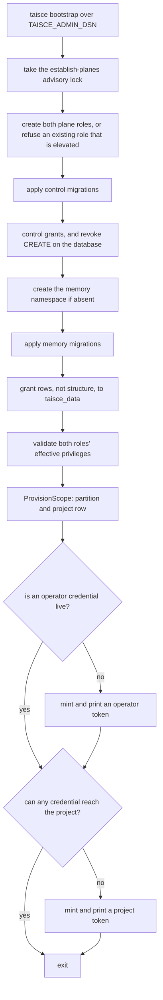

<!-- Copyright 2026 The Taisce Authors -->
<!-- SPDX-License-Identifier: Apache-2.0 -->

# Migrations

Taisce's schema ships inside the binary as numbered SQL files, applied in order by `taisce
bootstrap` through the administrative connection. This page explains how that works, what it
guarantees, and how to add a migration safely.

**You'll learn:**

- how the migration files are embedded, ordered and recorded;
- why the memory and control namespaces have separate sequences;
- what `taisce bootstrap` does, step by step;
- how a project is provisioned without a migration;
- who may run migrations, and what happens if the wrong identity does;
- how to write, add and test a new migration.

Read [the substrate overview](overview.md) first for the two namespaces and the `{schema}` template.
[Roles and grants](roles-and-grants.md) explains the grants every migration run ends with.

## The scripts are compiled into the binary

The migrations are SQL files under [internal/migrate](../../internal/migrate/), embedded by one
directive in [migrate.go](../../internal/migrate/migrate.go):

```go
//go:embed sql/*.sql control/*.sql
var scripts embed.FS
```

A deployment ships a schema instead of depending on files next to the binary. Nothing on disk at
runtime can change what is applied, so someone who can write beside the binary cannot change the
schema it installs. The SQL lives inside the package directory because `go:embed` cannot reach
outside it.

| Directory | Namespace | Loaded by | Applied by |
|---|---|---|---|
| [internal/migrate/sql/](../../internal/migrate/sql/) | Memory (`TAISCE_SCHEMA`, default `memory`) | `Load` | `Apply`, called by `ProvisionMemorySchema` on every bootstrap, under the namespace's migration lock |
| [internal/migrate/control/](../../internal/migrate/control/) | Control (fixed name `control`) | `LoadControl` | `applyControl`, called by `EstablishPlanes` on every bootstrap, under the bootstrap lock |

## File names, order and the record of what ran

A migration file is named `<version>_<name>.sql`. The loader reads everything before the first
underscore as an integer, and refuses:

- a file with no underscore;
- a version that is not a number;
- two files with the same version (they would apply in filename order on one machine and in a
  different order on another);
- an empty set.

The scripts are then sorted by version. The part after the underscore is recorded as the name.

Each namespace has its own record, `schema_migration (version, name, applied_at)`, created by that
namespace's first migration: memory [0001](../../internal/migrate/sql/0001_the_spine.sql) and control
[0001](../../internal/migrate/control/0001_the_fence_before_the_registry.sql).

Applying works like this:

1. Read the recorded versions. On the very first run the table does not exist yet, so the read
   fails, which is expected.
2. Walk the scripts in version order and skip any version already recorded.
3. For each remaining script, open one transaction, run the script with `{schema}` rendered for the
   target namespace, and insert the version marker.

A failure rolls back the script and its marker together. A namespace is therefore always at its last
fully applied migration.

What follows from that:

- **A second run applies nothing.** `TestApplyingTwiceChangesNothing` in
  [migrate_test.go](../../internal/migrate/migrate_test.go) holds this, and it is why bootstrap can run
  on every start.
- **Scripts need not be idempotent, and most are not.** The recorded marker prevents a re-run, not
  `IF NOT EXISTS`.
- **The record is a set, not a high-water mark.** A file added with a version lower than one already
  applied would still run on the next bootstrap, out of order. Always take the next unused number.
- **There are no down migrations.** A change is reversed by a later migration, or by restoring a
  backup.
- **Editing a file changes nothing in a database that already recorded its version.** That database
  never runs it again.
- **Everything runs inside a transaction block.** A statement PostgreSQL refuses there, such as
  `CREATE INDEX CONCURRENTLY` or `VACUUM`, cannot appear in a migration.
- **A migration holds its locks until it commits.** The chart's bootstrap Job runs while the previous
  release's pods are still serving. A migration that locks a busy table blocks those statements for
  its whole duration.

## Two sequences, advanced independently

The memory and control namespaces are different trust domains, and their migrations advance
separately. One version number across both would force one to wait on the other, or claim a version
that half its tables had never seen. The memory namespace's name can also vary by instance, while
`control` cannot.

**Control migrations** run inside `EstablishPlanes` ([planes.go](../../internal/migrate/planes.go)):

- It holds a session advisory lock, `taisce:establish-planes`, and runs everything on the one
  connection that holds it.
- The chart starts several replicas together. Without the lock, two bootstraps altering the same role
  at once would fail with `tuple concurrently updated`.
- Borrowing a second connection while holding the lock could deadlock the pool, so it never does.

**Memory migrations** run inside `ProvisionMemorySchema`
([provision.go](../../internal/migrate/provision.go)). All of the steps below hold one session
advisory lock, `taisce:migrate:<namespace>`, on one connection, for the same reason as the control
lock: replicas that bootstrap together take turns rather than fail on each other's objects. `Apply`
takes the same lock when it is called on its own.

1. `CREATE SCHEMA IF NOT EXISTS`.
2. `Apply`.
3. `grantMemoryToDataPlane`, which re-grants the memory namespace to the serving role so tables added
   by new migrations are covered.

This sequence runs after the bootstrap lock is released and takes no lock of its own. If two
bootstraps overlap, the first to reach a migration commits it. The second fails on a conflicting
statement inside its own transaction, rolls back cleanly, and succeeds on its next retry. No test
exercises that case today.

## Who runs migrations

Only the administrative identity runs migrations. It is reached through `TAISCE_ADMIN_DSN` in three
places:

- **`taisce bootstrap`**, the command.
- **The compose `bootstrap` service** ([compose.yaml](../../compose.yaml)). It runs to completion before
  the API, workers and management surface start, because they wait on
  `service_completed_successfully`. Here the administrative identity is the `postgres` superuser.
- **The chart's bootstrap Job**, named by release revision
  ([bootstrap-job.yaml](../../deploy/helm/taisce/templates/bootstrap-job.yaml)). It runs on every
  install and upgrade. Here the identity is `taisce_admin`, the database owner with `CREATEROLE` and
  nothing more. In `external` mode it is whatever the operator's secret names.

The serving roles cannot run a migration. `taisce_data` owns nothing and holds no `CREATE` on the
database or on any namespace. A runtime connection that could create or own objects is refused
before it enters a pool ([roles and grants](roles-and-grants.md#what-the-runtime-refuses)). The server
never holds a connection that can run DDL.

Every object a migration creates is owned by the identity that ran it. **Run every bootstrap of an
instance as the same administrative identity.** A later run as a role that neither owns nor inherits
the earlier objects fails on its first `ALTER`, because PostgreSQL requires ownership to alter a
table.

If `TAISCE_ADMIN_DSN` is unset, the CLI's `adminPool` in [commands.go](../../cmd/taisce/commands.go)
falls back to `TAISCE_MEMORY_DSN`. On an established deployment that identity cannot create roles or
run DDL, so the command fails. Set the administrative DSN explicitly.

## Bootstrap, end to end

`taisce bootstrap` brings an empty database to a state that can serve. Running it again on a serving
instance changes nothing it should not. The steps are in `bootstrap` in
[commands.go](../../cmd/taisce/commands.go).



1. **Establish the planes and apply control migrations.** `EstablishPlanes` takes the lock and
   creates `taisce_control` and `taisce_data`. An existing role that carries an attribute this system
   never grants is refused, not adopted. Otherwise only its login and password are reset. It then
   applies the control migrations and sets the control namespace's grants, all on the lock's
   connection. Both role passwords are required, because a login role with no password is one
   anything on the network can assume. The lock is released when this step returns.
2. **Apply memory migrations.** `ProvisionMemorySchema` creates the namespace if it is absent, applies
   every unrecorded memory migration, and grants the memory namespace to `taisce_data`.
3. **Validate.** `ValidateRolePrivileges` checks both roles' effective privileges through the
   administrative connection. It runs before anything is minted, so a deployment whose boundary has
   drifted stops here.
4. **Provision the project** named by `-project` (default `default`) with `ProvisionScope`.
5. **Issue credentials.**
   - An operator credential is minted only when none is live.
   - A project credential is minted only when no live credential reaches this project.
   - A restart therefore mints nothing, and bootstrapping a new project on an existing instance does
     not leave that project unreachable.
   - Each token is printed once. Only its digest is stored, so a lost token is replaced, never
     recovered.

## Provisioning a project

Creating a project runs no migration and creates no namespace. `ProvisionScope`
([provision.go](../../internal/migrate/provision.go)) creates the project's partition of
`{schema}.chunk` and its `project` row. Bootstrap, `taisce project create` and the management
surface's project creation all call it, through the administrative connection.

It is atomic, and it validates names before using them:

- **Names are checked before any statement runs.** The namespace passes `NewSchema`, and the project
  name passes `scopePattern` (`^[a-z][a-z0-9_]{0,62}$`). A refused name creates nothing, as
  `TestProjectNameRefusalNeverCreatesStorage` in
  [provision_test.go](../../internal/migrate/provision_test.go) shows.
- **Everything runs in one transaction**, serialised per project by
  `pg_advisory_xact_lock(hashtext('<namespace>:project:<scope>'))`. Repeated and concurrent calls for
  the same project take turns.
- **An existing partition is found by what it is, not by its name.** `findProjectPartitionSQL` looks
  for an ordinary table in the same namespace, attached to `chunk`, whose bound is exactly
  `FOR VALUES IN ('<scope>')`. A partition with a different name but the correct bound is reused.
- **`IF NOT EXISTS` is not treated as validation.** After creating the partition, the provisioner
  looks for the attachment again. A relation with the expected name that is not the right attachment
  is refused with `ErrProjectStorageConflict`, and left alone for an operator to investigate.
- **The project row is inserted last**, `ON CONFLICT (scope) DO NOTHING`. A trigger from
  [0037](../../internal/migrate/sql/0037_agent_artifacts_are_bounded_owned_storage.sql) creates the
  project's artifact-storage policy row in the same transaction.
- **Any failure rolls back everything**, including a failure after the partition exists, and
  cancellation.
- **Rows already in the default partition are not moved.** PostgreSQL refuses to attach a partition
  while the default partition holds rows that belong in it. Provisioning then fails and the data
  stays where it is. Moving it is a separate maintenance task.

The partition is named `chunk_<scope>` when the project name is at most 49 characters. Longer names
use `chunk_` followed by the base32 encoding of the name's SHA-256 digest. That way PostgreSQL's
63-byte identifier truncation cannot merge two projects that share a long prefix.

Embedding generations also add structure outside the migration sequence. `taisce embeddings start`,
and its entity and report counterparts, run over the administrative connection. Each creates a
partition for one generation and an HNSW index on it
([embeddinggeneration.go](../../internal/infra/pg/embeddinggeneration.go)). Pruning a generation
detaches and drops its partition. [Indexing and plans](indexing-and-plans.md) covers those indexes.

## How a migration is written

The file name is a sentence that says what becomes true once the migration has run:

- `0010_supersession_is_a_constraint_rather_than_a_lock.sql`
- `0017_the_ledger_seals_itself.sql`
- `0005_an_operator_credential_reaches_the_management_surface_and_no_project.sql`

The directory listing reads as a history of the schema.

The header comment explains the migration: what it does, why it has this shape, what alternatives
were rejected, and what it does not prove.
[0017](../../internal/migrate/sql/0017_the_ledger_seals_itself.sql), for example, has a section called
"What this proves, and what it does not". `COMMENT ON` statements put the short form of the reason
into the catalog, where a DBA's `\d+` and the generated schema reference both show it.

Some migrations extend a closed list, such as the audit ledger's `audit_operation_chk`. They
re-declare the whole constraint, so the latest migration to touch it shows the complete current set.

### Early headers describe an earlier design

A migration file is never edited once written, so a few early header comments describe a design that
later migrations changed. The schema today works like this:

- **One instance is one tenant.** Memory [0001](../../internal/migrate/sql/0001_the_spine.sql)
  describes a tenant as a schema and a project as a soft boundary inside it. Today the whole instance
  is the tenant, and the project is the isolation boundary inside the memory namespace.
- **The control namespace holds only credentials.** Control
  [0001](../../internal/migrate/control/0001_the_fence_before_the_registry.sql) describes a registry of
  tenants, principals, entitlements and plans, and its `COMMENT ON SCHEMA` carries that wording into
  the catalog. Today `control` holds `credential` and `schema_migration`, nothing more.
- **A project credential reaches exactly one project.** Control
  [0003](../../internal/migrate/control/0003_a_credential_belongs_to_one_project.sql) refers to the
  project table as living in the tenant schema. It lives in the memory namespace.

The [data model](data-model.md#where-early-migration-comments-differ) lists the other differences.

## Upgrades before the first supported release

Taisce has not had its first supported release yet. Until then:

| Promised | Not promised |
|---|---|
| The migrations build the current schema reproducibly from an empty database. | Compatibility between one unreleased commit's schema and another's. |
| Each migration is atomic with its version marker. | Repair of legacy data from earlier unreleased deployments. |
| Atomic writes, project boundaries, least privilege, provenance, erasure and rebuild hold at every commit. | Compatibility shims, mixed-binary operation or zero-downtime upgrades. |
| A schema baseline, version support, upgrades and rollback will be defined before the first supported release. | Down migrations. |

Some early migrations do carry upgrade logic. Control 0003 backfills a credential's single project.
[0024](../../internal/migrate/sql/0024_project_names_fit_the_provisioning_contract.sql) refuses invalid
historical project names atomically.
[0025](../../internal/migrate/sql/0025_unfinished_observations_reserve_ingestion_capacity.sql) keeps a
backlog that exceeds its new limit. They remain and are tested. New migrations do not add logic of
that kind for deployments that do not exist.

The mechanism does not change either way: a database that recorded a version never runs that file
again. Revise the schema by adding a migration, unless the database is disposable.

## Adding a migration

1. **Pick the next unused version** in the right directory: `sql/` for memory, `control/` for the
   registry. Name the file as a sentence, and start it with the copyright header.
2. **Write the header as an explanation**: why this shape, what was rejected, and what it does not
   cover. Add `COMMENT ON` where a DBA reading the catalog would need the reason.
3. **Name every object through `{schema}`**, never through a literal namespace. In a control
   migration `{schema}` renders as `control`.
4. **Keep it transaction-safe.** Use no `CONCURRENTLY` and no `VACUUM`, and weigh the locks held until
   commit against a table that is being served.
5. **Decide what the memory login may do with a new table.** `grantMemoryToDataPlane` grants
   `SELECT, INSERT, UPDATE, DELETE` on every table in the namespace. A table that holds policy (that
   is, anything deciding what the runtime may do) needs two more entries:
   - the `REVOKE` list in [planes.go](../../internal/migrate/planes.go);
   - the catalog list in `privilegeCheckSQL` in [privileges.go](../../internal/migrate/privileges.go),
     with a drift case in [privileges_test.go](../../internal/migrate/privileges_test.go).

   Missing either entry fails silently.
6. **A trigger function that must write what the memory login cannot** is declared
   `SECURITY DEFINER` with `SET search_path=pg_catalog,pg_temp`. It schema-qualifies every relation,
   checks `TG_TABLE_SCHEMA`, `TG_TABLE_NAME` and `TG_OP`, and is followed by
   `REVOKE ALL ON FUNCTION ... FROM PUBLIC`. See
   [0025](../../internal/migrate/sql/0025_unfinished_observations_reserve_ingestion_capacity.sql) and
   [0037](../../internal/migrate/sql/0037_agent_artifacts_are_bounded_owned_storage.sql).
7. **A new audit operation** re-declares `audit_operation_chk` with the complete list.
8. **A new extension is not a migration.** It is a change to
   [deploy/postgres](../../deploy/postgres/Dockerfile), to its initdb script and to the chart's
   initialisation list, and something in the code must read it.

### Testing it

Migration tests run against real PostgreSQL built from the shipped image, not against a mock.

- `make db-up` starts the substrate on `localhost:55432`.
- `make test` sets `TAISCE_TEST_DSN` and runs every package with `-count=1` and cross-package
  coverage.
- Some database tests skip when `TAISCE_TEST_DSN` is unset. The make target always sets it, and that
  is the run that counts.

What the tests do:

- **Each test provisions its own namespace** (`freshTenant` in
  [migrate_test.go](../../internal/migrate/migrate_test.go), or a unique name), so tests cannot see one
  another's data.
- **`TestTheMigrationApplies` compares against the embedded set**, not a literal. A new migration
  needs no test edit to pass it, and a migration that fails to apply fails it.
- **Upgrade behaviour is tested by applying a prefix**, seeding rows, then applying the rest, as
  [ingestion_test.go](../../internal/migrate/ingestion_test.go) and
  [instance_test.go](../../internal/migrate/instance_test.go) do:

  ```go
  var prior []Script
  for _, script := range all {
      if script.Version < 25 {
          prior = append(prior, script)
      }
  }
  if _, err := apply(ctx, pool, schema, prior); err != nil { t.Fatal(err) }
  // seed rows that the new migration must preserve, then:
  if _, err := Apply(ctx, pool, schema); err != nil { t.Fatal(err) }
  ```

- **A boundary is tested through the role that should be refused.**
  [planes_test.go](../../internal/migrate/planes_test.go) connects as `taisce_data` with
  `asDataPlane`, and [privileges_test.go](../../internal/migrate/privileges_test.go) opens a real
  `NewRuntimePool` under a non-owner login. A boundary tested through a superuser connection proves
  nothing.

## Where to go next

- [Roles and grants](roles-and-grants.md): the grants each migration run ends with, and what the
  runtime refuses.
- [The substrate overview](overview.md): the namespaces, the image and the connection model.
- [Data model](data-model.md): what the migrations build.
- [Indexing and plans](indexing-and-plans.md): the indexes migrations and generations create.
