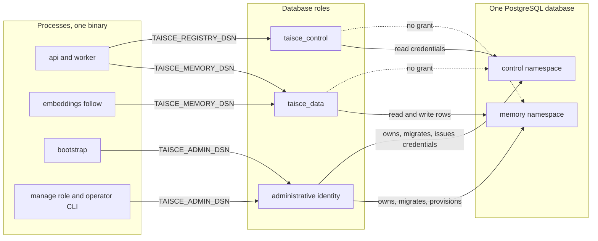

<!-- Copyright 2026 The Taisce Authors -->
<!-- SPDX-License-Identifier: Apache-2.0 -->

# PostgreSQL: the substrate

Taisce keeps everything in one PostgreSQL database, split into two namespaces that different
database roles can reach. This page covers that database, what the image carries, and how a running
process connects to it.

**You'll learn:**

- why PostgreSQL is the only required dependency;
- which extensions the image carries, and why each one is there;
- how the memory and control namespaces are separated;
- how a project maps onto storage;
- how SQL names a namespace safely;
- how a process sizes and checks its connections.

Read this page first in the section. Then go to [roles and grants](roles-and-grants.md) if you are
reviewing the security boundary, or to [migrations](migrations.md) if you are changing the schema.

## Why PostgreSQL is the only required dependency

Everything Taisce keeps lives in one PostgreSQL database: observations, the facts formed from them,
the passages and vectors that evidence those facts, the credential registry, the audit ledger and the
erasure receipts. There is no vector database, graph engine, broker, cache or object store beside it.

That follows from what the product promises:

- **An erasure has to prove what it covered.** Erasure walks a registered dependency from each source
  observation, and records its residual count in the same transaction. A second datastore would be a
  second place a person's data could live, and a second sweep the proof would have to cover, across a
  boundary no transaction spans.
- **Atomic operations share one transaction.** Provisioning a project creates its storage and its row
  together ([migrations](migrations.md#provisioning-a-project)). An operator's recovery commits with
  its audit record. Across two stores, each of these would need a distributed commit or a reconciler.
- **The operator runs it.** Every extra datastore is a second thing to back up, upgrade, secure and
  restore. On a one-machine deployment it is also a second process competing for the same host.

PostgreSQL supplies what the design leans on: transactional DDL, list partitioning, GiST indexes
over range types, exclusion constraints, advisory locks, and, through one extension, vector types
with approximate nearest-neighbour indexes.

## The image

The substrate image is built from [deploy/postgres/Dockerfile](../../deploy/postgres/Dockerfile).
The compose file and `make db-up` both use it.

- Its base is the PostgreSQL 18 Alpine image named by the `PG_BASE` build argument, today
  `postgres:18.6-alpine3.24`.
- pgvector is compiled in a builder stage against that base's exact server headers, at the tag named
  by `PGVECTOR_REF` (`v0.8.6`).
- The final stage copies only the installed files, so it carries no compiler, headers or package
  state.

### The three extensions

Every extension runs inside the database backend, so a fault in one can take the server down. An
extension is included only when something reads it today.

| Extension | What reads it | Why it cannot be absent |
|---|---|---|
| `vector` (pgvector) | The `embedding` columns of `message_embedding`, `entity_embedding` and `report_embedding` ([0046](../../internal/migrate/sql/0046_message_embeddings_belong_to_model_generations.sql), [0049](../../internal/migrate/sql/0049_entity_embeddings_are_source_owned_candidates.sql), [0050](../../internal/migrate/sql/0050_report_embeddings_are_source_owned_themes.sql)), and the HNSW index on each embedding generation's partition ([embeddinggeneration.go](../../internal/infra/pg/embeddinggeneration.go)) | Without it nothing can be retrieved by meaning. |
| `btree_gist` | The GiST indexes that lead with `scope` and an entity id and end with a time range ([0001](../../internal/migrate/sql/0001_the_spine.sql)), and the exclusion constraints over validity and knowledge ranges ([0010](../../internal/migrate/sql/0010_supersession_is_a_constraint_rather_than_a_lock.sql), [0029](../../internal/migrate/sql/0029_supersession_preserves_earlier_knowledge.sql), [0032](../../internal/migrate/sql/0032_retractions_preserve_source_instructions.sql)) | Core PostgreSQL has no GiST operator class for plain scalar types, so it refuses both the indexes and the constraints. |
| `pg_stat_statements` | The operator's statement profile, [scripts/postgres-profile.sql](../../scripts/postgres-profile.sql) | It tells an operator which statement got slower after a change, without adding instrumentation to the server. The image adds it to `shared_preload_libraries`, so every new cluster loads it. |

The extensions are registered once, when the cluster is first created, by
[00-extensions.sql](../../deploy/postgres/initdb/00-extensions.sql), which the image's entrypoint runs.
The migrator does not register them, for two reasons:

- `CREATE EXTENSION` needs privileges the serving roles do not have.
- A missing extension should fail while the cluster comes up, not halfway through a migration.

The Helm chart does the same through its `postInitApplicationSQL` list, and preloads
`pg_stat_statements` ([postgresql.yaml](../../deploy/helm/taisce/templates/postgresql.yaml)). The
memory migrations use `vector` and GiST operator classes from their first file. An external database
therefore needs all three extensions registered before bootstrap runs.

### What the image leaves out

- **A lexical (BM25) search extension.** The schema has no lexical index. Retrieval anchors on
  entities and reads passages as evidence, and the three semantic surfaces are vectors. Such an
  extension would also be the most expensive thing the image could carry: a compile from source and
  a preload entry. If lexical retrieval is ever added, the extension comes with the query that reads
  it.
- **`pgcrypto`.** The only function the schema would use from it, `gen_random_uuid()`, has been in
  core PostgreSQL since version 13.

### Alpine, and the collation caveat

Alpine gives a smaller base, and so a smaller attack surface. The cost is that Alpine uses musl
rather than glibc, so an extension that assumes glibc will not build on this image.

The same difference carries a data hazard:

- musl and glibc do not sort `en_US.utf8` text in the same order, even though both report the same
  locale name.
- A btree index on a text column stores its entries in the order of the C library that built it.
- If you move an existing data directory onto an image built against the other library, lookups can
  miss rows that are present, and a unique index can admit a duplicate. Nothing raises an error.

The Helm chart's default image is CloudNativePG's Debian-based image, which uses glibc. So a data
directory must not move between the compose image and the chart's image as it is. Use a dump and
restore, or at least `REINDEX` every index on a text column. A fresh volume has no such problem.

## Two namespaces in one database

The database holds two schemas, called namespaces throughout these pages. Grants separate them, and
no statement a serving process runs can reach both.

| Namespace | Name | Holds | Read by | Written by |
|---|---|---|---|---|
| Memory | `TAISCE_SCHEMA`, default `memory` | Every table except the registry: observations, projects and their settings, facts, entities, passages and embeddings, the audit ledger, erasure receipts, the vocabulary and policy catalogs, and its own `schema_migration` | `taisce_data` and the administrative identity | `taisce_data` for data rows; the administrative identity for structure and policy catalogs |
| Control | `control`, fixed | `credential` and its own `schema_migration` | `taisce_control` and the administrative identity | The administrative identity only |

The memory namespace's name is chosen once per instance, when a process starts, by
`configuredMemorySchema` in [main.go](../../cmd/taisce/main.go). It defaults to `memory`. It refuses
`control`, `public`, `information_schema` and any name starting with `pg_`, so configuration cannot
mix the two stores. No request, credential or project can choose it.

Changing the setting on an existing instance does not move data. It points the process at a
different, probably empty, namespace.

The control namespace is fixed as `ControlSchema` in [migrate.go](../../internal/migrate/migrate.go).
A name that cannot vary is a name no grant can be written against wrongly.

### Why the two never join

A credential row holds:

- the SHA-256 digest of a token, and a short display prefix (the token itself is never stored);
- a name and a kind, `project` or `operator`;
- the one project a project credential reaches, and its access mode.

The schema is in the [control migrations](../../internal/migrate/control/). Reading this table would
let a component list who can reach what. Writing it would let a component mint authority. The memory
service handles text written by callers and output produced by a model, so it is the component least
entitled to either.

So the memory login holds no privilege in `control`, not even `USAGE`. The registry login holds no
privilege on memory tables. A memory query cannot read a digest or widen its own authority, because
the grant does not exist, not because a predicate filtered the row.

The split follows what each side is for. The registry holds who may reach what. The memory namespace
holds what a project does, because project settings are read on the memory path
([0012](../../internal/migrate/sql/0012_a_project_is_a_row_with_settings.sql)).

One consequence: there is no foreign key from `credential.project` to the memory namespace's
`project` table. The two namespaces are migrated by separate sequences, and at first bootstrap the
control sequence runs before the memory namespace exists. Instead, `requireProject` in
[commands.go](../../cmd/taisce/commands.go) refuses to issue a credential for a project that does not
exist, because that command can see both namespaces.

This is weaker than a constraint. A credential written into `control` by some other route could name
a missing project. It would then authenticate and reach no memory.

The separation does not hide that things exist. Every role can read the system catalogs, so the
memory login can see that a `control` namespace and a `credential` table exist. It cannot read their
rows.

### Which process connects as which role



Each serving process (the API, the worker, or both in one process) holds two pools:

- the memory pool, as `taisce_data`;
- the registry pool, as `taisce_control`.

Neither pool can change the schema. Only bootstrap, the management surface and operator CLI commands
connect as the administrative identity. That identity owns every application object and is the only
one that runs DDL:

- in [compose.yaml](../../compose.yaml) it is the `postgres` superuser;
- in the Helm chart it is `taisce_admin`, the database owner with `CREATEROLE` and nothing more.

The dotted edges are the boundary: grants that do not exist. [Roles and grants](roles-and-grants.md)
lists each role's exact privileges, and what the runtime refuses when they drift.

## One instance, one tenant, and a project inside it

An instance holds one organisation's memory on its own infrastructure. There is no tenant boundary in
the database, because no other organisation's data is in it. The boundary that remains is the
project: several agents, teams or products share an instance, and a project keeps them apart.

Inside the memory namespace, a project is two things:

1. **A row** in `{schema}.project`
   ([0012](../../internal/migrate/sql/0012_a_project_is_a_row_with_settings.sql)). Its `scope` is the
   project's identity, and the same value appears on every row that belongs to the project. The row
   also carries a display label, the memory surfaces the project keeps (which can be added and never
   removed), its retention policy and its suspension state. `project_scope_chk` limits `scope` to
   `^[a-z][a-z0-9_]{0,62}$`, the same pattern the provisioner accepts
   ([0024](../../internal/migrate/sql/0024_project_names_fit_the_provisioning_contract.sql)).
2. **A list partition** of `{schema}.chunk`, the table of source passages, for
   `FOR VALUES IN ('<scope>')`. A default partition, `chunk_unpartitioned`, catches a write for a
   project whose partition was never created
   ([0001](../../internal/migrate/sql/0001_the_spine.sql)). A missing partition then costs locality,
   not a lost write, and rows in the default partition are reached by the same erasure.

A project is not a schema and not a database. Creating one runs no migration. It inserts a row and
attaches a partition in one transaction, as [migrations](migrations.md#provisioning-a-project)
describes.

Vectors are partitioned on a different key. Message, entity and report embeddings live in tables
partitioned by embedding generation. Each generation belongs to one project and one model, and each
generation's partition carries its own HNSW index. The partitioned parents carry no vector index.

Partitioning is a physical layout choice, not an authorization boundary. It keeps a project's source
lookup, erasure and maintenance local. Isolation between projects comes from two other things:

- every statement carries the authenticated project;
- composite keys include `scope`, so a row cannot reference a row in another project
  ([0023](../../internal/migrate/sql/0023_relationships_agree_on_the_project.sql)).

It does not come from grants, because one memory login serves every project. The
[data model](data-model.md) and [security](../architecture/security.md) pages cover this in detail.

## How SQL names a namespace

A PostgreSQL bind parameter is a value. `$1` can stand for a scope, but never for a schema or table
name. Yet every statement must name the configured memory namespace. So every statement in
[internal/infra/pg](../../internal/infra/pg/) is a template that writes the namespace as `{schema}`,
rendered by `Schema.SQL`:

```go
rows, err := admin.Query(ctx, schema.SQL(
    `SELECT scope, surfaces FROM {schema}.project ORDER BY scope`))
```

`Schema` is declared in [schema.go](../../internal/infra/pg/schema.go), and `NewSchema` is its
validating constructor. A name is accepted only if it:

- is non-empty and at most 63 bytes (PostgreSQL's identifier limit; a longer name is silently
  truncated and could select a different namespace);
- starts with a lowercase ASCII letter;
- continues with lowercase letters, digits or underscores.

The accepted set contains no quote, dot, space or uppercase letter, so the rendered text needs no
quoting and cannot inject SQL. Migrations use the same substitution: a migration file writes
`{schema}.observation`, and `apply` renders it for the namespace being migrated.

Other identifiers follow the same approach, allowlist first:

- **Project names** become part of partition DDL. `scopePattern` in
  [provision.go](../../internal/migrate/provision.go) admits `^[a-z][a-z0-9_]{0,62}$` and nothing else.
  An allowlist fails closed on input nobody anticipated; an escaping routine fails open.
- **Identifiers read from the server**, such as `current_database()`, are quoted with
  `pgx.Identifier{...}.Sanitize()` before they appear in a `REVOKE`.
- **Role passwords** are written as quoted literals by `quoteLiteral` in
  [planes.go](../../internal/migrate/planes.go), because role statements take no parameters. They come
  from the deployment's configuration, never from a request.

What the `Schema` type does not do:

- **It is not an authorization boundary.** A role granted two namespaces reads both, however their
  names were validated.
- **It does not force validation in every case.** `Schema` is a defined string type, so a string
  variable cannot be passed where a `Schema` is expected. That catches the common mistake at compile
  time. But an explicit conversion or an untyped string constant still produces a `Schema` without
  calling `NewSchema`, and `ControlSchema` is declared that way. Review, not the compiler, keeps
  unvalidated conversions out.

## Connections and pools

A serving process opens its two runtime pools with `NewRuntimePool`
([privileges.go](../../internal/migrate/privileges.go)). Both DSNs are required. The registry DSN
never defaults to the memory DSN: a single pool would work, and would quietly put credentials within
reach of every memory statement.

Each new physical connection is checked against the privilege boundary before it enters the pool
([roles and grants](roles-and-grants.md#what-the-runtime-refuses)). Startup pings both pools before
any listener or worker starts.

Each runtime connection also asks the server for TCP keepalives, probing after 30 seconds idle,
every 10 seconds, and giving up after 3, and for a client check every 10 seconds while a query runs.
A process whose host is cut off then loses its session, and any advisory lock it held, in about a
minute rather than the kernel's default of about two hours. The formation worker's lock on a project
is one of those. To change a setting, put it in the DSN, for example `?tcp_keepalives_idle=60`; a
value there wins.

Pool sizes are set in each DSN (`pool_max_conns`, `pool_min_conns`), not left to the driver. pgx sizes
an unconfigured pool from the CPU count the process sees, which multiplies unpredictably across
replicas. [compose.yaml](../../compose.yaml) gives the API a memory pool of 8 and a registry pool of 2,
and each worker 4 and 1. [The production specification](../21-production-postgresql.md#sizing-connections)
gives starting values and the arithmetic for a deployment.

### Each process reserves its connections

Every process opens its own pools, the deployment decides how many processes run, and the server
decides `max_connections`. Nothing forces those three to agree. So after building its pools, a
serving process calls `CheckConnectionBudget` on each one
([connectionbound.go](../../internal/migrate/connectionbound.go)).

The check reads three values:

- `max_connections`;
- `superuser_reserved_connections`;
- the number of client backends connected to the whole server.

It refuses to start if what remains is less than the pool's maximum, and the error names every
number.

The check counts every client backend, in every database and under every role. A pooler, a
monitoring session and an operator's `psql` all use the same slots, and a check that counted only its
own kind would pass a server that is already full.

The check reserves rather than declares. No process has to be told how many siblings it has. The
process that starts after the slots are gone is the one that fails, at startup, instead of serving
until a caller's write finds the ceiling.

What it does not cover:

- **Two processes starting at the same instant can both see room.** The check narrows that window but
  does not close it. So a statement that meets exhaustion anyway, SQLSTATE `53300`, is recognised by
  `NoConnectionSlots` in [connectionslots.go](../../internal/infra/pg/connectionslots.go). The API
  answers such a write with `503` and `Retry-After: 1`, not as an internal error. The retry is safe
  because an observation carries an idempotency key.
- **Only the serving path is checked.** The management process and `taisce embeddings follow` open
  pools without calling the check. The administrative DSN in [compose.yaml](../../compose.yaml) also
  sets no pool size.
- **Transaction poolers.** Do not put one in front of the database without a review. The privilege
  check runs when a physical connection opens, and a transaction pooler changes which backend runs
  later statements. Prepared statements and advisory locks would also have to be proved under the
  pooler's mode.

## Production guidance

[The production PostgreSQL specification](../21-production-postgresql.md) is the starting point for a
deployment. It covers the host shape, the durability settings that stay on (`fsync`,
`full_page_writes`, `synchronous_commit`), starting values to qualify, the connection budget, vacuum
and vector-index maintenance, promotion gates and rollback. It states no request rate or corpus
ceiling, because none has been measured on hardware that could support one.

The two shipped deployments differ:

- **The Helm chart** declares a CloudNativePG cluster of three instances by default. Its
  administrative identity is the database owner with `CREATEROLE`, and superuser access is disabled.
  The DSNs it writes use `sslmode=require`. The extensions are created when the cluster is
  initialised. `postgresql.mode=external` points the chart at an existing database instead, through a
  secret that carries the administrative, memory and registry DSNs.
- **The compose file** is one machine and says so. Its administrative identity is the superuser, and
  its connections stay inside the compose network without TLS.

Neither deployment claims a recovery time or a recovery point.

## Where to go next

- [Roles and grants](roles-and-grants.md): each role's exact privileges, what the runtime refuses, and
  what an administrator can still do.
- [Migrations](migrations.md): how the schema is applied, bootstrap end to end, and how to add a
  migration.
- [Data model](data-model.md): the tables inside the memory namespace and how they relate.
- [Concurrency](concurrency.md): advisory locks, `FOR UPDATE` and what makes replicas safe.
- [Indexing and plans](indexing-and-plans.md): the GiST, btree and HNSW indexes and the plans they
  produce.
- [Production PostgreSQL specification](../21-production-postgresql.md): sizing, settings and
  qualification.
