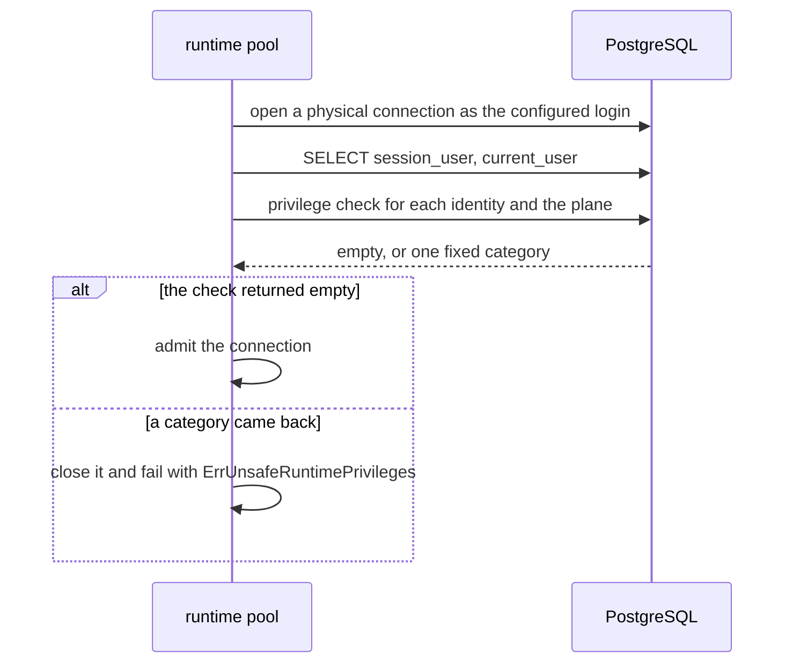

<!-- Copyright 2026 The Taisce Authors -->
<!-- SPDX-License-Identifier: Apache-2.0 -->

# Roles and grants

Taisce separates serving memory, reading credentials and changing the schema into different
PostgreSQL roles, so the boundary between them is a grant rather than a rule in application code. A
rule in code has to be remembered by every future query; a missing grant cannot be worked around by
any statement.

**You'll learn:**

- what the boundary protects, and from whom;
- the exact privileges of each role;
- how bootstrap establishes the grants;
- what the runtime refuses when privileges drift;
- how the audit ledger is protected at the privilege level;
- what an administrator can still do.

Read [the substrate overview](overview.md) first for the namespaces and the processes.

## What the boundary protects, and from whom

**Assets:**

- **The credential registry** in the `control` namespace. Reading it would let a component list who
  can reach which project. Writing it would let a component mint authority.
- **The policy catalogs** in the memory namespace: the relation vocabulary, the registered projection
  kinds that erasure walks, embedding generation identity and activation, the ingestion budget,
  artifact storage quotas and the migration record. Rewriting any of them changes what the next
  statement is allowed to do.
- **The schema itself**, and **the audit ledger**.

**Actors:**

- **The memory process**, meaning the API and the workers. It handles text written by callers and
  output produced by a model, so it is the component most likely to run a statement shaped by hostile
  input. It connects as `taisce_data`.
- **The registry reader**, `taisce_control`. It runs in the same process, in its own pool.
- **The operator**, through bootstrap, the management surface and the CLI, as the administrative
  identity.
- **Anyone else** who holds the administrative identity or a superuser login.

**The trust boundary** sits between the two serving logins and everything else. The worst path it
closes is a memory statement, possibly shaped by hostile input, that reads credential rows or rewrites
the policy that governs the next statement. The grants close it whatever the statement's predicate,
because the memory login holds no privilege on those objects.

**What the boundary does not separate** is one project from another inside the memory namespace. One
memory login serves every project. Project isolation comes from the authenticated project on every
statement, not from a grant (see [Row-level security](#row-level-security)).

## The roles

| Role | Connects from | May | Must never |
|---|---|---|---|
| Administrative identity: `postgres` in compose, `taisce_admin` in the chart, the operator's choice in external mode | `taisce bootstrap`, the management role and operator CLI commands, through `TAISCE_ADMIN_DSN` | Create and reconcile the plane roles. Own and migrate both namespaces. Create project and generation partitions and their indexes. Issue and revoke credentials. Suspend and resume projects. Seal and verify the ledger. Anything else an owner may do. | Be the identity behind `TAISCE_MEMORY_DSN` or `TAISCE_REGISTRY_DSN`. The admission check refuses it there. |
| `taisce_data` | The API and worker memory pool, and `taisce embeddings follow`, through `TAISCE_MEMORY_DSN` | `USAGE` on the memory namespace. `SELECT, INSERT, UPDATE, DELETE` on its tables. `USAGE, SELECT` on its sequences. `SELECT` only on the policy catalogs. | Hold any privilege in `control`. Hold `CREATE` on the database or any namespace. Own an application object. Write a policy catalog. Reach an elevated attribute. |
| `taisce_control` | The API's registry pool, through `TAISCE_REGISTRY_DSN`. Workers hold no registry login | `USAGE` on `control`, and `SELECT` on its tables. | Write `control`. Hold any privilege on memory tables. Create or own objects. Reach an elevated attribute. |
| `PUBLIC` | Every login | `CONNECT` and `TEMP` on the database, and `USAGE` on `public`. These are PostgreSQL's defaults and are left in place. | Hold `CREATE` on the database, or anything in `control`. Both are revoked explicitly. |

Both plane roles are created `LOGIN NOSUPERUSER NOCREATEDB NOCREATEROLE NOREPLICATION NOBYPASSRLS`,
with a password. The elevated attributes (superuser, database creation, role creation, replication
and RLS bypass) are never granted to them.

You can read the grants on your own deployment with one catalog query:

```sql
SELECT n.nspname, c.relname, c.relacl
  FROM pg_class c JOIN pg_namespace n ON n.oid = c.relnamespace
 WHERE n.nspname IN ('memory', 'control') AND c.relkind IN ('r', 'p')
 ORDER BY n.nspname, c.relname;
```

On a correctly bootstrapped instance:

- data tables show `taisce_data=arwd`;
- policy catalogs show `taisce_data=r`;
- control tables show `taisce_control=r`;
- the administrative identity is the owner of everything.

A project's or generation's partition shows no entry for either role. See
[Partitions carry no grant of their own](#partitions-carry-no-grant-of-their-own).

## How bootstrap establishes the planes

`EstablishPlanes` in [planes.go](../../internal/migrate/planes.go) runs on every bootstrap, through the
administrative connection. It holds a session advisory lock and runs everything on the one
connection that holds it ([migrations](migrations.md#two-sequences-advanced-independently)).

### Creating or reconciling each role

`ensureRole` handles each role:

- **An absent role** is created with every elevated attribute explicitly off.
- **An existing role** is read back, never re-declared. If it carries any elevated attribute,
  bootstrap refuses it and names every attribute.
- **An existing role that passes** has only its login and password reset. This is also how a password
  is rotated.

Bootstrap refuses rather than repairs, for two reasons. In the chart, the administrative identity has
`CREATEROLE` and nothing more, and PostgreSQL does not let such a login run an `ALTER ROLE` that names
any of those attributes. And a silent repair would close a door without anyone learning it had been
opened.

### The control grants

These run after the control migrations:

```sql
REVOKE ALL ON SCHEMA control FROM PUBLIC;
REVOKE ALL ON ALL TABLES IN SCHEMA control FROM PUBLIC;
REVOKE CREATE ON SCHEMA control FROM taisce_control;
GRANT USAGE ON SCHEMA control TO taisce_control;
REVOKE INSERT, UPDATE, DELETE, TRUNCATE, REFERENCES, TRIGGER
    ON ALL TABLES IN SCHEMA control FROM taisce_control;
GRANT SELECT ON ALL TABLES IN SCHEMA control TO taisce_control;
REVOKE CREATE ON DATABASE taisce FROM PUBLIC;
REVOKE CREATE ON DATABASE taisce FROM taisce_data;
```

Notes on these statements:

- **They revoke from `PUBLIC` explicitly** instead of relying on the default. A default is a fact
  about one PostgreSQL version, and this is a security boundary.
- **The database name** in the last two statements is read from `current_database()` and quoted,
  never configured, so it cannot disagree with where the connection actually is.
- **Nothing is granted to `taisce_data` in `control`.** That absence is the boundary, so there is no
  statement for it.
- **Revoking `CREATE` on the database** stops the memory login from creating a namespace of its own,
  where it would hold full rights.

### The memory grants

`grantMemoryToDataPlane` runs after every memory migration run, so tables added by a new migration are
covered:

```sql
GRANT USAGE ON SCHEMA memory TO taisce_data;
GRANT SELECT, INSERT, UPDATE, DELETE ON ALL TABLES IN SCHEMA memory TO taisce_data;
GRANT USAGE, SELECT ON ALL SEQUENCES IN SCHEMA memory TO taisce_data;
REVOKE INSERT, UPDATE, DELETE ON memory.projection_kind, memory.predicate,
    memory.unresolvable_term, memory.speaker_term, memory.schema_migration FROM taisce_data;
REVOKE INSERT, UPDATE, DELETE, TRUNCATE, REFERENCES, TRIGGER ON
    memory.embedding_generation, memory.embedding_active,
    memory.entity_embedding_generation, memory.entity_embedding_active,
    memory.report_embedding_generation, memory.report_embedding_active FROM taisce_data;
REVOKE INSERT, UPDATE, DELETE, TRUNCATE, REFERENCES, TRIGGER ON
    memory.ingestion_budget, memory.ingestion_project_usage,
    memory.ingestion_reservation, memory.agent_storage_policy FROM taisce_data;
```

The memory login gets rows, not structure: no `CREATE`, `ALTER` or `DROP`.

The grant is broad by default and narrowed by a list. Every table a migration adds is writable by the
memory login unless it is added to this `REVOKE` list **and** to the matching list in the admission
check. A new policy catalog that misses either list is writable, and nothing warns.
[Adding a migration](migrations.md#adding-a-migration) names both places.

Migrations also revoke directly.
[0025](../../internal/migrate/sql/0025_unfinished_observations_reserve_ingestion_capacity.sql) and
[0037](../../internal/migrate/sql/0037_agent_artifacts_are_bounded_owned_storage.sql) revoke all
privileges from `PUBLIC` on the ingestion and artifact-quota tables. Some trigger functions, including
every security-definer one, have `EXECUTE` revoked from `PUBLIC`. The rest, such as
`audit_is_append_only`, keep PostgreSQL's default. That exposes little, because PostgreSQL refuses to
run a trigger function outside a trigger.

### Partitions carry no grant of their own

A project's `chunk` partition and an embedding generation's partition are created after the namespace
grant has run, so they carry no privilege for either serving role.

PostgreSQL checks privileges on the table a statement names. A statement against the partitioned
parent is checked against the parent. The runtime reads and writes through `chunk` and the embedding
parents, and never names a partition. A partition's name is therefore not a way into its rows.

### Security-definer functions

Four trigger functions run with their owner's privileges rather than the caller's:

- `sync_ingestion_reservation` and `release_ingestion_reservation`
  ([0025](../../internal/migrate/sql/0025_unfinished_observations_reserve_ingestion_capacity.sql));
- `initialize_agent_storage_policy` and `account_agent_artifact`
  ([0037](../../internal/migrate/sql/0037_agent_artifacts_are_bounded_owned_storage.sql)).

They exist because the memory login's writes must move counters and quota rows that the memory login
may read but not write. The trigger fires on the memory login's statement, and the function writes as
its owner.

Each one:

- pins `search_path` to `pg_catalog, pg_temp`;
- schema-qualifies every relation;
- refuses to run on any table other than the one it was written for;
- has `EXECUTE` revoked from `PUBLIC`, so the memory login cannot call it directly.

What that does not cover: these functions run as whoever ran the migrations, which in
[compose.yaml](../../compose.yaml) is the superuser. A defect in one of their bodies is a defect at that
privilege. The admission check below inspects relations and roles, not functions.

## What the runtime refuses

`ValidateRolePrivileges` in [privileges.go](../../internal/migrate/privileges.go) runs one catalog
query. It returns either nothing or one fixed diagnostic category, never a credential value or a
row's contents. It runs at two points:

- **At bootstrap**, through the administrative connection, for both plane roles, after provisioning
  and before any credential is minted.
- **On every new physical connection** of a runtime pool. `NewRuntimePool` installs
  `ValidateRuntimeConnection` as the pool's after-connect hook. The hook checks `session_user`, and
  also `current_user` if the two differ. A privileged login cannot hide behind a `SET ROLE` in its
  connection setup and recover its privilege later with `RESET ROLE`.

Startup pings both pools before any listener or worker starts, so a refused identity stops the process
before it serves.

"Reachable" roles are the login itself, every role it can use through inheritance, and every role it
may switch to with `SET ROLE`. A membership granted with inheritance off still counts, because
`SET ROLE` reaches it.



The check is a connection's admission ticket. A connection that fails never serves a statement, and a
pool whose every new connection fails cannot serve at all. The conditions are evaluated in order, and
the first match is reported:

| Category reported | Condition | Plane |
|---|---|---|
| `login does not exist` | No role by that name | Both |
| `instance namespaces are missing` | The memory namespace or `control` is absent | Both |
| `elevated role attributes or reachable privileged role` | Any reachable role is superuser, or can create databases, create roles, replicate or bypass RLS | Both |
| `database schema creation is permitted` | Any reachable role holds `CREATE` on the database | Both |
| `namespace ownership or creation is permitted` | Any reachable role owns, or may create in, the memory namespace, `control` or `public` | Both |
| `runtime owns application database objects` | Any reachable role owns a table, partitioned table, view, materialized view, foreign table or sequence in the memory namespace or `control` | Both |
| `memory role can access the credential namespace` | Any reachable role holds `USAGE` on `control` | Memory |
| `memory role has credential object privileges` | Any reachable role holds any table or column privilege on a `control` table | Memory |
| `memory policy catalogs are writable` | Any reachable role may insert, update, delete, truncate, reference or trigger on one of the fifteen policy catalogs, including through a column grant | Memory |
| `registry runtime has memory access or credential write privileges` | Any reachable role holds any privilege on a memory table, or any write privilege on a `control` table | Registry |
| `required memory read privileges are missing` | The login lacks `USAGE` on the memory namespace or `SELECT` on `observation` | Memory |
| `required credential read privileges are missing` | The login lacks `USAGE` on `control` or `SELECT` on `credential` | Registry |

The fifteen policy catalogs are the tables in the `REVOKE` lists above:

- `projection_kind`, `predicate`, `speaker_term`, `unresolvable_term`, `schema_migration`;
- the three ingestion tables and `agent_storage_policy`;
- the generation and activation tables for message, entity and report embeddings.

Because of the ownership and elevated-attribute checks, handing the administrative DSN to a serving
process fails at startup.

### The tests

[privileges_test.go](../../internal/migrate/privileges_test.go) proves the refusals.
`TestRuntimePoolRefusesPrivilegeDriftAndAcceptsRemediation` seeds each kind of drift under a real
non-owner login:

- direct, column, inherited and `SET ROLE`-only grants on credentials;
- table and namespace ownership;
- `CREATEDB` and schema `CREATE`;
- writes to each policy catalog.

For each kind it forces a new physical connection, asserts the refusal, removes the drift, and asserts
that service returns. `TestSetRoleCannotHideAPrivilegedLoginFromRuntimeValidation` covers the session
case. [planes_test.go](../../internal/migrate/planes_test.go) asserts, through the memory login itself,
that it cannot read `control`, change the schema or create a namespace.

### Remediation

Fixing a refusal is the operator's job. Through the administrative connection, inspect the named
plane's role memberships and object privileges, remove the excess privilege or restore the intended
owner, and restart. Bootstrap does not reassign ownership or strip memberships on its own, because
those may express a policy that should be understood before it is changed.

### What the check does not cover

- **Changes after admission.** It is an admission check, not monitoring. A grant added while a
  connection is open is not seen until the pool opens a new physical connection. Setting
  `pool_max_conn_lifetime`, as [the production specification](../21-production-postgresql.md#pool-lifetimes)
  recommends, bounds how long that takes.
- **Functions.** `EXECUTE` privileges and function ownership are not inspected. Security-definer code
  needs its own review.
- **Temporary tables.** `TEMP` is left to `PUBLIC`, so a serving login can create temporary tables.
- **A transaction pooler** in front of the database defeats the per-connection premise.
- **Write access to non-policy tables.** The memory login may write every table the lists do not name.
  That includes the `project` table, which carries suspension and retention. The code changes those
  columns only through the administrative connection, but the grant does not require that.

## The audit ledger at the level of privileges

The ledger ([0013](../../internal/migrate/sql/0013_the_audit_ledger.sql),
[0017](../../internal/migrate/sql/0017_the_ledger_seals_itself.sql)) records who did what to which
project and how much it touched. It records no content and no data subject. Nothing in it could ever
be the subject of an erasure request, so it is append-only without exception, with no delete path and
no retention.

| Mechanism | What it does |
|---|---|
| Grants | The namespace grant gives `taisce_data` `SELECT, INSERT, UPDATE, DELETE` on `audit_entry` and `audit_seal`, and no `TRUNCATE`. |
| Row triggers | `audit_no_update` and `audit_no_delete` on `audit_entry`, and `audit_seal_no_update` and `audit_seal_no_delete` on `audit_seal`, raise for every identity, the owner included, before any row is changed. |
| Sealing | The worker seals on its tick through the memory pool, which is why the memory login needs `INSERT` on `audit_seal`. The management surface and `taisce audit` seal and verify through the administrative connection. A transaction advisory lock per namespace serialises sealers. |
| External anchor | Each seal's head digest is written to the process log, outside the database. |

For the memory login, append-only comes from triggers rather than grants. The grant would allow
`UPDATE` and `DELETE`; the triggers refuse them.

Each seal covers a contiguous range of entries, digests them over named fields, and chains to the
seal before it. Rewriting a sealed entry therefore changes its seal and every seal after it.

What the ledger's defences do not cover:

- **The window since the last seal.** Entries written after the last seal are covered by nothing.
- **An owner.** The owner can disable or drop the triggers. Row triggers also do not fire on
  `TRUNCATE`, so an owner can truncate either table without disabling anything.
- **A complete rewrite.** Someone who can rewrite everything can rebuild the ledger and re-seal it, and
  nothing inside the database can tell. Only a comparison with head digests kept in logs the database
  cannot reach detects that.
- **Completeness.** An append that fails is logged and the operation proceeds
  ([auditstore.go](../../internal/infra/pg/auditstore.go)). The ledger records what was written, not
  necessarily everything that happened.

## Row-level security

No table enables row-level security, and no policy exists. Neither the migrations nor the code
contain one. One memory login serves every project, so a role-based policy would have nothing to
distinguish between.

Project isolation inside the memory namespace comes from two things:

- every statement carries the authenticated project;
- composite keys that include `scope` keep writes consistent within one project
  ([0023](../../internal/migrate/sql/0023_relationships_agree_on_the_project.sql)).

[The security page](../architecture/security.md) covers the tests. The grants do not isolate projects
from a compromised process that already holds the memory login. Within the memory namespace, the
project boundary is enforced by the application, not by the database.

## What an administrator can still do

The administrative identity owns every application object, and a superuser can do more. Nothing in
this design stops either of them from:

- reading every credential digest and every memory row, and taking backups that contain both;
- changing or adding grants, or giving a plane role membership in a privileged role (admission
  catches that at the next physical connection, not before);
- disabling, dropping or bypassing the ledger's triggers, truncating the ledger, and re-sealing a
  rewritten one;
- replacing a function body, including a security-definer function;
- issuing a credential for any project, or suspending and resuming projects.

Against this, the design offers detection for the ledger only, and only when head digests are kept
outside the database. When self-hosted, the operator holds the disk, the database and the backups. The
realistic question is whether an operator can prove to their own auditor that they have not rewritten
their own records.

Least privilege still applies to the administrative identity itself. The chart uses the database
owner with `CREATEROLE` and keeps superuser access closed. The compose file, which is one machine,
uses the superuser. On compose, then, the security-definer functions and every operator command run
with superuser rights.

## Where to go next

- [The substrate overview](overview.md): the namespaces, the processes and the connection model.
- [Migrations](migrations.md): bootstrap end to end, and where grants fit when you add a table.
- [Security](../architecture/security.md): the trust boundaries above the database, including the
  project boundary.
- [Governance](../architecture/governance.md): erasure, retention and the ledger as a product feature.
