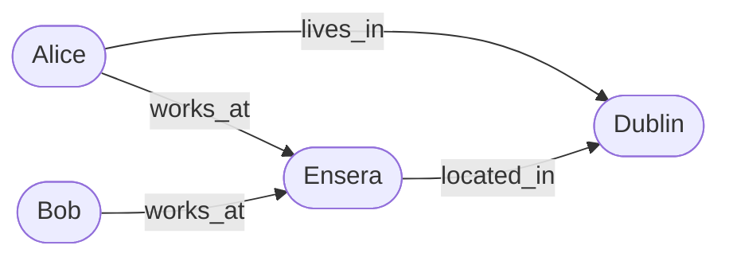

<!-- Copyright 2026 The Taisce Authors -->
<!-- SPDX-License-Identifier: Apache-2.0 -->

# How memory works

This page follows one sentence through Taisce. It goes in when your agent sends it, and comes back
out as an answer with its evidence. At the end, someone asks to be forgotten and it is erased. You
don't need to read any code.

```mermaid
flowchart LR
    agent["Your agent"] -->|"1. sends a turn"| stored[("Stored turns")]
    stored -->|"2. a worker reads it"| worker["The model proposes facts, Taisce checks each one"]
    worker -->|"3. only checked facts"| graph[("Facts connecting people, companies and places")]
    agent -->|"4. asks a question"| recall["Recall"]
    graph --> recall
    recall -->|"facts, each with its quote"| agent
```

## 1. Your agent sends a turn

Alice tells your agent where she works. Your agent passes that exchange to Taisce:

```json
{
  "idempotency_key": "4b7f3c1e-5a0d-4f7e-9a61-0c2d8e3b9f10",
  "data_subject_id": "alice",
  "messages": [{"role": "user", "content": "I work at Ensera and I live in Dublin."}]
}
```

That is a **turn**: the messages of one exchange, in order. Each message has a `role`, which says who
spoke: `user`, `assistant`, `system` or `tool`. `data_subject_id` says whose turn it is. It is a
string your application picks, such as its own user id. The `idempotency_key` names this one write,
so sending it twice after a network error stores it once.

Taisce stores the turn straight away and answers with a receipt:

```json
{"id":"…","scope":"default","log_offset":0}
```

No model has looked at the turn yet, and your agent does not wait for one. `log_offset` is the
turn's place in the project's log. The first turn is `0`, the next `1`, and so on.

## 2. A worker pulls out facts

A separate process, the **worker**, picks up stored turns in order and asks a model to read each
message. The model proposes facts. A **fact** is a small statement with three parts, a subject, a
relation and an object, plus the words that support it. From Alice's message:

| Subject | Relation | Object | Quote |
|---|---|---|---|
| Alice | `works_at` | Ensera | "I work at Ensera" |
| Alice | `lives_in` | Dublin | "I live in Dublin" |

The model only proposes. Taisce keeps a proposal only if it passes every check:

- **The relation is on a fixed list** of about forty, such as `works_at`, `lives_in`, `prefers`,
  `uses` and `manages`. A relation the model makes up is refused.
- **The quote is really in the message**, word for word. Taisce finds it itself and records exactly
  where it starts and ends. A paraphrase is refused.
- **Statements about "I" come from that person's own words.** "I" in Alice's `user` message becomes
  Alice, because the turn says it is hers. An assistant saying "so you work at Ensera" is the
  assistant's guess, not Alice's statement, so it is refused.

Refused proposals are counted, never silently dropped, so an operator can see what the model got
wrong. Every kept fact carries its quote, so every answer can show where it came from.

## Stored and formed

Because the reading happens in the background, "saved" and "in memory" are two different moments.
`GET /v1/freshness` tells you where each one is:

```text
right after the write   {"scope":"default","stored":0,"formed":null,"parked":0}
once the worker is done {"scope":"default","stored":0,"formed":0,"parked":0}
```

- **`stored`** is the last turn Taisce holds. It is `null` in a project nobody has written to.
- **`formed`** is the last turn that has been turned into facts, with nothing unfinished before it.
  It stays `null` until the first turn forms, because `0` is a real offset.
- **`parked`** counts turns the worker gave up on after several tries. `formed` moves past them, so
  one bad turn cannot hold up the rest, and an operator can retry them later.

The rule to remember: **your turn is in memory once `formed` is at least its `log_offset`**. A
question asked before that may not see it.

## 3. Facts connect things

The people, companies, places and tools that facts talk about are **entities**. Facts are the
arrows between them. When Bob says "I work at Ensera too", his fact points at the same Ensera, and
"Ensera is based in Dublin" connects the company to the city:



A company, place or thing is one entity however many people mention it, and it is known by its name.
A person speaking as "I" is different: they are known by their `data_subject_id`, not by a name. Two
users both called Sam stay two people.

## 4. A question starts at what it names

When your agent asks a question, Taisce does not search for sentences that look similar. It finds
the names in the question, looks them up exactly, and starts from the entities they name, called the
**anchors**. Then it walks to the facts connected to them:

```json
{"question": "What do we know about Ensera?"}
```

Ensera is the anchor, so the answer holds Alice's and Bob's `works_at` facts and Ensera's
`located_in` fact, each with its quote. A few things shape the answer:

- **One step by default.** Facts that touch an anchor come back. Ask for `"hops": 2` to follow one
  more arrow, for example from Alice to Ensera to Dublin; the answer then shows the path it took.
- **Personal questions name the person.** "Where do I work?" names nobody. Add
  `"data_subject_id": "alice"` and recall starts at Alice and uses only facts from her turns. Without
  it, "I" matches nobody, rather than everybody.
- **A size limit.** The answer is kept under a character budget, and `truncated` tells you when
  something was cut.
- **No model.** Answering is a database lookup, so a slow or missing model never delays an answer.
- **Empty answers explain themselves.** `reach.named_nothing_known` is `true` when the question named
  nothing Taisce has heard of, which is different from "known, but nothing to say".

## 5. Facts carry time

Every fact has two kinds of time:

- **When it was true**: `valid_from`, and `valid_until` once it stops being true. A fact starts
  being true when its message was said.
- **When Taisce learned it**: the moment the fact was recorded, and the moment Taisce stopped
  believing it, if it has.

Say Alice told your agent "I live in Dublin" in March, and "I live in Cork now" in June. Someone
lives in one place at a time, so the June fact **replaces** the March one: the Dublin fact gets a
`valid_until` in June. Nothing is overwritten or lost.

- An ordinary question gets today's answer: Cork.
- `"as_of": "2026-04-01T00:00:00Z"` asks what was true in April: Dublin.
- `"as_known_at"` asks what Taisce believed at some moment, which is how you answer "why did you tell
  me that last week?".

## 6. You stay in control

Memory can be wrong, and people change their minds. You can act on any fact without rewriting what
was said:

- **Correct it.** `POST /v1/records/correct` records a replacement value, marked as yours, and the
  original quote stays on file.
- **Retract it.** `POST /v1/records/retract` makes Taisce stop believing a fact, and the history of
  what it believed stays readable.
- **Flag it.** `POST /v1/feedback/record` notes a doubt without changing anything, for someone to
  review later.
- **Forget a person.** `POST /v1/erasures` with a `data_subject_id` deletes everything that person's
  turns produced, and returns a receipt:

```json
{"deleted": {"observation": 1, "fact": 2, "entity": …, "chunk": 1, …},
 "residual": {"fact": 0, "entity": 0, "chunk": 0, …},
 "clean": true}
```

`deleted` is what was removed. `residual` is what still matched the person **after** the delete,
counted in the same database transaction, and `clean` is `true` only when all of it is zero. Things
other people also mentioned, like Ensera when Bob works there too, belong to them as well and are
kept.

## Good to know

- **`data_subject_id` is a label, not a login.** Anyone holding the project's token can ask about
  any subject in the project. Keep people who must never see each other's memory in separate
  projects.
- **The model never writes memory directly.** It proposes; Taisce checks and records. Whatever
  arrives from a model is treated as untrusted text.
- **A hosted model sees the conversation.** With a model on your own machine, nothing leaves it.
  With a hosted provider, message text is sent there. Taisce sends it only to the hosts you list in
  `TAISCE_INFERENCE_ALLOWLIST`, and an empty list sends nothing.

## Where to go next

- [Quickstart](../developers/quickstart.md): do all of this on your machine.
- [Examples](../examples/overview.md): recipes for preferences, citations, forgetting and long
  conversations.
- [The HTTP API, by task](../developers/http-api.md): every field mentioned here.
- Going deeper: [formation](../architecture/formation.md), [the read path](../architecture/read-path.md#time-on-the-read-path)
  and [governance](../architecture/governance.md).
